# BÁO CÁO ỨNG DỤNG NHẮN TIN THỜI GIAN THỰC - CHATAPP

> **Nhóm 4** | Môn học: Kiến trúc phần mềm
> Ngày: 04/05/2026

---

## MỤC LỤC

- [Chương 1: Mở đầu](#chương-1-mở-đầu)
- [Chương 2: Phân tích Thiết kế](#chương-2-phân-tích-thiết-kế)
- [Chương 3: Kết quả](#chương-3-kết-quả)

---

# CHƯƠNG 1: MỞ ĐẦU

## 1.1. Giới thiệu ứng dụng

**ChatApp** là một ứng dụng nhắn tin thời gian thực đa nền tảng, được xây dựng với kiến trúc Client-Server hiện đại. Ứng dụng cung cấp đầy đủ các tính năng giao tiếp trực tuyến bao gồm: nhắn tin văn bản, gửi file đa phương tiện, gọi video, chatbot AI, dịch thuật tin nhắn tự động và chuyển đổi giọng nói thành văn bản.

**Thông tin kỹ thuật tổng quan:**

| Thành phần | Công nghệ |
|---|---|
| Backend (Server) | Spring Boot 4.0.5, Kotlin/Java 21 |
| Frontend (Client) | Flutter 3.5+, Dart |
| Cơ sở dữ liệu | PostgreSQL 18 |
| Cache | Redis 8 |
| Message Broker | Apache Artemis 2.53 (STOMP) |
| Object Storage | Versity S3-compatible |
| Reverse Proxy | Caddy 2 |
| AI/LLM | OpenAI-compatible API |
| Speech-to-Text | Whisper (Python FastAPI) |
| Video Call | Agora RTC Engine |
| Push Notification | Firebase Cloud Messaging |
| Container | Docker Compose |

## 1.2. Lý do thực hiện

Trong bối cảnh chuyển đổi số hiện nay, nhu cầu giao tiếp trực tuyến ngày càng tăng cao. Các ứng dụng nhắn tin phổ biến như Zalo, Messenger, Telegram đã trở thành công cụ không thể thiếu trong cuộc sống hàng ngày. Tuy nhiên, việc nghiên cứu và phát triển một ứng dụng nhắn tin từ đầu mang lại nhiều giá trị:

1. **Học thuật**: Ứng dụng nhắn tin là bài toán tổng hợp nhiều kiến thức kiến trúc phần mềm: real-time communication (WebSocket), xác thực bảo mật (JWT/OAuth2), lưu trữ phân tán (S3), message queue (STOMP Broker), caching (Redis), và tích hợp AI.

2. **Thực tiễn**: Nắm vững quy trình phát triển full-stack từ thiết kế database, xây dựng RESTful API, đến phát triển giao diện đa nền tảng với Flutter.

3. **Xu hướng AI**: Tích hợp các tính năng AI hiện đại (chatbot, dịch thuật, tóm tắt, speech-to-text) vào ứng dụng truyền thống, tạo trải nghiệm người dùng vượt trội.

4. **Kiến trúc phần mềm**: Thực hành thiết kế hệ thống với kiến trúc microservice-ready, containerized deployment, và các design pattern phổ biến (Repository, Service Layer, Provider Pattern).

## 1.3. Concept ứng dụng

ChatApp được thiết kế theo concept **"All-in-One Messenger with AI"** — một nền tảng nhắn tin tích hợp trí tuệ nhân tạo, hướng tới:

- **Real-time First**: Mọi tương tác đều diễn ra theo thời gian thực thông qua WebSocket (STOMP protocol) với Apache Artemis làm message broker, đảm bảo tin nhắn được gửi và nhận tức thì.

- **AI-Powered**: Tích hợp sâu các tính năng AI:
  - **Chatbot AI**: Trợ lý ảo hỗ trợ người dùng với khả năng streaming response (SSE)
  - **Dịch thuật**: Dịch tin nhắn sang nhiều ngôn ngữ trong thời gian thực
  - **Tóm tắt**: Tóm tắt cuộc hội thoại dài bằng AI
  - **Speech-to-Text**: Chuyển đổi tin nhắn thoại thành văn bản qua Whisper

- **Cross-Platform**: Frontend Flutter cho phép chạy trên Android, iOS và Web từ một codebase duy nhất.

- **Security-First**: Bảo mật đa lớp với Argon2 password hashing, JWT access/refresh token, OAuth2 Resource Server, và WebSocket authentication.

- **Cloud-Native**: Toàn bộ hệ thống được containerize với Docker Compose, sẵn sàng triển khai trên bất kỳ cloud platform nào.

## 1.4. Phân tích yêu cầu

### 1.4.1. Yêu cầu chức năng

#### Nhóm 1: Quản lý tài khoản
| STT | Chức năng | Mô tả |
|-----|-----------|-------|
| F01 | Đăng ký tài khoản | Tạo tài khoản mới với username và password |
| F02 | Đăng nhập | Xác thực và nhận JWT access/refresh token |
| F03 | Làm mới token | Tự động refresh access token khi hết hạn |
| F04 | Cập nhật hồ sơ | Thay đổi tên hiển thị, avatar |
| F05 | Đổi mật khẩu | Đổi mật khẩu khi đã đăng nhập |
| F06 | Quên mật khẩu | Reset mật khẩu qua email |

#### Nhóm 2: Nhắn tin
| STT | Chức năng | Mô tả |
|-----|-----------|-------|
| F07 | Nhắn tin 1-1 | Gửi/nhận tin nhắn real-time giữa 2 người |
| F08 | Nhắn tin nhóm | Gửi/nhận tin nhắn trong nhóm chat |
| F09 | Gửi file đa phương tiện | Gửi ảnh, video, audio, tài liệu (PDF, DOC, XLS...) |
| F10 | Trả lời tin nhắn | Reply trực tiếp một tin nhắn cụ thể |
| F11 | Chỉnh sửa tin nhắn | Sửa nội dung tin nhắn đã gửi |
| F12 | Thu hồi tin nhắn | Thu hồi (recall) tin nhắn đã gửi |
| F13 | Trạng thái đang gõ | Hiển thị "đang nhập..." cho người đối diện |
| F14 | Đánh dấu đã đọc | Đánh dấu đã đọc tin nhắn trong phòng chat |

#### Nhóm 3: Quản lý nhóm chat
| STT | Chức năng | Mô tả |
|-----|-----------|-------|
| F15 | Tạo nhóm | Tạo nhóm chat với tối thiểu 3 thành viên |
| F16 | Thêm thành viên | Admin thêm thành viên vào nhóm |
| F17 | Xóa thành viên | Admin xóa thành viên khỏi nhóm |
| F18 | Rời nhóm | Thành viên tự rời khỏi nhóm |
| F19 | Giải tán nhóm | Admin giải tán nhóm chat |
| F20 | Cập nhật thông tin nhóm | Đổi tên, avatar nhóm |

#### Nhóm 4: Quan hệ người dùng
| STT | Chức năng | Mô tả |
|-----|-----------|-------|
| F21 | Tìm kiếm người dùng | Tìm kiếm theo username |
| F22 | Gửi lời mời kết bạn | Gửi invitation cho người dùng khác |
| F23 | Chấp nhận/Từ chối lời mời | Xử lý lời mời kết bạn |
| F24 | Mời vào nhóm | Gửi lời mời tham gia nhóm chat |
| F25 | Chặn/Bỏ chặn | Chặn người dùng không mong muốn |
| F26 | Trạng thái online | Hiển thị trạng thái trực tuyến/ngoại tuyến |

#### Nhóm 5: Tính năng AI
| STT | Chức năng | Mô tả |
|-----|-----------|-------|
| F27 | Chatbot AI | Trò chuyện với chatbot AI, hỗ trợ streaming |
| F28 | Dịch thuật tin nhắn | Dịch tin nhắn sang ngôn ngữ khác |
| F29 | Tóm tắt hội thoại | Tóm tắt nội dung cuộc hội thoại |
| F30 | Speech-to-Text | Chuyển đổi ghi âm thành văn bản |

#### Nhóm 6: Đa phương tiện & Thông báo
| STT | Chức năng | Mô tả |
|-----|-----------|-------|
| F31 | Gọi video | Video call 1-1 và nhóm qua Agora RTC |
| F32 | Push notification | Thông báo đẩy qua Firebase Cloud Messaging |
| F33 | Thông báo cục bộ | Thông báo trong ứng dụng |
| F34 | Cài đặt thông báo | Bật/tắt push notification |
| F35 | Ghim phòng chat | Ghim phòng chat yêu thích lên đầu |

### 1.4.2. Yêu cầu phi chức năng

| STT | Yêu cầu | Mô tả |
|-----|---------|-------|
| NF01 | Hiệu năng | Tin nhắn gửi/nhận trong < 500ms trên mạng ổn định |
| NF02 | Bảo mật | Mã hóa mật khẩu Argon2, JWT token có thời hạn (access: 30 phút, refresh: 30 ngày) |
| NF03 | Khả năng mở rộng | Kiến trúc container hóa, dễ dàng scale horizontal |
| NF04 | Đa nền tảng | Hỗ trợ Android, iOS, Web từ cùng một codebase Flutter |
| NF05 | Khả năng phục hồi | Auto-reconnect WebSocket với token refresh, graceful degradation |
| NF06 | Kích thước file | Hỗ trợ upload file tối đa 100MB, audio tối đa 12MB |
| NF07 | Tương thích | API RESTful chuẩn, tài liệu Swagger/OpenAPI tự động |

---

# CHƯƠNG 2: PHÂN TÍCH THIẾT KẾ

## 2.1. Kiến trúc tổng quan

Ứng dụng ChatApp được thiết kế theo mô hình **Client-Server** với kiến trúc phân lớp (Layered Architecture) phía server và mô hình **Provider Pattern** phía client.

### 2.1.1. Sơ đồ kiến trúc tổng quan

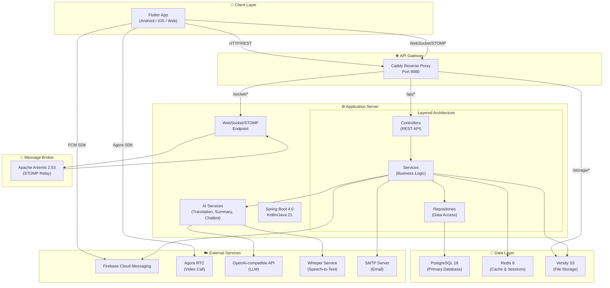

### 2.1.2. Kiến trúc phía Server (Backend)

Server được xây dựng theo mô hình **3-Layer Architecture**:

| Tầng | Thành phần | Chức năng |
|------|-----------|-----------|
| **Presentation** | 11 REST Controllers | Tiếp nhận HTTP request, validation, trả response |
| **Business Logic** | 24+ Services | Xử lý logic nghiệp vụ, tích hợp AI |
| **Data Access** | 12 JPA Repositories | Truy vấn và thao tác với PostgreSQL |

**Danh sách Controllers:**
- `UserController` — Quản lý tài khoản, xác thực, FCM token
- `MessageController` — CRUD tin nhắn, dịch thuật, tóm tắt
- `ChatRoomController` — Quản lý phòng chat
- `GroupChatController` — Quản lý nhóm chat
- `InvitationController` — Lời mời kết bạn/nhóm
- `ChatbotController` — Chatbot AI với SSE streaming
- `SpeechToTextController` — Chuyển giọng nói thành văn bản
- `PresenceWebSocketController` — Trạng thái online/offline
- `HealthController` — Health check endpoint
- `ExceptionController` — Xử lý ngoại lệ toàn cục

### 2.1.3. Kiến trúc phía Client (Frontend)

Client Flutter sử dụng **Provider Pattern** cho state management:

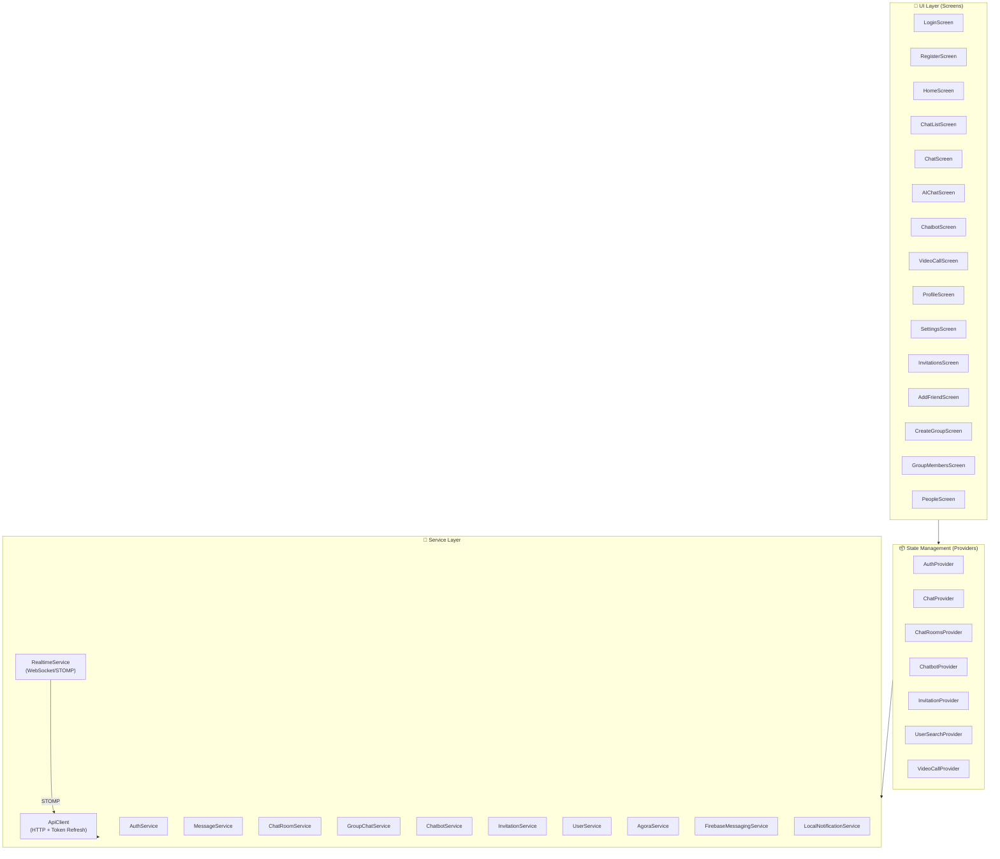

## 2.2. Biểu đồ Use Case tổng quan

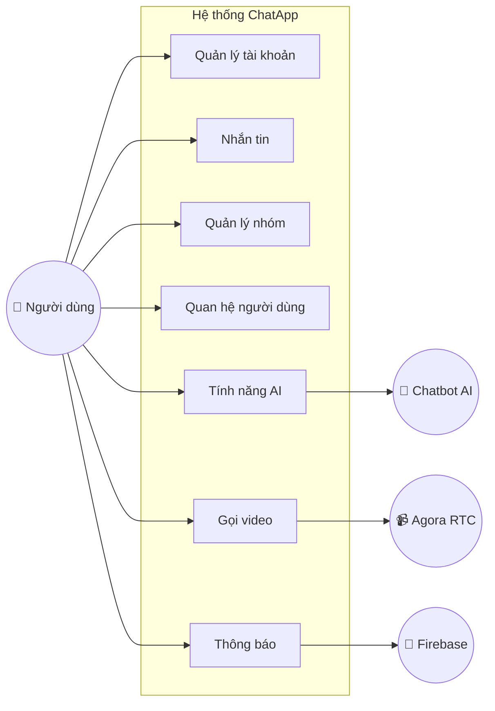

## 2.3. Biểu đồ Use Case chi tiết

### 2.3.1. Module Quản lý tài khoản

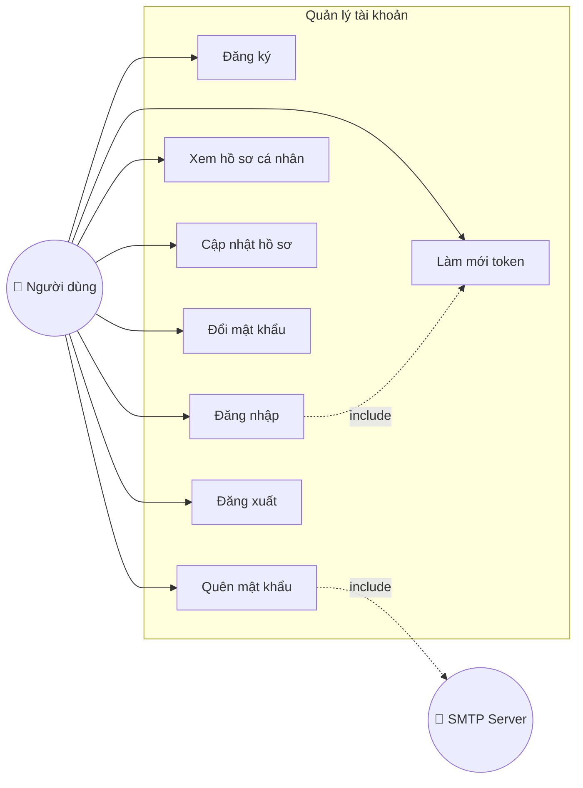

### 2.3.2. Module Nhắn tin

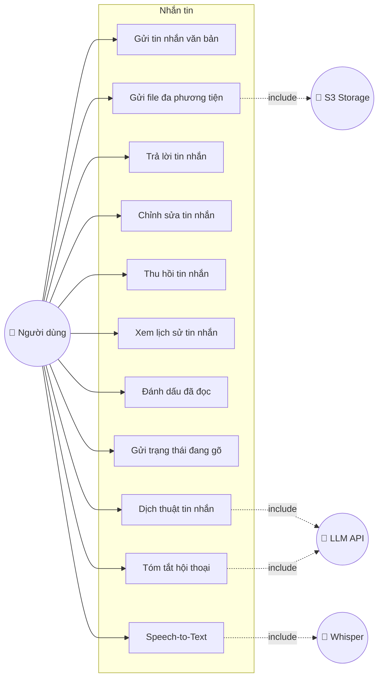

### 2.3.3. Module Quản lý nhóm

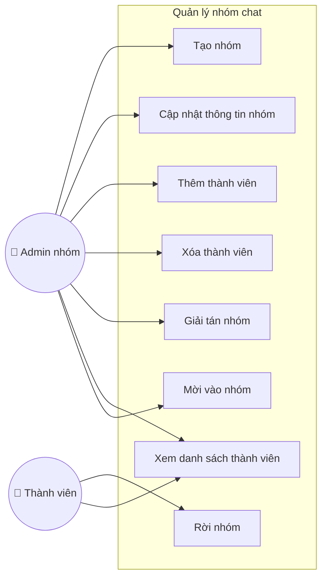

### 2.3.4. Module Tính năng AI

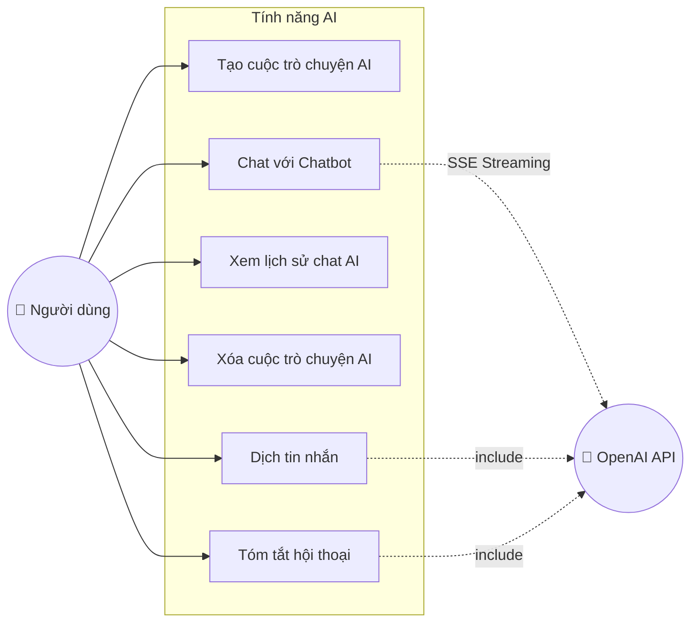

### 2.3.5. Module Video Call & Thông báo

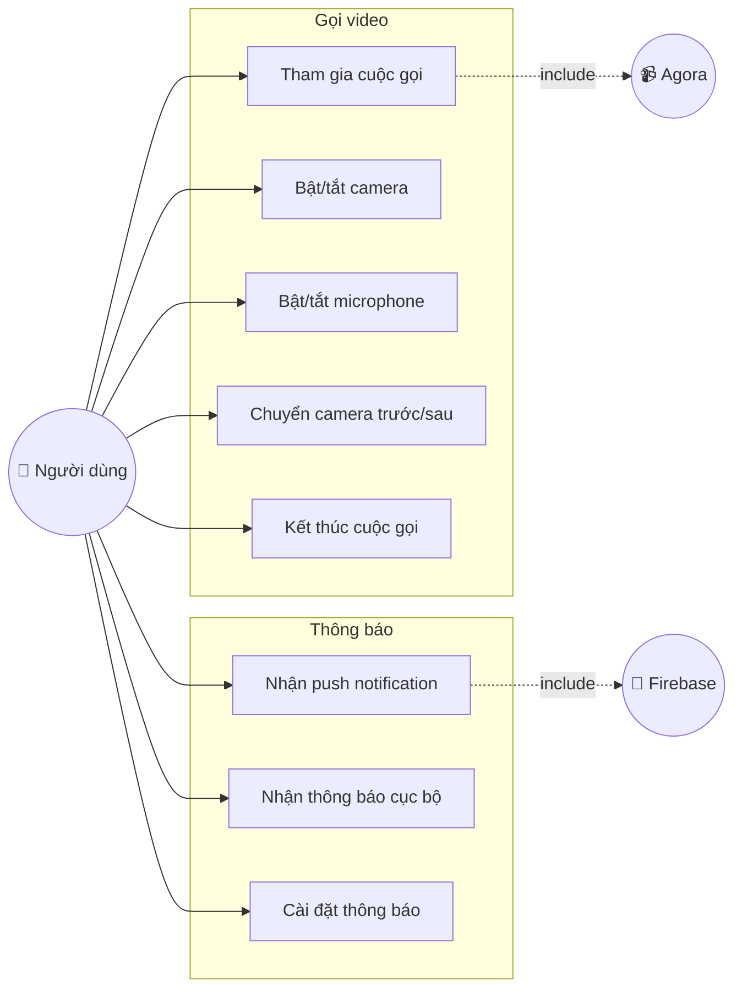

## 2.4. Biểu đồ lớp (Class Diagram)

### 2.4.1. Biểu đồ lớp — Entity Models (Server)

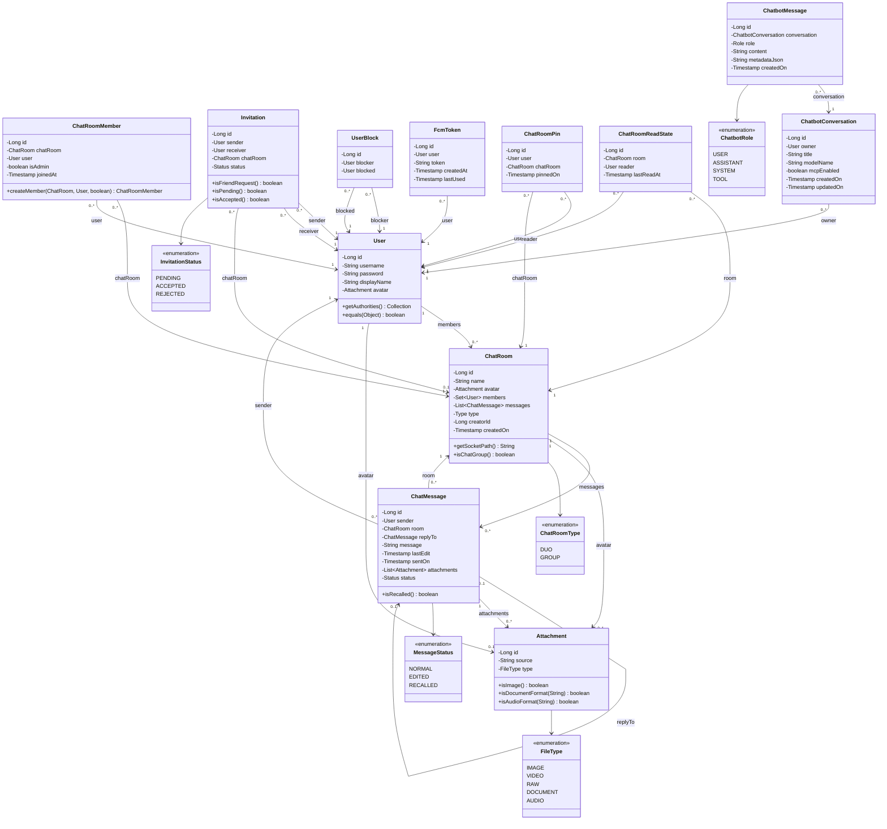

### 2.4.2. Biểu đồ lớp — Service Layer (Server)

```mermaid
classDiagram
    class UserService {
        +createUser(UserDto) void
        +searchUser(String, int) List
        +getCurrentProfile() UserWithAvatarDto
        +updateCurrentProfile(UserProfileUpdateDto) UserWithAvatarDto
        +changePassword(String, String) void
        +requestPasswordReset(String) void
        +resetPassword(String, String) void
    }

    class JwtsService {
        +tokenObtainPair(UserDto) TokenObtainPairDto
        +refreshToken(String) TokenRefreshDto
        +revokeRefreshToken(String) void
    }

    class MessageService {
        +getMessages(long, int) List
        +sendMessage(long, MessageSendDto) MessageSendResponseDto
        +changeMessage(long, MessageSendDto) void
        +deleteMessage(long) void
        +setTypingStatus(long, boolean) void
        +setReadStatus(long) void
    }

    class ChatRoomService {
        +listRooms() List
        +getOrCreateDuoRoom(long) ChatRoom
    }

    class GroupChatService {
        +createGroup(GroupChatCreateDto) GroupChatDto
        +updateGroup(long, GroupChatUpdateDto) GroupChatDto
        +addMembers(long, List) GroupChatDto
        +removeMember(long, long) void
        +leaveGroup(long) void
        +dissolveGroup(long) void
    }

    class ChatbotService {
        +listConversations() List
        +createConversation(ChatbotConversationCreateDto) ChatbotConversationDto
        +listMessages(long) List
        +deleteConversation(long) void
        +streamReply(long, ChatbotStreamRequestDto) SseEmitter
    }

    class TranslationService {
        +translate(MessageTranslateRequestDto) MessageTranslationDto
    }

    class SummaryService {
        +summarize(MessageSummarizeRequestDto) MessageSummaryDto
    }

    class NotificationService {
        +sendPushNotification(User, String, String) void
    }

    class S3Service {
        +uploadFile(MultipartFile) String
        +deleteFile(String) void
    }

    class PresenceService {
        +getPresence(String) UserPresenceDto
        +setPresence(String, boolean) void
    }

    MessageService --> ChatRoomService
    MessageService --> NotificationService
    MessageService --> S3Service
    GroupChatService --> ChatRoomService
    GroupChatService --> NotificationService
    ChatbotService --> TranslationService
    UserService --> S3Service
```

## 2.5. Biểu đồ tuần tự (Sequence Diagram)

### 2.5.1. Luồng Đăng nhập (Login Flow)

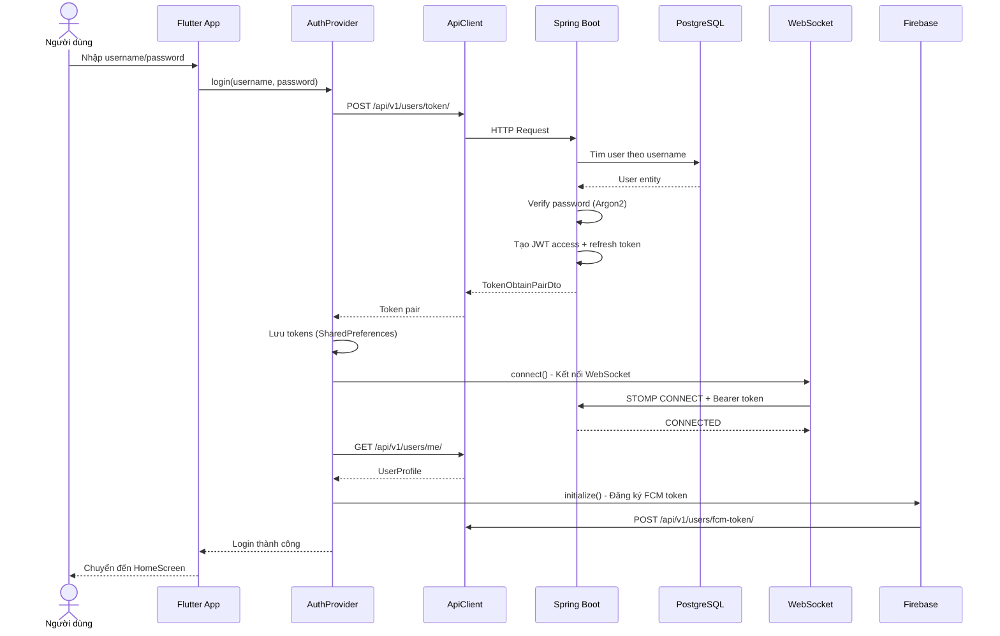

### 2.5.2. Luồng Gửi tin nhắn (Send Message Flow)

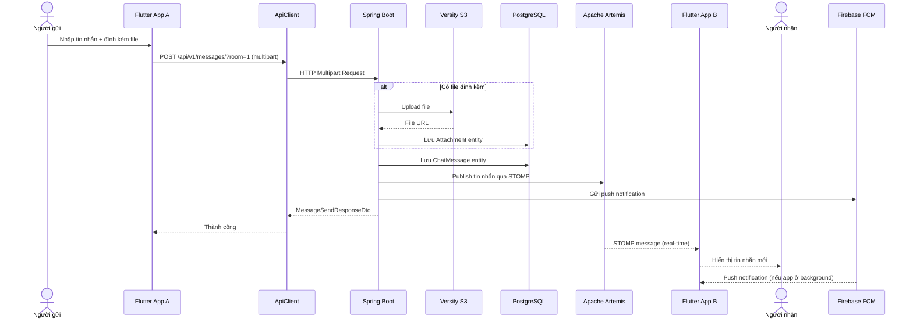

### 2.5.3. Luồng Chatbot AI (AI Chat Flow)

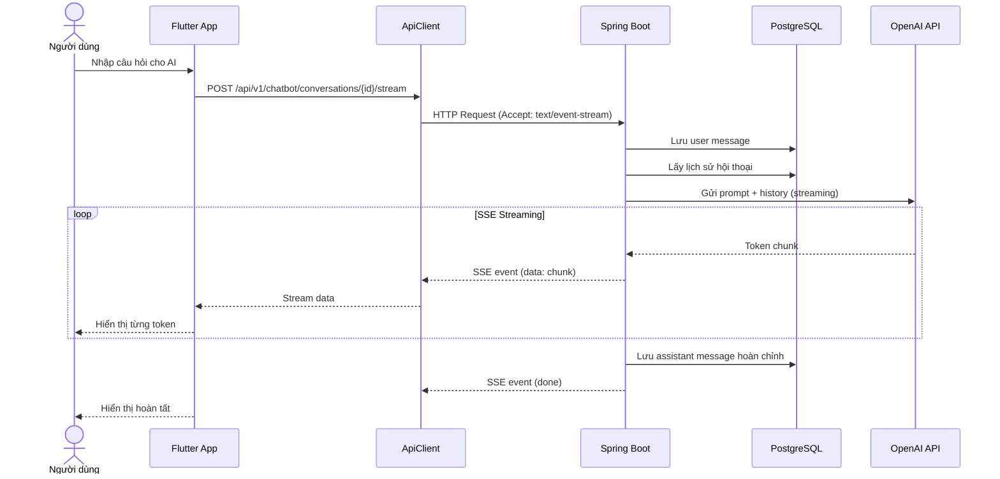

### 2.5.4. Luồng Video Call

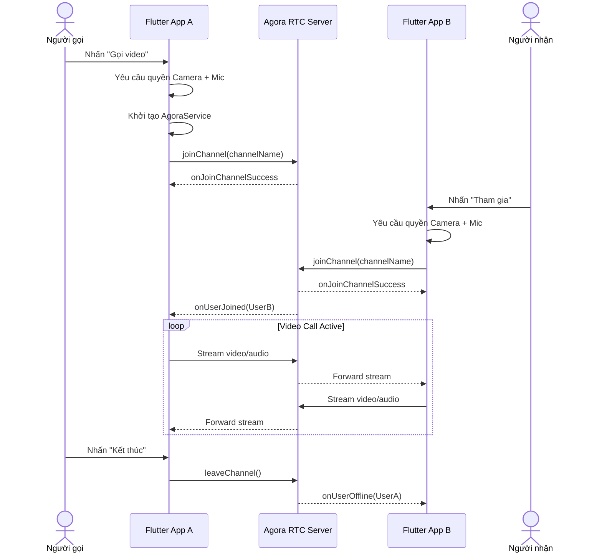

## 2.6. Sơ đồ thực thể quan hệ (ER Diagram)

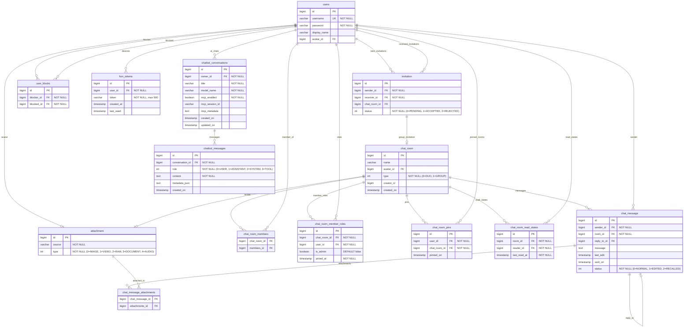

## 2.7. Giao diện đáp ứng chức năng và luồng

Ứng dụng ChatApp Flutter sử dụng **Dark Theme** với tông màu xanh dương (`#3B82F6`) làm chủ đạo. Dưới đây là mô tả chi tiết các màn hình chính:

### 2.7.1. Màn hình Đăng nhập (LoginScreen)

- **Chức năng**: F02 (Đăng nhập)
- **Mô tả**: Form đăng nhập với 2 trường nhập (username, password), nút "Đăng nhập" và liên kết "Đăng ký tài khoản mới". Hiển thị loading indicator và thông báo lỗi thân thiện bằng tiếng Việt khi không kết nối được server.
- **Luồng**: Nhập thông tin → Nhấn đăng nhập → Validate → Gọi API → Lưu token → Kết nối WebSocket → Chuyển đến HomeScreen.

### 2.7.2. Màn hình Đăng ký (RegisterScreen)

- **Chức năng**: F01 (Đăng ký tài khoản)
- **Mô tả**: Form đăng ký với các trường username, password, xác nhận password. Validate ở client-side trước khi gọi API.
- **Luồng**: Nhập thông tin → Validate → Gọi API đăng ký → Thông báo thành công → Quay về màn hình đăng nhập.

### 2.7.3. Màn hình Chính (HomeScreen)

- **Chức năng**: Navigation hub
- **Mô tả**: Bottom navigation bar với 4 tab: Chat (danh sách phòng chat), Danh bạ (People), AI Chat, Cài đặt. Badge hiển thị số tin nhắn chưa đọc trên tab Chat.
- **Luồng**: Người dùng chuyển giữa các tab, mỗi tab là một màn hình con độc lập.

### 2.7.4. Màn hình Danh sách Chat (ChatListScreen)

- **Chức năng**: F07, F08, F35 (Nhắn tin, Ghim phòng)
- **Mô tả**: Danh sách phòng chat được sắp xếp theo tin nhắn mới nhất. Mỗi phòng hiển thị: avatar, tên, tin nhắn cuối, thời gian, badge chưa đọc. Phòng chat đã ghim nằm trên cùng. Nút floating action để tạo nhóm mới hoặc thêm bạn.
- **Luồng**: Nhấn vào phòng → Mở ChatScreen | Vuốt để ghim/bỏ ghim | Nhấn FAB → Tạo nhóm/Thêm bạn.

### 2.7.5. Màn hình Nhắn tin (ChatScreen)

- **Chức năng**: F07-F14, F28-F30 (Nhắn tin, AI features)
- **Mô tả**: Màn hình chính của ứng dụng. Gồm: AppBar (tên phòng, avatar, trạng thái online), vùng hiển thị tin nhắn (message bubbles với phân biệt gửi/nhận), thanh nhập tin nhắn (text input, nút gửi file, ghi âm). Hỗ trợ: reply tin nhắn (swipe), long-press để chỉnh sửa/thu hồi/dịch/tóm tắt, hiển thị "đang nhập...", attachment preview (ảnh, video, audio player, document).
- **Luồng**: Nhập tin nhắn → Gửi (REST API) → Broadcast qua WebSocket → Render real-time cho tất cả thành viên.

### 2.7.6. Màn hình Chatbot AI (ChatbotScreen)

- **Chức năng**: F27 (Chatbot AI)
- **Mô tả**: Giao diện chat riêng với AI. Sidebar hiển thị danh sách conversations. Tin nhắn AI hỗ trợ Markdown rendering. Response được stream real-time (SSE) với typing animation.
- **Luồng**: Tạo conversation → Nhập câu hỏi → Stream response từ LLM → Render Markdown → Lưu lịch sử.

### 2.7.7. Màn hình Video Call (VideoCallScreen)

- **Chức năng**: F31 (Gọi video)
- **Mô tả**: Grid layout hiển thị video (1-4 người tham gia). Toolbar ở dưới: Mute/Unmute, Camera On/Off, Switch Camera, End Call. Status bar hiển thị trạng thái kết nối và số người tham gia.
- **Luồng**: Nhập channel name → Yêu cầu quyền → Join Agora channel → Stream video/audio → End call.

### 2.7.8. Màn hình Cài đặt (SettingsScreen)

- **Chức năng**: F04, F05, F34 (Cập nhật profile, Đổi MK, Cài đặt thông báo)
- **Mô tả**: Hiển thị avatar và tên người dùng ở trên cùng. Danh sách cài đặt: Chỉnh sửa hồ sơ, Đổi mật khẩu, Danh sách bị chặn, Cài đặt thông báo, Cài đặt dịch thuật, Đăng xuất.

### 2.7.9. Các màn hình phụ trợ

| Màn hình | Chức năng | Mô tả ngắn |
|----------|-----------|-------------|
| AddFriendScreen | F21, F22 | Tìm kiếm user và gửi lời mời kết bạn |
| InvitationsScreen | F23, F24 | Xem và xử lý lời mời kết bạn/nhóm |
| CreateGroupScreen | F15 | Chọn thành viên và tạo nhóm chat mới |
| GroupMembersScreen | F16-F20 | Quản lý thành viên nhóm (admin features) |
| PeopleScreen | F26 | Danh sách bạn bè với trạng thái online |
| ProfileScreen | F04 | Xem/chỉnh sửa hồ sơ cá nhân |
| ChangePasswordScreen | F05 | Form đổi mật khẩu |


---

# CHƯƠNG 3: KẾT QUẢ

## 3.1. Mô hình triển khai ứng dụng

Ứng dụng ChatApp được triển khai theo mô hình **Docker Compose** với 6 container:

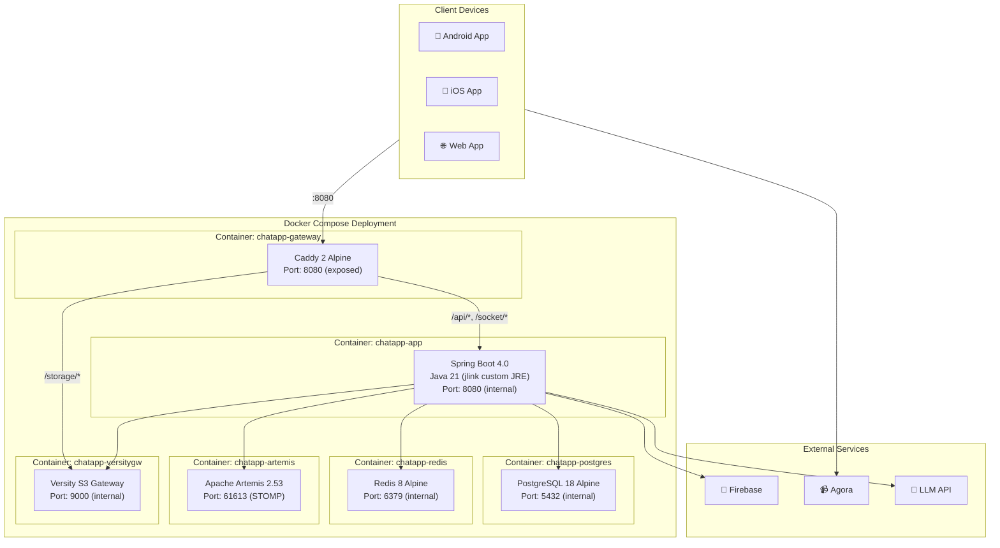

**Chi tiết routing của Caddy Gateway:**

| Path | Đích | Mô tả |
|------|------|-------|
| `/api/*` | `app:8080` | RESTful API endpoints |
| `/ws*` | `app:8080` | WebSocket native endpoint |
| `/socket*` | `app:8080` | SockJS fallback endpoint |
| `/storage/*` | `versitygw:9000` | S3 file storage (strip prefix) |
| `/*` (default) | `app:8080` | Các request khác |

## 3.2. Các bước cài đặt và triển khai ứng dụng

### 3.2.1. Yêu cầu hệ thống

| Thành phần | Yêu cầu |
|---|---|
| Docker | Docker Engine 24+ với Docker Compose v2 |
| RAM Server | Tối thiểu 4GB (khuyến nghị 8GB) |
| Disk | Tối thiểu 10GB cho dữ liệu |
| Flutter SDK | 3.5+ (cho phát triển client) |
| Java JDK | 21+ (cho phát triển server) |
| Android SDK | API Level 31+ (cho build Android) |

### 3.2.2. Triển khai Backend (Server)

**Bước 1: Clone repository**
```bash
git clone <repository-url> chatapp
cd chatapp
```

**Bước 2: Cấu hình môi trường**
```bash
cp .env.example .env
# Chỉnh sửa file .env với các giá trị thực tế:
# - JWTS_SECRET: khóa bí mật JWT (tối thiểu 32 bytes)
# - DB_PASSWORD: mật khẩu PostgreSQL
# - S3_ACCESS_KEY/S3_SECRET_KEY: khóa truy cập S3
# - LLM_API_KEY: API key cho dịch vụ AI
# - FIREBASE_SERVICE_ACCOUNT_PATH: đường dẫn file service account
# - SMTP_USERNAME/SMTP_PASSWORD: thông tin SMTP cho gửi email
# - AGORA_APP_ID/AGORA_APP_CERTIFICATE: thông tin Agora
```

**Bước 3: Cấu hình Firebase**
```bash
mkdir -p secrets
# Copy file firebase-service-account.json vào thư mục secrets/
cp /path/to/firebase-service-account.json secrets/
```

**Bước 4: Khởi chạy Docker Compose**
```bash
docker compose up -d
```

**Bước 5: Kiểm tra trạng thái**
```bash
docker compose ps
# Đảm bảo tất cả 6 container đều ở trạng thái "running (healthy)"
```

Server sẽ khả dụng tại `http://localhost:8080`. API documentation tại `http://localhost:8080/swagger-ui.html`.

### 3.2.3. Triển khai Frontend (Client Flutter)

**Bước 1: Clone repository**
```bash
git clone <repository-url> chatapp-flutter
cd chatapp-flutter
```

**Bước 2: Cấu hình API URL**
```bash
cp .env.example.json .env.json
# Chỉnh sửa .env.json:
# { "API_BASE_URL": "http://<server-ip>:8080" }
```

**Bước 3: Cấu hình Firebase (Android)**
```bash
# Copy google-services.json vào android/app/
cp /path/to/google-services.json android/app/
```

**Bước 4: Cấu hình Agora**
```bash
# Chỉnh sửa lib/core/agora_config.dart
# Thay <YOUR_APP_ID> bằng Agora App ID thực tế
```

**Bước 5: Cài đặt dependencies và build**
```bash
flutter pub get

# Build cho Android
flutter build apk --release

# Hoặc chạy trên thiết bị kết nối
flutter run
```

## 3.3. Các kết quả thực hiện được

### 3.3.1. Tổng quan chức năng đã hoàn thành

| # | Nhóm chức năng | Số tính năng | Trạng thái |
|---|---|---|---|
| 1 | Quản lý tài khoản | 6 | ✅ Hoàn thành |
| 2 | Nhắn tin (1-1 và nhóm) | 8 | ✅ Hoàn thành |
| 3 | Quản lý nhóm chat | 6 | ✅ Hoàn thành |
| 4 | Quan hệ người dùng | 6 | ✅ Hoàn thành |
| 5 | Tính năng AI | 4 | ✅ Hoàn thành |
| 6 | Đa phương tiện & Thông báo | 5 | ✅ Hoàn thành |
| **Tổng** | | **35** | **✅ 35/35** |

### 3.3.2. Chi tiết chức năng qua giao diện

#### A. Module Xác thực

| Giao diện | Chức năng chi tiết |
|---|---|
| **LoginScreen** | Đăng nhập bằng username/password, hiển thị lỗi xác thực, loading state, auto-connect WebSocket sau đăng nhập |
| **RegisterScreen** | Đăng ký tài khoản mới, validate mật khẩu, chuyển về login sau thành công |
| **ChangePasswordScreen** | Đổi mật khẩu với xác nhận mật khẩu cũ, validate mật khẩu mới |

#### B. Module Nhắn tin

| Giao diện | Chức năng chi tiết |
|---|---|
| **ChatListScreen** | Danh sách phòng chat real-time, badge tin chưa đọc, ghim/bỏ ghim phòng, sắp xếp theo thời gian |
| **ChatScreen** | Gửi/nhận tin nhắn real-time, gửi ảnh/video/audio/tài liệu, reply tin nhắn (swipe), chỉnh sửa tin nhắn, thu hồi tin nhắn, typing indicator, đánh dấu đã đọc, dịch thuật, tóm tắt, speech-to-text |

#### C. Module Quản lý nhóm

| Giao diện | Chức năng chi tiết |
|---|---|
| **CreateGroupScreen** | Tạo nhóm mới, chọn thành viên từ danh sách bạn bè, đặt tên nhóm |
| **GroupMembersScreen** | Xem danh sách thành viên, thêm/xóa thành viên (admin), phân quyền admin, rời nhóm, giải tán nhóm, cập nhật tên/avatar nhóm |

#### D. Module Quan hệ người dùng

| Giao diện | Chức năng chi tiết |
|---|---|
| **AddFriendScreen** | Tìm kiếm người dùng theo username, gửi lời mời kết bạn |
| **InvitationsScreen** | Xem lời mời đến/đi, chấp nhận/từ chối lời mời kết bạn và mời nhóm |
| **PeopleScreen** | Danh sách bạn bè, trạng thái online/offline real-time, nhấn để mở chat |

#### E. Module AI

| Giao diện | Chức năng chi tiết |
|---|---|
| **ChatbotScreen** | Chat với AI, streaming response (SSE), Markdown rendering, quản lý nhiều cuộc hội thoại, xóa cuộc hội thoại |
| **ChatScreen (AI features)** | Dịch thuật tin nhắn (hỗ trợ nhiều ngôn ngữ), tóm tắt hội thoại, chuyển giọng nói thành văn bản |

#### F. Module Video Call & Thông báo

| Giao diện | Chức năng chi tiết |
|---|---|
| **JoinVideoCallScreen** | Nhập tên kênh, yêu cầu quyền camera/mic, tham gia cuộc gọi |
| **VideoCallScreen** | Grid layout video 1-4 người, mute/unmute, camera on/off, switch camera, kết thúc cuộc gọi |
| **SettingsScreen** | Bật/tắt push notification, cài đặt ngôn ngữ dịch thuật mặc định |

## 3.4. Kết quả thử nghiệm/triển khai

### 3.4.1. Môi trường triển khai

| Thông số | Chi tiết |
|---|---|
| Server | Docker Compose trên máy local/VPS |
| Database | PostgreSQL 18 Alpine |
| Client Test | Android (thiết bị thật), Web (Chrome) |
| Kết nối | Tailscale VPN (cho test từ xa) |

### 3.4.2. Thống kê dữ liệu thử nghiệm

| Thực thể | Số lượng | Ghi chú |
|---|---|---|
| Bảng trong CSDL | 14 | 12 entity chính + 2 bảng join |
| REST API Endpoints | 30+ | Đầy đủ CRUD cho tất cả module |
| WebSocket Channels | 5+ | Chat, Invitation, Presence, Typing, Read |
| Service Classes (Server) | 24+ | Bao gồm 4 AI service |
| Flutter Screens | 17 | 2 auth + 10 home + 5 chat |
| Flutter Providers | 7 | State management cho từng module |
| Flutter Services | 19 | API client, realtime, Firebase, Agora |
| Flutter Models | 16 | Data transfer objects |

### 3.4.3. Kết quả kiểm thử

| Test Case | Kết quả | Ghi chú |
|---|---|---|
| Đăng ký tài khoản mới | ✅ Pass | Mã hóa Argon2, validate unique username |
| Đăng nhập/Đăng xuất | ✅ Pass | JWT token pair, auto-refresh 401 |
| Gửi tin nhắn văn bản | ✅ Pass | Real-time qua WebSocket < 500ms |
| Gửi file ảnh/video | ✅ Pass | Upload S3, preview trong chat |
| Gửi file tài liệu | ✅ Pass | PDF, DOC, XLS với icon phân biệt |
| Ghi âm và Speech-to-Text | ✅ Pass | Whisper transcription tiếng Việt |
| Reply/Edit/Recall tin nhắn | ✅ Pass | Real-time update cho tất cả người dùng |
| Tạo nhóm chat | ✅ Pass | Tối thiểu 3 thành viên |
| Quản lý thành viên nhóm | ✅ Pass | Phân quyền admin/member |
| Chatbot AI streaming | ✅ Pass | SSE response, Markdown render |
| Dịch thuật tin nhắn | ✅ Pass | Đa ngôn ngữ qua LLM |
| Video call 1-1 | ✅ Pass | Agora RTC, camera/mic toggle |
| Push notification | ✅ Pass | FCM trên Android |
| Auto-reconnect WebSocket | ✅ Pass | 4s delay + token refresh |
| Chặn/Bỏ chặn người dùng | ✅ Pass | Ẩn tin nhắn từ người bị chặn |
| Ghim phòng chat | ✅ Pass | Persistent, hiển thị đầu danh sách |

## 3.5. Kết luận và các điểm hạn chế

### 3.5.1. Kết luận

Nhóm đã hoàn thành việc phát triển ứng dụng nhắn tin thời gian thực **ChatApp** với đầy đủ 35 chức năng theo yêu cầu. Ứng dụng đáp ứng được các mục tiêu đề ra:

1. **Kiến trúc phần mềm hiện đại**: Áp dụng thành công kiến trúc phân lớp (Layered Architecture) phía server và Provider Pattern phía client, đảm bảo tính module hóa và dễ bảo trì.

2. **Real-time Communication**: Triển khai thành công hệ thống nhắn tin thời gian thực với WebSocket/STOMP và Apache Artemis message broker, đảm bảo tin nhắn được gửi nhận tức thì.

3. **Tích hợp AI**: Tích hợp thành công 4 tính năng AI (Chatbot, Dịch thuật, Tóm tắt, Speech-to-Text) sử dụng OpenAI-compatible API và Whisper, nâng cao trải nghiệm người dùng.

4. **Đa nền tảng**: Client Flutter chạy trên Android, iOS và Web từ cùng một codebase, tiết kiệm chi phí phát triển.

5. **Container hóa**: Toàn bộ backend được đóng gói trong Docker Compose với 6 container, dễ dàng triển khai và mở rộng.

6. **Bảo mật**: Triển khai đầy đủ các cơ chế bảo mật: Argon2 password hashing, JWT với refresh token, OAuth2 Resource Server, WebSocket authentication.

### 3.5.2. Các điểm hạn chế

| # | Hạn chế | Mô tả | Hướng khắc phục |
|---|---------|-------|-----------------|
| 1 | Chưa có End-to-End Encryption | Tin nhắn được mã hóa TLS trong transit nhưng chưa có E2E encryption | Tích hợp Signal Protocol hoặc tương tự |
| 2 | Video call chưa có call invitation | Người dùng cần biết trước tên channel để tham gia | Tích hợp Agora Call Invitation API |
| 3 | Web không hỗ trợ Push Notification | Firebase Web SDK chưa được tích hợp | Thêm Firebase Web SDK + Service Worker |
| 4 | Chưa có Unit Test đầy đủ | Test coverage còn thấp | Bổ sung JUnit test cho server, Widget test cho Flutter |
| 5 | Chưa hỗ trợ tin nhắn offline | Tin nhắn chỉ gửi được khi có kết nối | Implement message queue local + sync |
| 6 | Whisper service chưa tích hợp Docker | Whisper service hiện đang comment trong compose.yml | Uncomment và cấu hình GPU support |
| 7 | Chưa có screen sharing | Video call chưa hỗ trợ chia sẻ màn hình | Sử dụng Agora Screen Sharing API |
| 8 | Single server deployment | Chưa hỗ trợ horizontal scaling | Chuyển sang Kubernetes hoặc Docker Swarm |

## 3.6. Tài liệu tham khảo

| # | Tài liệu | URL |
|---|----------|-----|
| 1 | Spring Boot Documentation | https://docs.spring.io/spring-boot/docs/current/reference/htmlsingle/ |
| 2 | Flutter Documentation | https://docs.flutter.dev/ |
| 3 | Spring WebSocket (STOMP) Guide | https://docs.spring.io/spring-framework/reference/web/websocket.html |
| 4 | Apache Artemis Documentation | https://activemq.apache.org/components/artemis/documentation/ |
| 5 | PostgreSQL Documentation | https://www.postgresql.org/docs/ |
| 6 | Redis Documentation | https://redis.io/docs/ |
| 7 | Firebase Cloud Messaging | https://firebase.google.com/docs/cloud-messaging |
| 8 | Agora RTC Engine (Flutter) | https://docs.agora.io/en/Video/landing-page?platform=Flutter |
| 9 | OpenAI API Documentation | https://platform.openai.com/docs/api-reference |
| 10 | OpenAI Whisper | https://github.com/openai/whisper |
| 11 | Docker Compose Documentation | https://docs.docker.com/compose/ |
| 12 | Caddy Web Server | https://caddyserver.com/docs/ |
| 13 | Versity S3 Gateway | https://github.com/versity/versitygw |
| 14 | STOMP Protocol Specification | https://stomp.github.io/stomp-specification-1.2.html |
| 15 | Provider Package (Flutter) | https://pub.dev/packages/provider |
| 16 | Spring Security OAuth2 | https://docs.spring.io/spring-security/reference/servlet/oauth2/index.html |
| 17 | JWT (JSON Web Tokens) | https://jwt.io/introduction |
| 18 | Argon2 Password Hashing | https://github.com/P-H-C/phc-winner-argon2 |

---

> **Ngày hoàn thành**: 04/05/2026
> **Nhóm thực hiện**: Nhóm 4


