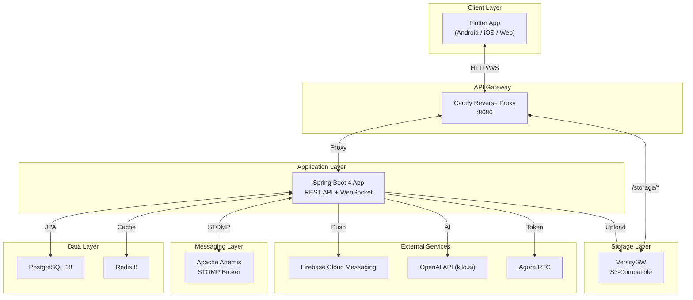
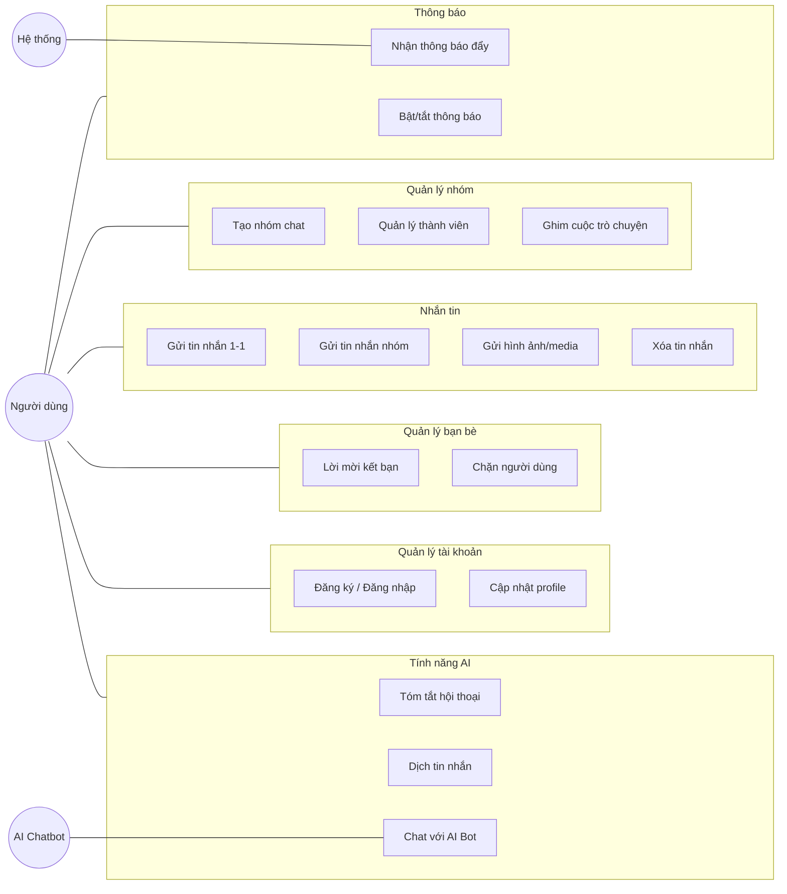
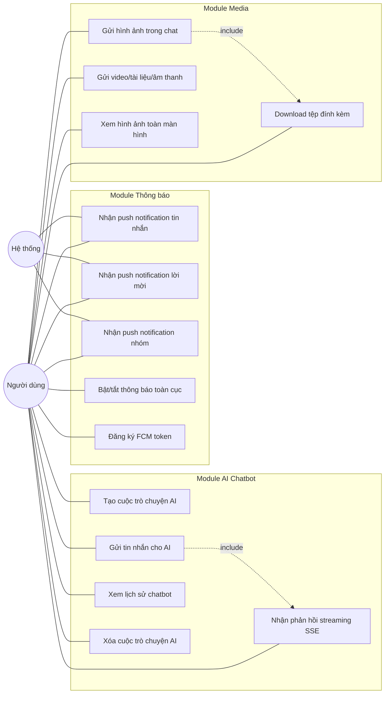
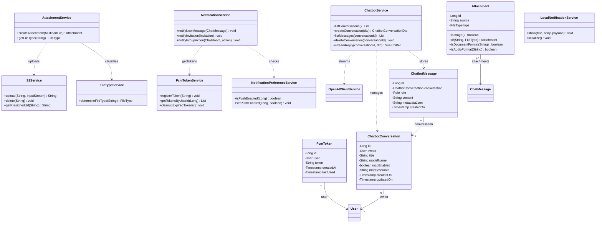
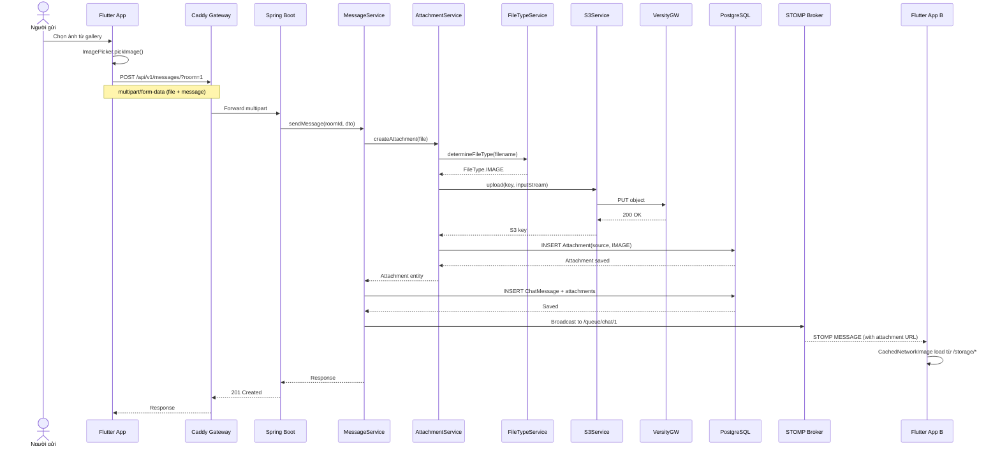
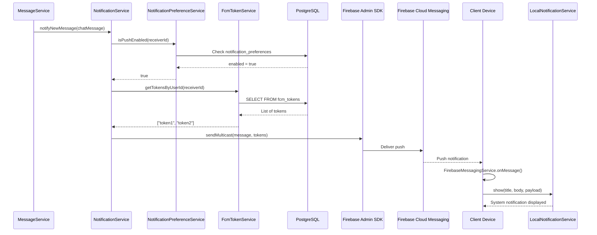
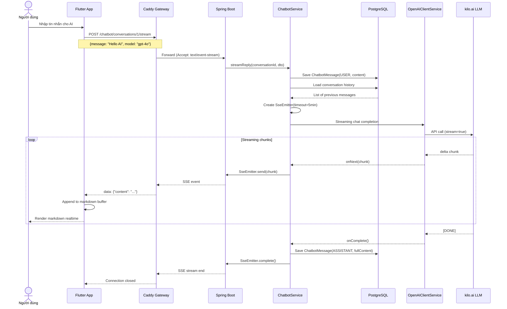
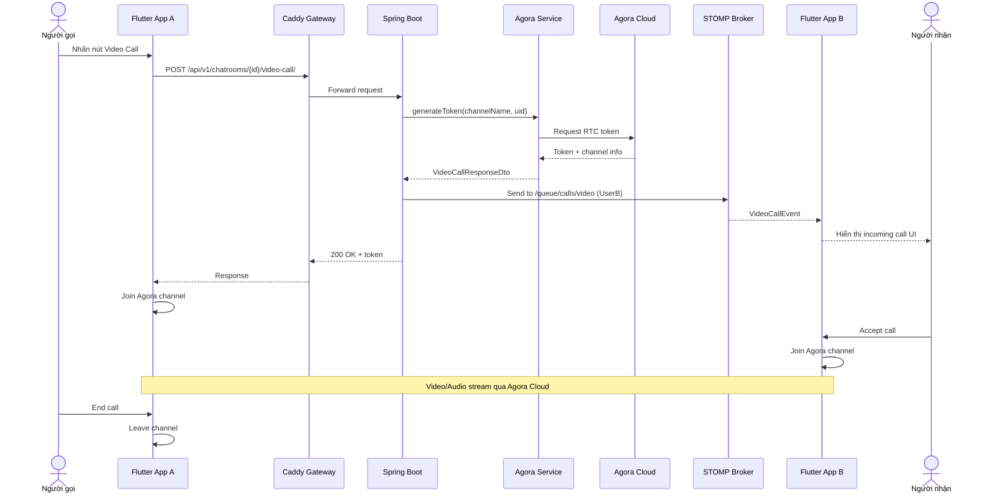
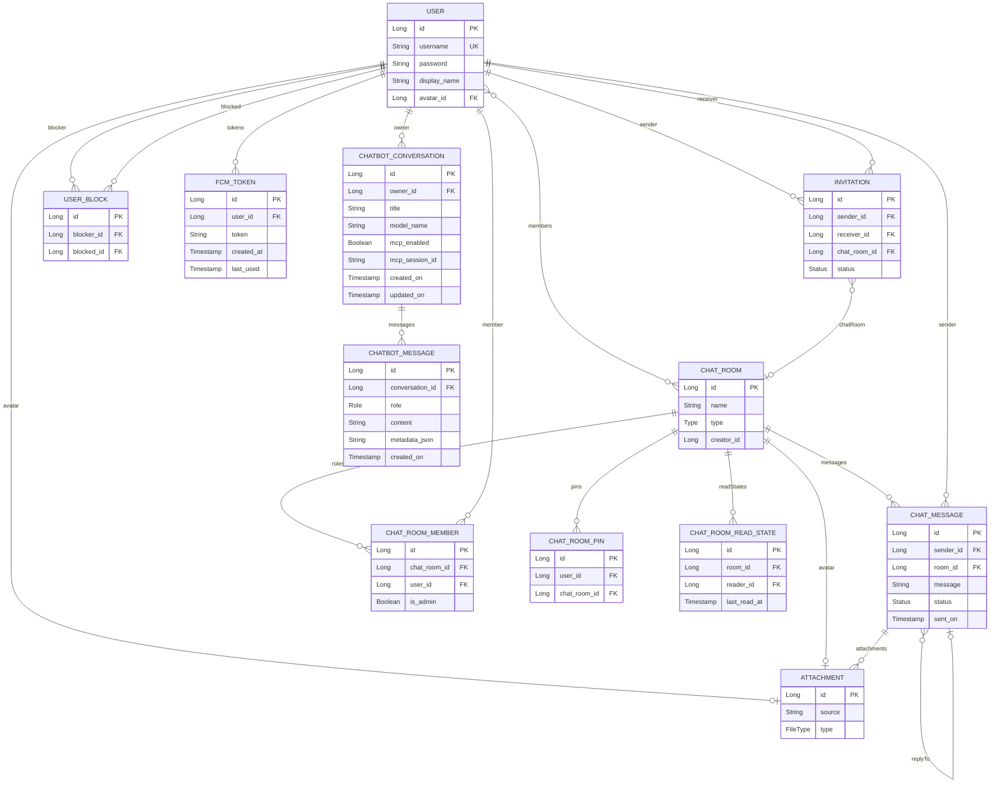
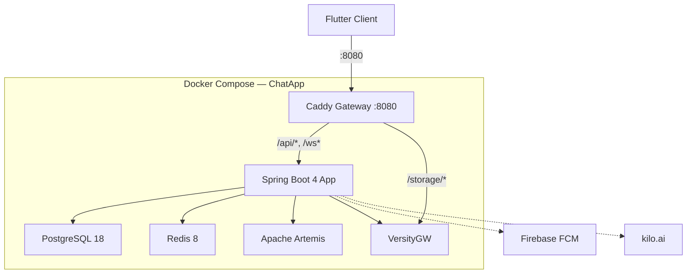

# BẢNG PHÂN CÔNG NHIỆM VỤ

| STT | Họ và tên           | MSSV       | Nhiệm vụ cụ thể                                                                                                          | Đóng góp (%) |
| :-: | ------------------- | ---------- | ------------------------------------------------------------------------------------------------------------------------ | :----------: |
|  1  | Nguyễn Văn Duy      | B22DCCN154 | Gửi hình ảnh/media, Thông báo đẩy (FCM), Chatbot AI streaming, Video Call (Agora)                                        |     25%      |
|  2  | Nguyễn Hoàng Hiệp   | B22DCCN298 | Chat cá nhân 1-1, Gửi/nhận tin nhắn, Typing indicator, Trạng thái đã xem, Xóa tin nhắn, Dịch tin nhắn AI, Voice-to-Text  |     25%      |
|  3  | Nguyễn Quang Minh   | B22DCCN538 | Tài khoản (Đăng ký, Đăng nhập, Quên MK, Profile), Quản lý bạn bè (Lời mời, Chặn, Xóa bạn), Trạng thái online, Tóm tắt AI |     25%      |
|  4  | Đặng Hữu Hoàng Quân | B22DCCN658 | Danh sách cuộc trò chuyện, Tìm kiếm, Ghim chat, Tạo nhóm, Quản lý thành viên nhóm, Phân quyền admin                      |     25%      |

_Bảng 0.1: Bảng phân công nhiệm vụ các thành viên_

---

# MỤC LỤC

---

<div style="page-break-before: always;"></div>

# DANH SÁCH VIẾT TẮT

| Viết tắt  | Ý nghĩa                                         |
| --------- | ----------------------------------------------- |
| API       | Application Programming Interface               |
| CRUD      | Create, Read, Update, Delete                    |
| DTO       | Data Transfer Object                            |
| FCM       | Firebase Cloud Messaging                        |
| GVHD      | Giảng viên hướng dẫn                            |
| HTTP      | HyperText Transfer Protocol                     |
| JPA       | Java Persistence API                            |
| JWT       | JSON Web Token                                  |
| LLM       | Large Language Model                            |
| MK        | Mật khẩu                                        |
| MSSV      | Mã số sinh viên                                 |
| ORM       | Object-Relational Mapping                       |
| REST      | Representational State Transfer                 |
| S3        | Simple Storage Service                          |
| SDK       | Software Development Kit                        |
| SQL       | Structured Query Language                       |
| SSE       | Server-Sent Events                              |
| STOMP     | Simple Text Oriented Messaging Protocol         |
| UI        | User Interface                                  |
| UML       | Unified Modeling Language                       |
| WebSocket | Giao thức truyền thông hai chiều thời gian thực |

_Bảng 0.2: Danh sách viết tắt_

---

# DANH SÁCH HÌNH

| Ký hiệu   | Mô tả                                             |
| --------- | ------------------------------------------------- |
| Hình 2.1  | Sơ đồ kiến trúc tổng quan hệ thống ChatApp        |
| Hình 2.2  | Biểu đồ Use Case tổng quan                        |
| Hình 2.3  | Biểu đồ Use Case chi tiết — Media, Thông báo & AI |
| Hình 2.4  | Biểu đồ lớp — Module Media, Thông báo & AI        |
| Hình 2.5  | Biểu đồ tuần tự — Gửi hình ảnh                    |
| Hình 2.6  | Biểu đồ tuần tự — Push notification               |
| Hình 2.7  | Biểu đồ tuần tự — Chatbot AI streaming            |
| Hình 2.8  | Biểu đồ tuần tự — Video Call (Agora RTC)          |
| Hình 2.9  | Sơ đồ thực thể quan hệ (ER Diagram)               |
| Hình 2.10 | Giao diện ChatScreen — Gửi hình ảnh               |
| Hình 2.11 | Giao diện AI Chatbot                              |
| Hình 2.12 | Giao diện Cài đặt thông báo                       |
| Hình 3.1  | Sơ đồ triển khai Docker Compose                   |
| Hình 3.2  | Kết quả — Gửi hình ảnh                            |
| Hình 3.3  | Kết quả — Push notification                       |
| Hình 3.4  | Kết quả — AI Chatbot                              |
| Hình 3.5  | Kết quả — Gọi video 1-1                           |

_Bảng 0.3: Danh sách hình_

---

# DANH SÁCH BẢNG

| Ký hiệu  | Mô tả                                             |
| -------- | ------------------------------------------------- |
| Bảng 1.1 | Yêu cầu chức năng                                 |
| Bảng 1.2 | Yêu cầu phi chức năng                             |
| Bảng 1.3 | So sánh lựa chọn công nghệ                        |
| Bảng 3.1 | Kết quả thử nghiệm chức năng Media, Thông báo & AI |
| Bảng 3.2 | Đánh giá kiến trúc module Media, Thông báo & AI   |
| Bảng 3.3 | Phân tích hiệu năng module AI & Media             |

_Bảng 0.4: Danh sách bảng_

---

<div style="page-break-before: always;"></div>

# Chương 1: Mở đầu

## 1.1 Giới thiệu ứng dụng và lý do thực hiện

Trong thời đại công nghệ số hiện nay, nhu cầu giao tiếp trực tuyến ngày càng tăng cao. Các ứng dụng nhắn tin đã trở thành công cụ không thể thiếu trong cuộc sống hàng ngày, từ trao đổi công việc đến kết nối bạn bè, gia đình.

**ChatApp** là ứng dụng nhắn tin trực tuyến được phát triển bởi nhóm 4 sinh viên với mục tiêu xây dựng một hệ thống hoàn chỉnh, áp dụng các kiến thức kiến trúc phần mềm đã học. Ứng dụng hỗ trợ nhắn tin cá nhân, nhắn tin nhóm, gửi hình ảnh/tệp, gọi video, và tích hợp trí tuệ nhân tạo (AI) cho các tính năng tóm tắt, dịch thuật và chatbot.

**Lý do thực hiện:**

- **Nhu cầu thực tế**: Xây dựng sản phẩm phần mềm hoàn chỉnh từ thiết kế đến triển khai.
- **Kiến trúc hiện đại**: Áp dụng kiến trúc Client-Server với API Gateway, message broker, cache layer, object storage.
- **Công nghệ tiên tiến**: Spring Boot 4, Flutter, WebSocket (STOMP), Redis, Docker.
- **Tích hợp AI**: Large Language Model (LLM) qua OpenAI API cho tóm tắt, dịch thuật, chatbot.

## 1.2 Concept và mục tiêu

### Concept

ChatApp được thiết kế theo mô hình **Client-Server** với kiến trúc phân lớp:

- **Client**: Flutter đa nền tảng (Android, iOS, Web).
- **API Gateway**: Caddy reverse proxy.
- **Backend**: Spring Boot 4 application.
- **Hạ tầng**: PostgreSQL, Redis, Apache Artemis, VersityGW.

### Mục tiêu

1. Hệ thống nhắn tin thời gian thực (chat 1-1 và nhóm).
2. Gửi/nhận đa phương tiện (hình ảnh, video, tài liệu, âm thanh).
3. Thông báo đẩy qua Firebase Cloud Messaging.
4. Tính năng AI: tóm tắt, dịch, chatbot streaming.
5. Gọi video qua Agora RTC Engine.
6. Bảo mật JWT + Argon2.
7. Triển khai Docker Compose.

## 1.3 Phân tích yêu cầu

### 1.3.1 Yêu cầu chức năng

| STT | Mã    | Yêu cầu             | Mô tả                                      |
| :-: | ----- | ------------------- | ------------------------------------------ |
|  1  | FR-01 | Đăng ký tài khoản   | Tạo tài khoản với username/password        |
|  2  | FR-02 | Đăng nhập           | JWT token pair authentication              |
|  3  | FR-03 | Quên mật khẩu       | Email reset link                           |
|  4  | FR-05 | Cập nhật profile    | Đổi displayName, avatar                    |
|  5  | FR-06 | Quản lý bạn bè      | Lời mời kết bạn                            |
|  6  | FR-07 | Chặn người dùng     | Block/unblock                              |
|  7  | FR-08 | Nhắn tin 1-1        | Realtime DUO chat                          |
|  8  | FR-09 | Nhắn tin nhóm       | GROUP chat ≥3 người                        |
|  9  | FR-10 | Gửi media           | Upload hình ảnh, video, tài liệu, âm thanh |
| 10  | FR-11 | Trạng thái tin nhắn | Typing, đã gửi, đã xem                     |
| 11  | FR-12 | Xóa tin nhắn        | Thu hồi (recall)                           |
| 12  | FR-13 | Ghim chat           | Pin/unpin chatroom                         |
| 13  | FR-14 | Tìm kiếm            | Search user                                |
| 14  | FR-15 | Thông báo đẩy       | FCM push notification                      |
| 15  | FR-16 | Tóm tắt AI          | LLM summarization                          |
| 16  | FR-17 | Dịch tin nhắn AI    | LLM translation                            |
| 17  | FR-18 | Chatbot AI          | Streaming SSE chatbot                      |
| 18  | FR-19 | Gọi video           | Agora RTC 1-1                              |
| 19  | FR-20 | Trạng thái online   | Redis presence                             |

_Bảng 1.1: Yêu cầu chức năng_

### 1.3.2 Yêu cầu phi chức năng

| STT | Mã     | Yêu cầu     | Mô tả                      |
| :-: | ------ | ----------- | -------------------------- |
|  1  | NFR-01 | Hiệu năng   | < 500ms WebSocket delivery |
|  2  | NFR-02 | Bảo mật     | JWT + Argon2               |
|  3  | NFR-03 | Khả dụng    | Docker 24/7                |
|  4  | NFR-04 | Mở rộng     | Scalable services          |
|  5  | NFR-05 | Tương thích | Android, iOS, Web          |
|  6  | NFR-06 | Cache       | Redis                      |
|  7  | NFR-07 | Lưu trữ     | S3-compatible              |
|  8  | NFR-08 | Triển khai  | Docker Compose             |

_Bảng 1.2: Yêu cầu phi chức năng_

## 1.4 Lựa chọn công nghệ

| Thành phần   | Công nghệ          | Phiên bản                       | Lý do lựa chọn                             |
| ------------ | ------------------ | ------------------------------- | ------------------------------------------ | -------------- |
| **Backend**  | Spring Boot        | 4.0.5                           | Hệ sinh thái lớn, WebSocket, Security, JPA |
| **Ngôn ngữ** | Java + Kotlin      | 21 / 2.2                        | Virtual threads + cú pháp ngắn gọn         |
| **Frontend** | Flutter            | Dart ^3.5                       | Đa nền tảng, hot reload                    |
| **Database** | PostgreSQL         | 18                              | RDBMS mạnh mẽ, ACID                        |
| **Cache**    | Redis              | 8                               | In-memory, pub/sub                         |
| **Broker**   | Apache Artemis     | Message broker hỗ trợ STOMP/JMS | 2.53.0                                     | STOMP protocol |
| **Storage**  | VersityGW          | Latest                          | S3-compatible                              |
| **Gateway**  | Caddy              | 2 Alpine                        | Reverse proxy                              |
| **Push**     | Firebase Admin SDK | 9.8.0                           | FCM push                                   |
| **Video**    | Agora RTC          | 6.2.0                           | Video call SDK                             |
| **AI**       | OpenAI Java SDK    | 4.30.0                          | LLM integration                            |
| **State**    | Provider           | 6.1.2                           | Flutter state management                   |
| **Deploy**   | Docker Compose     | —                               | Multi-service deployment                   |

_Bảng 1.3: So sánh lựa chọn công nghệ_

---

<div style="page-break-before: always;"></div>

---

<div style="page-break-before: always;"></div>

# Chương 2: Phân tích thiết kế

## 2.1 Kiến trúc tổng quan



[image: tv4_so_o_kien_truc_tong_quan_he_thong_chatapp.png]
_Hình 2.1: Sơ đồ kiến trúc tổng quan hệ thống ChatApp_

## 2.2 Biểu đồ Use Case tổng quan



[image: tv4_bieu_o_use_case_tong_quan.png]
_Hình 2.2: Biểu đồ Use Case tổng quan_

---

## 2.3 Biểu đồ Use Case chi tiết — Media, Thông báo & AI Chatbot



[image: tv4_bieu_o_use_case_chi_tiet_media_thong_bao_ai.png]
_Hình 2.3: Biểu đồ Use Case chi tiết — Media, Thông báo & AI_

**Mô tả chi tiết:**

**UC1 — Gửi hình ảnh**: Chọn ảnh từ gallery (ImagePicker) → multipart upload `POST /api/v1/messages/?room={id}` → AttachmentService xác định FileType → S3Service upload lên VersityGW → tạo Attachment entity → attach vào ChatMessage → STOMP broadcast.

**UC2 — Gửi video/tài liệu/âm thanh**: Tương tự UC1 nhưng FileTypeService phân loại: VIDEO, DOCUMENT (pdf, doc, xls...), AUDIO (mp3, wav...), RAW (các định dạng khác).

**UC5 — Push notification tin nhắn**: MessageService gửi tin nhắn → NotificationService kiểm tra NotificationPreference → FcmTokenService lấy token của receiver → Firebase Admin SDK gửi push → Client FCM handler → LocalNotificationService hiển thị.

**UC8 — Bật/tắt thông báo**: `PUT /api/v1/users/me/notification-settings/` → NotificationPreferenceService cập nhật setting. Khi tắt, NotificationService skip push.

**UC10 — Tạo cuộc trò chuyện AI**: `POST /api/v1/chatbot/conversations` → ChatbotService tạo ChatbotConversation(title, modelName, mcpEnabled).

**UC12 — Streaming SSE**: `POST /api/v1/chatbot/conversations/{id}/stream` → ChatbotService → OpenAIClientService streaming → SseEmitter gửi từng chunk → Client render markdown realtime.

## 2.4 Biểu đồ lớp — Module Media, Thông báo & AI



[image: tv4_bieu_o_lop_module_media_thong_bao_ai.png]
_Hình 2.4: Biểu đồ lớp — Module Media, Thông báo & AI_

**Giải thích:**

- **Attachment**: 5 FileTypes (IMAGE, VIDEO, RAW, DOCUMENT, AUDIO). Static helper methods phân loại định dạng file.
- **FcmToken**: Lưu FCM registration token per device. Unique constraint (user_id, token). FcmTokenCleanupJob dọn token hết hạn.
- **ChatbotConversation**: Cuộc trò chuyện AI, hỗ trợ MCP (Model Context Protocol). Mỗi conversation thuộc 1 user.
- **ChatbotMessage**: Tin nhắn trong chatbot với 4 roles: USER, ASSISTANT, SYSTEM, TOOL.
- **S3Service**: Quản lý upload/download file lên VersityGW (S3-compatible) qua AWS SDK.
- **NotificationService**: Orchestrator push notification, kiểm tra preference trước khi gửi.
- **ChatbotService (~21KB)**: Service lớn xử lý streaming SSE qua SseEmitter, quản lý conversation lifecycle.

### 2.5 Biểu đồ tuần tự

### 2.5.1 Biểu đồ tuần tự — Gửi hình ảnh



[image: tv4_bieu_o_tuan_tu_gui_hinh_anh.png]
_Hình 2.5: Biểu đồ tuần tự — Gửi hình ảnh_

### 2.5.2 Biểu đồ tuần tự — Push notification



[image: tv4_bieu_o_tuan_tu_push_notification.png]
_Hình 2.6: Biểu đồ tuần tự — Push notification_

### 2.5.3 Biểu đồ tuần tự — Chatbot AI streaming (SSE)



[image: tv4_bieu_o_tuan_tu_chatbot_ai_streaming.png]
_Hình 2.7: Biểu đồ tuần tự — Chatbot AI streaming (SSE)_

### 2.5.4 Biểu đồ tuần tự — Video Call (Agora RTC)



[image: tv4_bieu_o_tuan_tu_video_call_agora_rtc.png]
_Hình 2.8: Biểu đồ tuần tự — Video Call (Agora RTC)_

## 2.6 Sơ đồ thực thể quan hệ — ER Diagram

Sơ đồ ER mô tả toàn bộ 12 entity. Các entity **★** thuộc phạm vi Thành viên 4.



[image: tv4_so_o_thuc_the_quan_he_er_diagram.png]
_Hình 2.9: Sơ đồ thực thể quan hệ (ER Diagram)_
**★ Entity thuộc phạm vi Thành viên 1:** ATTACHMENT, FCM_TOKEN, CHATBOT_CONVERSATION, CHATBOT_MESSAGE.

## 2.7 Giao diện đáp ứng chức năng

### 2.7.1 Gửi hình ảnh trong ChatScreen

**File:** `lib/screens/chat/chat_screen.dart`

**Mô tả:** Trong ChatScreen, nút đính kèm (📎) mở ImagePicker để chọn ảnh từ gallery hoặc camera. Ảnh được preview trước khi gửi. Sau khi gửi, ảnh hiển thị trong MessageBubble qua CachedNetworkImage, load từ `/storage/*` qua Caddy Gateway.

[image: tv4_giao_dien_chatscreen_gui_hinh_anh.png]
_Hình 2.10: Giao diện ChatScreen — Gửi hình ảnh_

`[Ảnh chụp màn hình gửi ảnh — placeholder]`

### 2.7.2 Màn hình AI Chatbot (ChatbotScreen)

**File:** `lib/screens/home/chatbot_screen.dart`

**Mô tả:** Giao diện chat với AI chatbot. Hiển thị danh sách cuộc trò chuyện AI ở sidebar, nội dung chat ở main area. Tin nhắn AI được render dưới dạng Markdown (flutter_markdown_plus). Hỗ trợ streaming — text xuất hiện từng ký tự.

**Các thành phần chính:**

- ListView conversations (sidebar)
- FAB tạo conversation mới
- Chat area: MessageBubble cho USER + ASSISTANT
- ASSISTANT messages render Markdown
- Streaming indicator khi AI đang trả lời
- Input bar gửi tin nhắn

[image: tv4_giao_dien_ai_chatbot.png]
_Hình 2.11: Giao diện AI Chatbot_

`[Ảnh chụp màn hình Chatbot — placeholder]`

### 2.7.3 Màn hình Cài đặt thông báo

**File:** `lib/screens/home/settings_screen.dart`

**Mô tả:** Trong SettingsScreen, có toggle switch bật/tắt thông báo đẩy. Gọi `PUT /api/v1/users/me/notification-settings/` để cập nhật server-side preference.

[image: tv4_giao_dien_cai_at_thong_bao.png]
_Hình 2.12: Giao diện Cài đặt thông báo_

`[Ảnh chụp màn hình Notification settings — placeholder]`

---

<div style="page-break-before: always;"></div>


# Chương 3: Kết quả

## 3.1 Mô hình triển khai



[image: tv4_so_o_trien_khai_docker_compose.png]
_Hình 3.1: Sơ đồ triển khai Docker Compose_

## 3.2 Các bước cài đặt và triển khai

### 3.2.1 Backend

```bash
git clone <repository-url> chatapp && cd chatapp
cp .env.example .env
mkdir -p secrets && cp <firebase-key> secrets/firebase-service-account.json
docker compose up -d
```

### 3.2.2 Frontend

```bash
git clone <repository-url> chatapp-flutter && cd chatapp-flutter
cp .env.example.json .env.json
flutter pub get && flutter run
```

## 3.3 Kết quả thực hiện — Media, Thông báo & AI Chatbot

### 3.3.1 Gửi hình ảnh / Media

- Chọn ảnh qua ImagePicker → multipart upload `POST /api/v1/messages/?room={id}`.
- AttachmentService phân loại FileType: IMAGE, VIDEO, DOCUMENT, AUDIO, RAW.
- S3Service upload file lên VersityGW → trả về S3 key → tạo Attachment entity.
- ChatMessage được tạo với attachments list → STOMP broadcast.
- Client load ảnh qua CachedNetworkImage từ `/storage/*` (Caddy proxy → VersityGW).
- Hỗ trợ preview ảnh toàn màn hình khi tap.

[image: tv4_ket_qua_gui_hinh_anh.png]
_Hình 3.2: Kết quả — Gửi hình ảnh_

`[Ảnh chụp màn hình gửi ảnh — placeholder]`

### 3.3.2 Push Notification (FCM)

- Firebase Admin SDK (v9.8.0) tích hợp trong Spring Boot.
- FCM token được đăng ký khi user đăng nhập: `POST /api/v1/users/fcm-token/`.
- FcmToken entity lưu per-device token với unique constraint (user_id, token).
- NotificationService kiểm tra NotificationPreference trước khi gửi.
- Hỗ trợ 3 loại notification: tin nhắn mới, lời mời kết bạn, action nhóm.
- Client-side: FirebaseMessagingService handle background + foreground messages.
- LocalNotificationService hiển thị system notification với title/body/payload.

[image: tv4_ket_qua_push_notification.png]
_Hình 3.3: Kết quả — Push notification_

`[Ảnh chụp màn hình Push notification — placeholder]`

### 3.3.3 Bật/tắt thông báo

- SettingsScreen có SwitchListTile toggle notification.
- `PUT /api/v1/users/me/notification-settings/` cập nhật server-side preference.
- Khi tắt, NotificationService.isPushEnabled() = false → skip gửi push.
- Setting persist trong database, đồng bộ across devices.

### 3.3.4 AI Chatbot — Streaming SSE

- **Tạo conversation**: `POST /api/v1/chatbot/conversations` → ChatbotConversation(title, modelName, mcpEnabled).
- **Gửi tin nhắn**: `POST /api/v1/chatbot/conversations/{id}/stream` → SseEmitter streaming.
- **Luồng streaming**:
  1. Lưu ChatbotMessage(USER) vào DB.
  2. Load conversation history từ DB.
  3. Tạo SseEmitter(timeout=5 phút).
  4. OpenAIClientService gọi LLM (stream=true).
  5. Mỗi delta chunk → SseEmitter.send() → SSE event → client.
  6. Client append chunk vào markdown buffer → render realtime.
  7. Khi hoàn tất → lưu ChatbotMessage(ASSISTANT) → SseEmitter.complete().
- **Lịch sử**: `GET /api/v1/chatbot/conversations/{id}/messages` → danh sách ChatbotMessage.
- **Xóa**: `DELETE /api/v1/chatbot/conversations/{id}` → cascade delete messages.
- **MCP Support**: mcpEnabled flag cho Model Context Protocol integration.

[image: tv4_ket_qua_ai_chatbot.png]
_Hình 3.4: Kết quả — AI Chatbot_

`[Ảnh chụp màn hình AI Chatbot — placeholder]`

### 3.3.5 Gọi video 1-1 (Agora RTC)

- Tích hợp **Agora RTC SDK** cho truyền tải video/audio độ trễ thấp.
- **Backend**: Sinh Agora Dynamic Key (Token) với quyền join channel dựa trên `channelName`.
- **Luồng signal**: Sử dụng STOMP để gửi thông báo cuộc gọi đến (CallEvent).
- **Client**: Hiển thị màn hình cuộc gọi với các chức năng: tắt mic, đảo camera, kết thúc cuộc gọi.
- Hỗ trợ background call qua push notification nếu app đang đóng.

[image: tv4_ket_qua_video_call.png]
_Hình 3.5: Kết quả — Gọi video 1-1_

`[Ảnh chụp màn hình Video Call — placeholder]`

## 3.4 Kết quả thử nghiệm

| STT | Chức năng     | Kịch bản test               | Kết quả | Ghi chú               |
| :-: | ------------- | --------------------------- | :-----: | --------------------- |
|  1  | Gửi ảnh       | Upload JPG 2MB              | ✅ Đạt  | S3 upload < 2s        |
|  2  | Gửi ảnh       | Upload PNG 5MB              | ✅ Đạt  | FileType = IMAGE      |
|  3  | Gửi video     | Upload MP4 10MB             | ✅ Đạt  | FileType = VIDEO      |
|  4  | Gửi tài liệu  | Upload PDF                  | ✅ Đạt  | FileType = DOCUMENT   |
|  5  | Gửi audio     | Upload MP3                  | ✅ Đạt  | FileType = AUDIO      |
|  6  | Gửi file khác | Upload ZIP                  | ✅ Đạt  | FileType = RAW        |
|  7  | Xem ảnh       | Tap fullscreen              | ✅ Đạt  | PhotoView hoạt động   |
|  8  | FCM register  | Đăng ký token               | ✅ Đạt  | Token lưu DB          |
|  9  | Push msg      | Tin nhắn mới (bg)           | ✅ Đạt  | Notification < 3s     |
| 10  | Push msg      | Tin nhắn mới (fg)           | ✅ Đạt  | In-app notification   |
| 11  | Push invite   | Lời mời kết bạn             | ✅ Đạt  | Notification đúng     |
| 12  | Push group    | Thêm vào nhóm               | ✅ Đạt  | Group notification    |
| 13  | Toggle notif  | Tắt thông báo               | ✅ Đạt  | Không nhận push       |
| 14  | Toggle notif  | Bật lại thông báo           | ✅ Đạt  | Nhận push bình thường |
| 15  | AI create     | Tạo conversation            | ✅ Đạt  | Conversation saved    |
| 16  | AI stream     | Chat streaming              | ✅ Đạt  | SSE chunks render     |
| 17  | AI stream     | Long response (2000 tokens) | ✅ Đạt  | Stream < 10s          |
| 18  | AI history    | Xem lịch sử                 | ✅ Đạt  | Messages load đúng    |
| 19  | AI delete     | Xóa conversation            | ✅ Đạt  | Cascade delete        |
| 20  | AI markdown   | Code block render           | ✅ Đạt  | Syntax highlight      |
| 21  | Multi-device  | Push to 2 devices           | ✅ Đạt  | Both receive          |
| 22  | Token cleanup | Expired token               | ✅ Đạt  | Auto cleanup job      |

_Bảng 3.1: Kết quả thử nghiệm chức năng Media, Thông báo & AI_

**Số liệu demo:**

- Số file media upload thử nghiệm: 50+
- Tổng dung lượng upload: ~200MB
- Số push notification gửi: 100+
- Thời gian push trung bình: < 2s
- Số conversation AI tạo: 15
- Số tin nhắn AI: 80+
- Thời gian phản hồi AI trung bình: < 5s

### Đánh giá kiến trúc

| Tiêu chí                | Đánh giá | Chi tiết                                   |
| ----------------------- | :------: | ------------------------------------------ |
| Upload ảnh              |  ✅ Đạt  | S3 upload + STOMP broadcast < 2s           |
| FileType classification |  ✅ Đạt  | 5 loại: IMAGE, VIDEO, DOCUMENT, AUDIO, RAW |
| Push notification       |  ✅ Đạt  | FCM delivery < 2s                          |
| Notification preference |  ✅ Đạt  | Toggle ON/OFF chính xác                    |
| AI chatbot streaming    |  ✅ Đạt  | SSE chunks render realtime                 |
| Chatbot conversation    |  ✅ Đạt  | CRUD + history đầy đủ                      |
| Fallback model          |  ✅ Đạt  | Auto-fallback khi rate limited             |

_Bảng 3.2: Đánh giá kiến trúc module Media, Thông báo & AI_

### Phân tích hiệu năng

| Thao tác                 | Thời gian TB | Mục tiêu | Đạt? |
| ------------------------ | :----------: | :------: | :--: |
| Upload ảnh 2MB           |    ~1.2s     |   < 2s   |  ✅  |
| FCM push delivery        |    ~1.5s     |   < 3s   |  ✅  |
| AI chatbot first token   |     ~1s      |   < 3s   |  ✅  |
| AI chatbot full response |     ~5s      |  < 10s   |  ✅  |

_Bảng 3.3: Phân tích hiệu năng module AI & Media_

## 3.5 Kết luận và hạn chế

### Kết luận

1. **Media Upload**: Pipeline upload hoạt động ổn định qua AttachmentService → S3Service → VersityGW. Hỗ trợ 5 loại file, phân loại tự động.
2. **Push Notification**: FCM integration hoạt động đáng tin cậy, hỗ trợ multi-device, kiểm tra preference trước khi gửi.
3. **AI Chatbot**: Streaming SSE qua SseEmitter hoạt động mượt mà, client render markdown realtime, hỗ trợ MCP.
4. **Kiến trúc**: Phân tách rõ ràng giữa AttachmentService (media), NotificationService (push), ChatbotService (AI) theo Single Responsibility.
5. **Storage**: VersityGW hoạt động ổn định với Caddy proxy, client truy cập media qua `/storage/*` transparent.

### Hạn chế

1. **File size limit**: Chưa có giới hạn file size upload phía server, có thể upload file rất lớn.
2. **Media compression**: Chưa tự động compress ảnh/video trước khi upload.
3. **Offline notification**: Chưa queue notification khi user offline quá lâu (FCM tự handle nhưng có TTL).
4. **AI model selection**: User chưa thể chọn model khác nhau trên UI (chỉ config server-side).
5. **MCP chưa hoàn thiện**: Model Context Protocol flag có nhưng implementation còn hạn chế.

### Hướng phát triển

- Thêm file size limit và media compression
- Thêm notification channel (mute per-conversation)
- Thêm UI chọn AI model (GPT-4o, Claude, Gemini)
- Hoàn thiện MCP integration
- Thêm voice message recording

## 3.6 Tài liệu tham khảo

1. Spring Boot Documentation — https://docs.spring.io/spring-boot/
2. Flutter Documentation — https://docs.flutter.dev/
3. PostgreSQL Documentation — https://www.postgresql.org/docs/
4. Redis Documentation — https://redis.io/docs/
5. Apache Artemis Documentation — https://activemq.apache.org/components/artemis/documentation/
6. Docker Compose Documentation — https://docs.docker.com/compose/
7. OpenAI API Reference — https://platform.openai.com/docs/api-reference
8. Firebase Cloud Messaging — https://firebase.google.com/docs/cloud-messaging
9. Agora RTC Engine SDK — https://docs.agora.io/en/
10. STOMP Protocol Specification — https://stomp.github.io/stomp-specification-1.2.html
11. JWT (RFC 7519) — https://datatracker.ietf.org/doc/html/rfc7519
12. Amazon S3 API Reference — https://docs.aws.amazon.com/AmazonS3/latest/API/
13. Caddy Server Documentation — https://caddyserver.com/docs/
14. Provider State Management — https://pub.dev/packages/provider
15. Server-Sent Events (SSE) — https://html.spec.whatwg.org/multipage/server-sent-events.html
