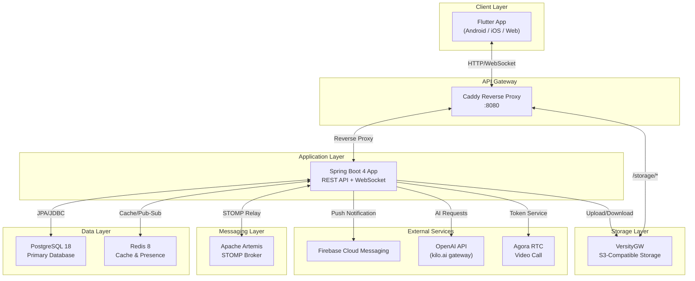
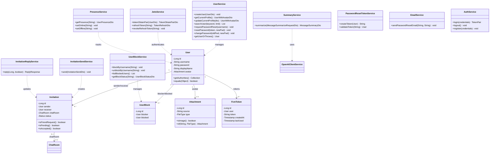
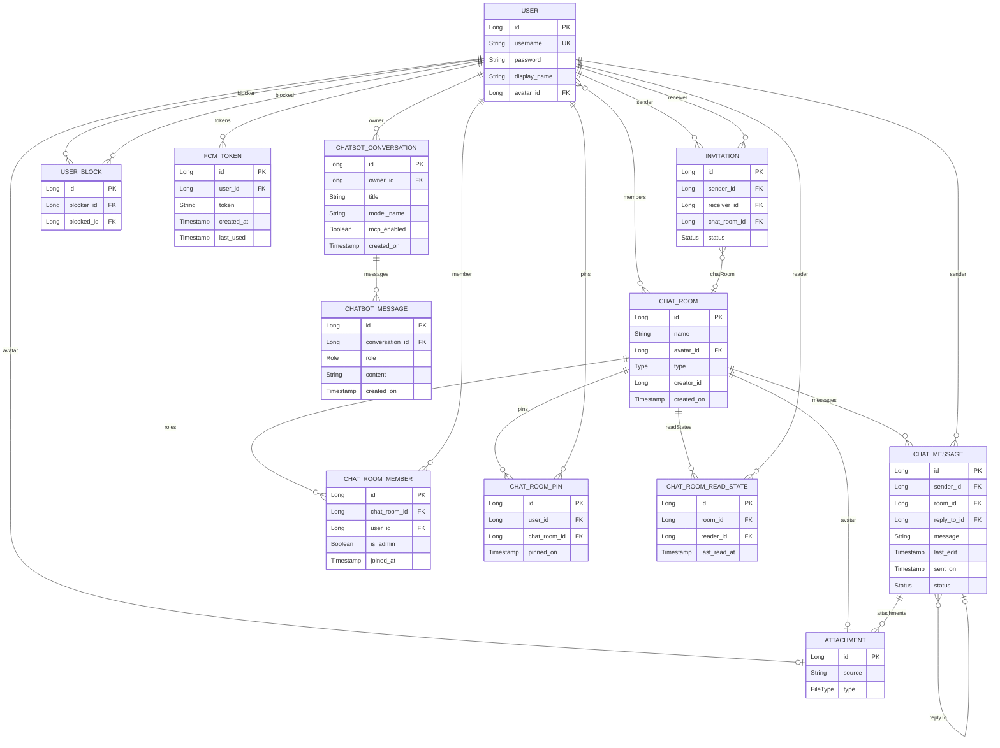
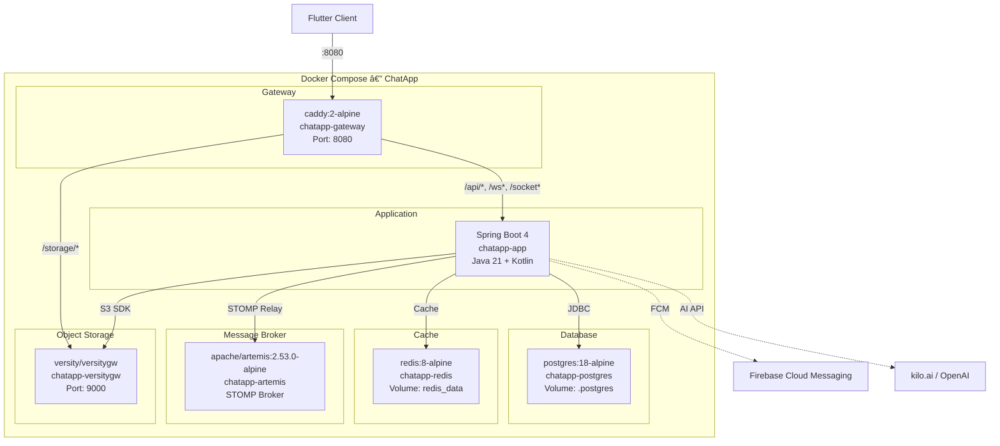

<div align="center">

# BỘ GIÁO DỤC VÀ ĐÀO TẠO

## [Tên Trường Đại Học]

### KHOA CÔNG NGHỆ THÔNG TIN

---

# BÁO CÁO BÀI TẬP LỚN

## Môn: Kiến trúc Phần mềm

**Nhóm QLĐT:** [Nhóm QLĐT]  
**Nhóm BTL:** [Nhóm BTL]

---

# ỨNG DỤNG NHẮN TIN TRỰC TUYẾN — CHATAPP

---

| STT | Họ và tên | MSSV |
|:---:|-----------|------|
| 1 | [Họ tên TV1] | [MSSV1] |
| 2 | [Họ tên TV2] | [MSSV2] |
| 3 | [Họ tên TV3] | [MSSV3] |
| 4 | [Họ tên TV4] | [MSSV4] |

**Thành viên thực hiện báo cáo:** [Họ tên TV1] — [MSSV1]

**GVHD:** [Tên GVHD]

**Năm học:** 2025 – 2026

</div>

> *Ghi chú in ấn: Font Times New Roman, cỡ 14, căn lề 2 bên, in 1 mặt.*

---

<div style="page-break-before: always;"></div>

# BẢNG PHÂN CÔNG NHIỆM VỤ

| STT | Họ và tên | MSSV | Nhiệm vụ cụ thể | Đóng góp (%) |
|:---:|-----------|------|------------------|:------------:|
| 1 | [Họ tên TV1] | [MSSV1] | Tài khoản (Đăng ký, Đăng nhập, Quên MK, Profile), Quản lý bạn bè (Lời mời, Chặn, Xóa bạn), Trạng thái online, Tóm tắt AI | 25% |
| 2 | [Họ tên TV2] | [MSSV2] | Chat cá nhân 1-1, Gửi/nhận tin nhắn văn bản, Typing indicator, Trạng thái đã xem, Xóa tin nhắn, Dịch tin nhắn AI | 25% |
| 3 | [Họ tên TV3] | [MSSV3] | Danh sách cuộc trò chuyện, Tìm kiếm, Ghim chat, Tạo nhóm, Quản lý thành viên nhóm, Phân quyền admin | 25% |
| 4 | [Họ tên TV4] | [MSSV4] | Gửi hình ảnh/media, Thông báo đẩy (FCM), Bật/tắt thông báo, Chatbot AI streaming | 25% |

*Bảng 0.1: Bảng phân công nhiệm vụ các thành viên*

---

<div style="page-break-before: always;"></div>

# MỤC LỤC

- [Bảng phân công nhiệm vụ](#bảng-phân-công-nhiệm-vụ)
- [Danh sách viết tắt](#danh-sách-viết-tắt)
- [Danh sách hình](#danh-sách-hình)
- [Danh sách bảng](#danh-sách-bảng)
- [Chương 1: Mở đầu](#chương-1-mở-đầu)
  - [1.1 Giới thiệu ứng dụng và lý do thực hiện](#11-giới-thiệu-ứng-dụng-và-lý-do-thực-hiện)
  - [1.2 Concept và mục tiêu](#12-concept-và-mục-tiêu)
  - [1.3 Phân tích yêu cầu](#13-phân-tích-yêu-cầu)
  - [1.4 Lựa chọn công nghệ](#14-lựa-chọn-công-nghệ)
- [Chương 2: Phân tích thiết kế](#chương-2-phân-tích-thiết-kế)
  - [2.1 Kiến trúc tổng quan](#21-kiến-trúc-tổng-quan)
  - [2.2 Biểu đồ Use Case tổng quan](#22-biểu-đồ-use-case-tổng-quan)
  - [2.3 Biểu đồ Use Case chi tiết](#23-biểu-đồ-use-case-chi-tiết)
  - [2.4 Biểu đồ lớp](#24-biểu-đồ-lớp)
  - [2.5 Biểu đồ tuần tự](#25-biểu-đồ-tuần-tự)
  - [2.6 Sơ đồ thực thể quan hệ — ER Diagram](#26-sơ-đồ-thực-thể-quan-hệ--er-diagram)
  - [2.7 Giao diện đáp ứng chức năng](#27-giao-diện-đáp-ứng-chức-năng)
- [Chương 3: Kết quả](#chương-3-kết-quả)
  - [3.1 Mô hình triển khai](#31-mô-hình-triển-khai)
  - [3.2 Các bước cài đặt và triển khai](#32-các-bước-cài-đặt-và-triển-khai)
  - [3.3 Kết quả thực hiện](#33-kết-quả-thực-hiện)
  - [3.4 Kết quả thử nghiệm](#34-kết-quả-thử-nghiệm)
  - [3.5 Kết luận và hạn chế](#35-kết-luận-và-hạn-chế)
  - [3.6 Tài liệu tham khảo](#36-tài-liệu-tham-khảo)

---

<div style="page-break-before: always;"></div>

# DANH SÁCH VIẾT TẮT

| Viết tắt | Ý nghĩa |
|----------|---------|
| API | Application Programming Interface |
| CRUD | Create, Read, Update, Delete |
| DTO | Data Transfer Object |
| FCM | Firebase Cloud Messaging |
| GVHD | Giảng viên hướng dẫn |
| HTTP | HyperText Transfer Protocol |
| JPA | Java Persistence API |
| JWT | JSON Web Token |
| LLM | Large Language Model |
| MK | Mật khẩu |
| MSSV | Mã số sinh viên |
| ORM | Object-Relational Mapping |
| QLĐT | Quản lý đào tạo |
| REST | Representational State Transfer |
| S3 | Simple Storage Service |
| SDK | Software Development Kit |
| SQL | Structured Query Language |
| SSE | Server-Sent Events |
| STOMP | Simple Text Oriented Messaging Protocol |
| UI | User Interface |
| UML | Unified Modeling Language |
| WebSocket | Giao thức truyền thông hai chiều thời gian thực |

*Bảng 0.2: Danh sách viết tắt*

---

# DANH SÁCH HÌNH

| Ký hiệu | Mô tả |
|----------|-------|
| Hình 2.1 | Sơ đồ kiến trúc tổng quan hệ thống ChatApp |
| Hình 2.2 | Biểu đồ Use Case tổng quan |
| Hình 2.3 | Biểu đồ Use Case chi tiết — Tài khoản & Bạn bè |
| Hình 2.4 | Biểu đồ lớp — Module Tài khoản & Bạn bè |
| Hình 2.5 | Biểu đồ tuần tự — Đăng nhập & JWT |
| Hình 2.6 | Biểu đồ tuần tự — Gửi lời mời kết bạn |
| Hình 2.7 | Biểu đồ tuần tự — Tóm tắt hội thoại AI |
| Hình 2.8 | Sơ đồ thực thể quan hệ (ER Diagram) |
| Hình 2.9 | Giao diện Đăng nhập |
| Hình 2.10 | Giao diện Đăng ký |
| Hình 2.11 | Giao diện Quên mật khẩu |
| Hình 2.12 | Giao diện Trang cá nhân |
| Hình 2.13 | Giao diện Danh sách bạn bè |
| Hình 2.14 | Giao diện Lời mời kết bạn |
| Hình 2.15 | Giao diện Thêm bạn |
| Hình 2.16 | Giao diện Cài đặt |
| Hình 3.1 | Sơ đồ triển khai Docker Compose |
| Hình 3.2 | Kết quả — Đăng nhập |
| Hình 3.3 | Kết quả — Đăng ký |
| Hình 3.4 | Kết quả — Profile |
| Hình 3.5 | Kết quả — Bạn bè |
| Hình 3.6 | Kết quả — Lời mời kết bạn |

*Bảng 0.3: Danh sách hình*

---

# DANH SÁCH BẢNG

| Ký hiệu | Mô tả |
|----------|-------|
| Bảng 0.1 | Bảng phân công nhiệm vụ các thành viên |
| Bảng 0.2 | Danh sách viết tắt |
| Bảng 0.3 | Danh sách hình |
| Bảng 0.4 | Danh sách bảng |
| Bảng 1.1 | Yêu cầu chức năng |
| Bảng 1.2 | Yêu cầu phi chức năng |
| Bảng 1.3 | So sánh lựa chọn công nghệ |
| Bảng 3.1 | Danh sách services trong Docker Compose |
| Bảng 3.2 | Kết quả thử nghiệm chức năng Tài khoản & Bạn bè |

*Bảng 0.4: Danh sách bảng*

---

<div style="page-break-before: always;"></div>

# Chương 1: Mở đầu

## 1.1 Giới thiệu ứng dụng và lý do thực hiện

Trong thời đại công nghệ số hiện nay, nhu cầu giao tiếp trực tuyến ngày càng tăng cao. Các ứng dụng nhắn tin đã trở thành công cụ không thể thiếu trong cuộc sống hàng ngày, từ trao đổi công việc đến kết nối bạn bè, gia đình. Thị trường hiện nay có nhiều ứng dụng nhắn tin phổ biến như Zalo, Messenger, Telegram, mỗi ứng dụng đều có những ưu điểm và hạn chế riêng.

**ChatApp** là ứng dụng nhắn tin trực tuyến được phát triển bởi nhóm 4 sinh viên với mục tiêu xây dựng một hệ thống hoàn chỉnh, áp dụng các kiến thức kiến trúc phần mềm đã học. Ứng dụng hỗ trợ nhắn tin cá nhân, nhắn tin nhóm, gửi hình ảnh/tệp, gọi video, và tích hợp trí tuệ nhân tạo (AI) cho các tính năng tóm tắt, dịch thuật và chatbot.

**Lý do thực hiện:**

- **Nhu cầu thực tế**: Xây dựng một sản phẩm phần mềm hoàn chỉnh từ thiết kế đến triển khai, giúp sinh viên vận dụng kiến thức lý thuyết vào thực hành.
- **Kiến trúc hiện đại**: Áp dụng kiến trúc Client-Server với API Gateway, message broker, cache layer, và object storage — đại diện cho các mô hình kiến trúc phần mềm phổ biến trong ngành.
- **Công nghệ tiên tiến**: Sử dụng Spring Boot 4, Flutter, WebSocket (STOMP), Redis, Docker — các công nghệ được sử dụng rộng rãi trong các doanh nghiệp phần mềm.
- **Tích hợp AI**: Tận dụng Large Language Model (LLM) thông qua OpenAI API để cung cấp các tính năng thông minh như tóm tắt hội thoại, dịch tin nhắn, và chatbot hỗ trợ.

## 1.2 Concept và mục tiêu

### Concept

ChatApp được thiết kế theo mô hình **Client-Server** với kiến trúc phân lớp rõ ràng:

- **Client**: Ứng dụng Flutter đa nền tảng (Android, iOS, Web) cung cấp giao diện người dùng trực quan, mượt mà.
- **API Gateway**: Caddy reverse proxy đóng vai trò điểm truy cập duy nhất, phân phối request đến đúng service.
- **Backend**: Spring Boot 4 application xử lý toàn bộ business logic, xác thực, và quản lý dữ liệu.
- **Hạ tầng hỗ trợ**: PostgreSQL (database), Redis (cache & presence), Apache Artemis (message broker), VersityGW (S3-compatible object storage).

### Mục tiêu

1. Xây dựng hệ thống nhắn tin thời gian thực hỗ trợ chat 1-1 và chat nhóm.
2. Tích hợp gửi/nhận đa phương tiện (hình ảnh, video, tài liệu, âm thanh).
3. Triển khai hệ thống thông báo đẩy (push notification) qua Firebase Cloud Messaging.
4. Tích hợp các tính năng AI: tóm tắt hội thoại, dịch tin nhắn, chatbot thông minh.
5. Hỗ trợ gọi video qua Agora RTC Engine.
6. Đảm bảo bảo mật với JWT authentication và mã hóa mật khẩu.
7. Triển khai dễ dàng với Docker Compose.

## 1.3 Phân tích yêu cầu

### 1.3.1 Yêu cầu chức năng

| STT | Mã | Yêu cầu | Mô tả |
|:---:|-----|---------|-------|
| 1 | FR-01 | Đăng ký tài khoản | Người dùng tạo tài khoản với username và password |
| 2 | FR-02 | Đăng nhập | Xác thực bằng username/password, trả về JWT token pair |
| 3 | FR-03 | Quên mật khẩu | Gửi email chứa link reset mật khẩu |
| 4 | FR-04 | Đổi mật khẩu | Thay đổi mật khẩu khi đã đăng nhập |
| 5 | FR-05 | Cập nhật profile | Thay đổi displayName và avatar |
| 6 | FR-06 | Quản lý bạn bè | Gửi/nhận/chấp nhận/từ chối lời mời kết bạn |
| 7 | FR-07 | Chặn người dùng | Chặn/bỏ chặn user, ngăn gửi tin nhắn và lời mời |
| 8 | FR-08 | Nhắn tin 1-1 | Gửi/nhận tin nhắn văn bản thời gian thực (DUO) |
| 9 | FR-09 | Nhắn tin nhóm | Tạo nhóm (≥3 người), gửi tin nhắn trong nhóm |
| 10 | FR-10 | Gửi media | Upload hình ảnh, video, tài liệu, âm thanh |
| 11 | FR-11 | Trạng thái tin nhắn | Typing indicator, đã gửi, đã xem |
| 12 | FR-12 | Xóa tin nhắn | Thu hồi (recall) tin nhắn đã gửi |
| 13 | FR-13 | Ghim cuộc trò chuyện | Ghim/bỏ ghim chatroom lên đầu danh sách |
| 14 | FR-14 | Tìm kiếm | Tìm kiếm người dùng theo keyword |
| 15 | FR-15 | Thông báo đẩy | Push notification khi có tin nhắn mới, lời mời |
| 16 | FR-16 | Tóm tắt AI | Tóm tắt nội dung hội thoại bằng LLM |
| 17 | FR-17 | Dịch tin nhắn AI | Dịch nội dung tin nhắn sang ngôn ngữ chọn |
| 18 | FR-18 | Chatbot AI | Trò chuyện với AI chatbot, hỗ trợ streaming SSE |
| 19 | FR-19 | Gọi video | Video call 1-1 qua Agora RTC |
| 20 | FR-20 | Trạng thái online | Hiển thị trạng thái online/offline (Redis presence) |

*Bảng 1.1: Yêu cầu chức năng*

### 1.3.2 Yêu cầu phi chức năng

| STT | Mã | Yêu cầu | Mô tả |
|:---:|-----|---------|-------|
| 1 | NFR-01 | Hiệu năng | Tin nhắn gửi/nhận trong < 500ms qua WebSocket |
| 2 | NFR-02 | Bảo mật | JWT authentication, mã hóa password với Argon2 |
| 3 | NFR-03 | Khả dụng | Hệ thống hoạt động 24/7 với Docker containerization |
| 4 | NFR-04 | Khả năng mở rộng | Kiến trúc tách biệt cho phép scale từng service |
| 5 | NFR-05 | Tương thích | Hỗ trợ Android, iOS, Web qua Flutter |
| 6 | NFR-06 | Cache | Redis cache cho user info và presence |
| 7 | NFR-07 | Lưu trữ | S3-compatible storage cho media files |
| 8 | NFR-08 | Triển khai | Docker Compose one-command deployment |

*Bảng 1.2: Yêu cầu phi chức năng*

## 1.4 Lựa chọn công nghệ

| Thành phần | Công nghệ | Phiên bản | Lý do lựa chọn |
|------------|-----------|-----------|-----------------|
| **Backend Framework** | Spring Boot | 4.0.5 | Framework Java phổ biến nhất, hệ sinh thái lớn, hỗ trợ WebSocket, Security, JPA, Mail |
| **Ngôn ngữ Backend** | Java + Kotlin | Java 21, Kotlin 2.2 | Java 21 với virtual threads, Kotlin bổ sung cú pháp ngắn gọn cho một số service |
| **Frontend Framework** | Flutter | Dart SDK ^3.5 | Đa nền tảng (Android, iOS, Web), hot reload, hiệu năng native |
| **Database** | PostgreSQL | 18 | RDBMS mã nguồn mở mạnh mẽ, hỗ trợ ACID, JSON, full-text search |
| **Cache** | Redis | 8 | In-memory cache nhanh, hỗ trợ pub/sub cho presence tracking |
| **Message Broker** | Apache Artemis | 2.53.0 | JMS broker hỗ trợ STOMP protocol, tích hợp tốt với Spring WebSocket |
| **Object Storage** | VersityGW | Latest | S3-compatible, tự host, lưu trữ hình ảnh/tệp đính kèm |
| **API Gateway** | Caddy | 2 Alpine | Reverse proxy tự động HTTPS, cấu hình đơn giản, hiệu năng cao |
| **Push Notification** | Firebase Admin SDK | 9.8.0 | Dịch vụ push notification miễn phí, đáng tin cậy, hỗ trợ Android/iOS |
| **Video Call** | Agora RTC | 6.2.0 | SDK video call chất lượng cao, low latency |
| **AI Service** | OpenAI Java SDK | 4.30.0 | Tích hợp LLM cho tóm tắt, dịch thuật, chatbot |
| **State Management** | Provider | 6.1.2 | Quản lý state đơn giản, official recommendation từ Flutter team |
| **Containerization** | Docker Compose | — | Triển khai multi-service dễ dàng, reproducible environment |

*Bảng 1.3: So sánh lựa chọn công nghệ*

## 1.5 So sánh với các ứng dụng nhắn tin hiện có

Để đánh giá vị trí và giá trị của ChatApp, nhóm tiến hành so sánh với 3 ứng dụng nhắn tin phổ biến nhất tại Việt Nam và thế giới:

| Tiêu chí | ChatApp | Zalo | Telegram | Messenger |
|----------|---------|------|----------|-----------|
| **Nền tảng** | Android, iOS, Web (Flutter) | Android, iOS, Web, Desktop | Đa nền tảng | Android, iOS, Web |
| **Nhắn tin realtime** | STOMP WebSocket | Proprietary | MTProto | Proprietary |
| **Nhóm chat** | ≥3 thành viên, admin/member | ≥3, nhiều quyền | ≥3, supergroup 200K | ≥3, admin |
| **Gửi media** | Hình ảnh, video, tài liệu, âm thanh | Đầy đủ + stories | Đầy đủ + kênh | Đầy đủ + stories |
| **AI tích hợp** | Tóm tắt, dịch, chatbot (LLM) | Không | Bot API | Meta AI |
| **Thông báo đẩy** | FCM | Proprietary | Proprietary | Proprietary |
| **Video call** | Agora RTC 1-1 | 1-1, nhóm | 1-1, nhóm | 1-1, nhóm |
| **Mã nguồn** | Mở (source code BTL) | Đóng | Client mở | Đóng |
| **Self-hosted** | Docker Compose | Không | TDLib | Không |
| **Mã hóa password** | Argon2 (state-of-the-art) | Không rõ | Không rõ | Không rõ |

*Bảng 1.4: So sánh ChatApp với các ứng dụng nhắn tin hiện có*

**Điểm mạnh của ChatApp:**
- Tích hợp AI trực tiếp vào chat (tóm tắt, dịch thuật) — tính năng mà Zalo và Telegram chưa có sẵn.
- Self-hosted hoàn toàn qua Docker Compose, kiểm soát hoàn toàn dữ liệu.
- Kiến trúc rõ ràng, phù hợp cho nghiên cứu và học tập kiến trúc phần mềm.
- Sử dụng Argon2 (thuật toán mã hóa mật khẩu đạt giải PHC 2015) — bảo mật hơn BCrypt.

## 1.6 Các mẫu thiết kế áp dụng (Design Patterns)

Hệ thống ChatApp áp dụng nhiều mẫu thiết kế (Design Patterns) theo phân loại GoF (Gang of Four) và các mẫu kiến trúc phần mềm hiện đại:

### 1.6.1 Repository Pattern
- **Áp dụng:** Tất cả JPA Repositories (`UserRepository`, `ChatRoomRepository`, `InvitationRepository`, v.v.)
- **Mục đích:** Tách biệt logic truy cập dữ liệu khỏi business logic, cho phép thay đổi database engine mà không ảnh hưởng service layer.
- **Ví dụ:** `UserRepository.findByUsername(username)` trả về `Optional<User>`, service layer không cần biết cách truy vấn SQL.

### 1.6.2 Service Layer Pattern
- **Áp dụng:** Tất cả Service classes (`UserService`, `MessageService`, `GroupChatService`, `ChatbotService`, v.v.)
- **Mục đích:** Đóng gói business logic vào các service riêng biệt, mỗi service đảm nhiệm một nhóm chức năng.
- **Ví dụ:** `MessageService` xử lý gửi/nhận/sửa/xóa tin nhắn, ủy quyền cho `MessageChangesService` và `MessageCheckService`.

### 1.6.3 DTO Pattern (Data Transfer Object)
- **Áp dụng:** Toàn bộ DTO classes (`UserDto`, `MessageSendDto`, `GroupChatCreateDto`, `ChatbotStreamRequestDto`, v.v.)
- **Mục đích:** Tách biệt domain model khỏi API contract, chỉ truyền dữ liệu cần thiết qua network.
- **Ví dụ:** `MessageSendDto` chỉ chứa `message` và `attachments`, không expose internal fields như `id`, `sender`, `sentOn`.

### 1.6.4 Observer Pattern (Pub/Sub)
- **Áp dụng:** STOMP WebSocket messaging, FCM push notification
- **Mục đích:** Gửi thông báo realtime đến nhiều subscriber mà không cần coupling trực tiếp.
- **Ví dụ:** Khi gửi tin nhắn, MessageService publish message đến STOMP topic `/queue/chat/{roomId}`, tất cả subscribers trong room đều nhận được.

### 1.6.5 Strategy Pattern
- **Áp dụng:** `FileTypeService` — phân loại file dựa trên extension
- **Mục đích:** Cho phép thay đổi cách phân loại file mà không ảnh hưởng logic upload.
- **Ví dụ:** `FileTypeService.determineFileType("photo.jpg")` → `FileType.IMAGE`, `determineFileType("report.pdf")` → `FileType.DOCUMENT`.

### 1.6.6 Proxy Pattern
- **Áp dụng:** Caddy reverse proxy, Spring Security filter chain
- **Mục đích:** Kiểm soát truy cập, routing, và xác thực trước khi request đến ứng dụng.
- **Ví dụ:** Caddy nhận request tại `:8080`, route `/api/*` → Spring Boot, `/storage/*` → VersityGW.

### 1.6.7 Builder Pattern
- **Áp dụng:** Prompt construction trong `PromptService`, DTO builders
- **Mục đích:** Xây dựng đối tượng phức tạp từng bước.
- **Ví dụ:** `PromptService.buildTranslationPrompt()` sử dụng `buildString {}` để tạo prompt có cấu trúc rõ ràng.

| Mẫu thiết kế | Loại (GoF) | Vị trí áp dụng | Lợi ích chính |
|---------------|------------|-----------------|---------------|
| Repository | Structural | JPA Repositories | Tách data access, testability |
| Service Layer | Architectural | Service classes | Single Responsibility |
| DTO | Structural | API request/response | Bảo vệ domain model |
| Observer | Behavioral | STOMP, FCM | Loose coupling, realtime |
| Strategy | Behavioral | FileTypeService | Open/Closed Principle |
| Proxy | Structural | Caddy, Security | Access control, routing |
| Builder | Creational | PromptService | Readable construction |

*Bảng 1.5: Tổng hợp các mẫu thiết kế áp dụng trong ChatApp*

## 1.7 Đặc tả Use Case chi tiết — Tài khoản & Bạn bè

### UC-01: Đăng ký tài khoản

| Thành phần | Mô tả |
|------------|-------|
| **Tên UC** | Đăng ký tài khoản mới |
| **Actor** | Người dùng (chưa đăng nhập) |
| **Tiền điều kiện** | Người dùng chưa có tài khoản, đang ở màn hình Đăng ký |
| **Hậu điều kiện** | Tài khoản mới được tạo trong database, password được mã hóa Argon2 |
| **Luồng chính** | 1. Người dùng nhập username và password. 2. Hệ thống kiểm tra username không trùng. 3. Hệ thống mã hóa password bằng Argon2. 4. Lưu User entity vào PostgreSQL. 5. Trả về 201 Created. 6. Chuyển sang màn hình đăng nhập. |
| **Luồng ngoại lệ** | 2a. Username đã tồn tại → trả lỗi 409 Conflict, hiển thị thông báo. |
| **API** | `POST /api/v1/users/register/` |

*Bảng 1.6: Đặc tả UC-01 — Đăng ký tài khoản*

### UC-02: Đăng nhập

| Thành phần | Mô tả |
|------------|-------|
| **Tên UC** | Đăng nhập vào hệ thống |
| **Actor** | Người dùng (có tài khoản) |
| **Tiền điều kiện** | Tài khoản đã tồn tại trong database |
| **Hậu điều kiện** | JWT token pair được tạo, WebSocket connected, trạng thái online |
| **Luồng chính** | 1. Nhập username, password. 2. Gửi `POST /api/v1/users/token/`. 3. JwtsService xác thực password (Argon2). 4. Tạo access token (HMAC-SHA256) + refresh token. 5. Lưu refresh token vào Redis. 6. Client lưu token vào SharedPreferences. 7. Kết nối WebSocket `/ws`. 8. PresenceService cập nhật online trong Redis. |
| **Luồng ngoại lệ** | 3a. Sai password → 401 Unauthorized. 2b. Username không tồn tại → 401. |
| **API** | `POST /api/v1/users/token/` |

*Bảng 1.7: Đặc tả UC-02 — Đăng nhập*

### UC-06: Gửi lời mời kết bạn

| Thành phần | Mô tả |
|------------|-------|
| **Tên UC** | Gửi lời mời kết bạn |
| **Actor** | Người dùng (đã đăng nhập) |
| **Tiền điều kiện** | 2 user chưa là bạn bè, không bị chặn, chưa có lời mời PENDING |
| **Hậu điều kiện** | Invitation(PENDING) được tạo, người nhận được thông báo realtime |
| **Luồng chính** | 1. Tìm kiếm user theo keyword. 2. Chọn user, nhấn "Kết bạn". 3. Gửi `POST /api/v1/invitations/`. 4. UserBlockService kiểm tra block status. 5. InvitationSendService kiểm tra duplicate. 6. Tạo Invitation(PENDING). 7. STOMP notify receiver. 8. FCM push notification. |
| **Luồng ngoại lệ** | 4a. Bị chặn → 403 Forbidden. 5a. Đã có lời mời PENDING → 409 Conflict. |
| **API** | `POST /api/v1/invitations/` |

*Bảng 1.8: Đặc tả UC-06 — Gửi lời mời kết bạn*

### UC-20: Tóm tắt hội thoại AI

| Thành phần | Mô tả |
|------------|-------|
| **Tên UC** | Tóm tắt nội dung hội thoại bằng AI |
| **Actor** | Người dùng (thành viên chatroom) |
| **Tiền điều kiện** | Chatroom có tin nhắn, dịch vụ AI đã cấu hình |
| **Hậu điều kiện** | Bản tóm tắt tiếng Việt được hiển thị cho người dùng |
| **Luồng chính** | 1. Nhấn "Tóm tắt hội thoại". 2. `POST /api/v1/messages/summarize`. 3. SummaryService lấy tin nhắn từ DB. 4. PromptService xây dựng prompt tiếng Việt. 5. OpenAIClientService gọi LLM (kilo.ai). 6. LLM trả về tóm tắt. 7. Hiển thị kết quả. |
| **Luồng ngoại lệ** | 5a. LLM rate limited → thử fallback model. 5b. Timeout → trả lỗi 504. |
| **API** | `POST /api/v1/messages/summarize` |

*Bảng 1.9: Đặc tả UC-20 — Tóm tắt hội thoại AI*

---

<div style="page-break-before: always;"></div>

# Chương 2: Phân tích thiết kế

## 2.1 Kiến trúc tổng quan

Hệ thống ChatApp được thiết kế theo kiến trúc **Client-Server** với API Gateway pattern. Toàn bộ hạ tầng được container hóa bằng Docker Compose gồm 7 services hoạt động phối hợp.



*Hình 2.1: Sơ đồ kiến trúc tổng quan hệ thống ChatApp*

**Mô tả các khối:**

- **Flutter App**: Ứng dụng đa nền tảng, sử dụng Provider cho state management, STOMP WebSocket cho realtime, Firebase Messaging cho push notification.
- **Caddy Gateway**: Reverse proxy lắng nghe port 8080, route `/api/*` và `/ws*` đến Spring Boot App, route `/storage/*` đến VersityGW.
- **Spring Boot App**: Xử lý toàn bộ business logic: Authentication (JWT), REST API, WebSocket (STOMP), file upload, AI integration.
- **PostgreSQL**: Lưu trữ toàn bộ dữ liệu quan hệ: User, ChatRoom, ChatMessage, Invitation, Attachment, v.v. (12 bảng).
- **Redis**: Cache thông tin user, quản lý trạng thái online/offline (presence), hỗ trợ refresh token.
- **Apache Artemis**: Message broker hỗ trợ STOMP protocol, relay tin nhắn WebSocket giữa các client.
- **VersityGW**: Object storage tương thích S3, lưu trữ hình ảnh, video, tài liệu, avatar.
- **Firebase Cloud Messaging**: Dịch vụ push notification cho Android/iOS.
- **OpenAI API**: Cung cấp khả năng AI cho tóm tắt, dịch thuật, chatbot.
- **Agora RTC**: Dịch vụ video call real-time.

## 2.2 Biểu đồ Use Case tổng quan

```mermaid
graph LR
    User((Người dùng))
    AI_Bot((AI Chatbot))
    System((Hệ thống))

    subgraph UC_Auth["Quản lý tài khoản"]
        UC1["Đăng ký"]
        UC2["Đăng nhập"]
        UC3["Quên mật khẩu"]
        UC4["Cập nhật profile"]
        UC5["Đổi mật khẩu"]
    end

    subgraph UC_Friend["Quản lý bạn bè"]
        UC6["Gửi lời mời kết bạn"]
        UC7["Chấp nhận/Từ chối"]
        UC8["Xóa bạn"]
        UC9["Chặn người dùng"]
    end

    subgraph UC_Chat["Nhắn tin"]
        UC10["Gửi tin nhắn 1-1"]
        UC11["Gửi tin nhắn nhóm"]
        UC12["Gửi hình ảnh/media"]
        UC13["Xóa tin nhắn"]
    end

    subgraph UC_Group["Quản lý nhóm"]
        UC14["Tạo nhóm chat"]
        UC15["Thêm/xóa thành viên"]
        UC16["Phân quyền admin"]
        UC17["Ghim cuộc trò chuyện"]
    end

    subgraph UC_AI["Tính năng AI"]
        UC18["Tóm tắt hội thoại"]
        UC19["Dịch tin nhắn"]
        UC20["Chat vá»›i AI Bot"]
    end

    subgraph UC_Notify["Thông báo"]
        UC21["Nhận thông báo đẩy"]
        UC22["Bật/tắt thông báo"]
    end

    subgraph UC_Call["Cuộc gọi"]
        UC23["Gọi video 1-1"]
    end

    User --- UC_Auth
    User --- UC_Friend
    User --- UC_Chat
    User --- UC_Group
    User --- UC_AI
    User --- UC_Notify
    User --- UC_Call

    AI_Bot --- UC20
    System --- UC21
```



*Hình 2.2: Biểu đồ Use Case tổng quan*

---

## 2.3 Biểu đồ Use Case chi tiết — Tài khoản & Quản lý bạn bè

Phần này trình bày chi tiết các Use Case thuộc phạm vi phụ trách của Thành viên 1, bao gồm module Tài khoản (Authentication) và module Quản lý bạn bè (Friend Management).

```mermaid
graph LR
    User((Người dùng))

    subgraph UC_Account["Module Tài khoản"]
        UC1["Đăng ký tài khoản"]
        UC2["Đăng nhập<br/>(JWT Token Pair)"]
        UC3["Đăng xuất<br/>(Revoke Token)"]
        UC4["Quên mật khẩu<br/>(Email Reset)"]
        UC5["Đổi mật khẩu"]
        UC6["Cập nhật Profile<br/>(DisplayName, Avatar)"]
        UC7["Xem Profile cá nhân"]
        UC8["Tìm kiếm người dùng"]
    end

    subgraph UC_Friend["Module Bạn bè"]
        UC9["Gửi lời mời kết bạn"]
        UC10["Xem danh sách lời mời"]
        UC11["Chấp nhận lời mời"]
        UC12["Từ chối lời mời"]
        UC13["Xem danh sách bạn bè"]
        UC14["Xóa bạn"]
    end

    subgraph UC_Block["Module Chặn"]
        UC15["Chặn người dùng"]
        UC16["Bỏ chặn"]
        UC17["Xem danh sách đã chặn"]
        UC18["Kiểm tra trạng thái chặn"]
    end

    subgraph UC_Presence["Module Trạng thái"]
        UC19["Trạng thái Online/Offline"]
    end

    subgraph UC_AI_Summary["Module AI"]
        UC20["Tóm tắt hội thoại AI"]
    end

    User --- UC1
    User --- UC2
    User --- UC3
    User --- UC4
    User --- UC5
    User --- UC6
    User --- UC7
    User --- UC8
    User --- UC9
    User --- UC10
    User --- UC11
    User --- UC12
    User --- UC13
    User --- UC14
    User --- UC15
    User --- UC16
    User --- UC17
    User --- UC18
    User --- UC19
    User --- UC20

    UC2 -.->|"include"| UC19
    UC9 -.->|"extend"| UC18
```



*Hình 2.3: Biểu đồ Use Case chi tiết — Tài khoản & Bạn bè*

**Mô tả chi tiết các Use Case:**

**UC1 — Đăng ký tài khoản**: Người dùng cung cấp username và password. Hệ thống kiểm tra tính duy nhất của username, mã hóa password bằng Argon2, lưu vào PostgreSQL. API: `POST /api/v1/users/register/`.

**UC2 — Đăng nhập**: Xác thực username/password, trả về JWT token pair (access token + refresh token). Access token dùng để xác thực các request tiếp theo. API: `POST /api/v1/users/token/`.

**UC3 — Đăng xuất**: Revoke refresh token hiện tại, ngăn việc refresh thêm access token mới. API: `POST /api/v1/users/token/revoke/`.

**UC4 — Quên mật khẩu**: Gửi email chứa token reset mật khẩu qua EmailService. Người dùng click link → xác nhận token → đặt mật khẩu mới. API: `POST /api/v1/users/password/reset-request/` và `POST /api/v1/users/password/reset-confirm/`.

**UC6 — Cập nhật Profile**: Upload avatar mới (multipart) → AttachmentService lưu lên S3 → cập nhật User entity. Cho phép thay đổi displayName. API: `PUT /api/v1/users/me/` (multipart/form-data).

**UC9 — Gửi lời mời kết bạn**: Kiểm tra trạng thái chặn (UserBlock) → kiểm tra duplicate invitation → tạo Invitation(PENDING) → STOMP notify receiver. API: `POST /api/v1/invitations/`.

**UC11/12 — Chấp nhận/Từ chối lời mời**: Cập nhật Invitation status thành ACCEPTED hoặc REJECTED. Nếu chấp nhận → tạo ChatRoom(DUO) giữa 2 người. API: `PATCH /api/v1/invitations/{id}`.

**UC15 — Chặn người dùng**: Tạo record UserBlock, ngăn mọi tương tác giữa 2 user. API: `POST /api/v1/users/{username}/block/`.

**UC19 — Trạng thái Online**: Khi kết nối WebSocket → PresenceService cập nhật Redis set online. Khi disconnect → cập nhật lastSeen timestamp. API: `GET /api/v1/users/{username}/presence/`.

**UC20 — Tóm tắt hội thoại AI**: Gửi nội dung tin nhắn đến SummaryService → OpenAIClientService → LLM xử lý → trả về bản tóm tắt. API: `POST /api/v1/messages/summarize`.

## 2.4 Biểu đồ lớp — Module Tài khoản & Bạn bè



*Hình 2.4: Biểu đồ lớp — Module Tài khoản & Bạn bè*

**Giải thích:**

- **User**: Entity trung tâm, implement `UserDetails` của Spring Security. Chứa thông tin cơ bản (username, password, displayName) và liên kết ManyToOne đến Attachment cho avatar.
- **Invitation**: Quản lý lời mời kết bạn với trạng thái PENDING/ACCEPTED/REJECTED. Nếu `chatRoom == null` thì đây là friend request, ngược lại là group invitation.
- **UserBlock**: Quan hệ chặn giữa 2 user (blocker → blocked), có unique constraint.
- **Attachment**: Lưu trữ file đính kèm với 5 loại: IMAGE, VIDEO, RAW, DOCUMENT, AUDIO.
- **Service layer**: Mỗi service đảm nhận một nghiệp vụ riêng biệt, tuân theo nguyên lý Single Responsibility.

## 2.5 Biểu đồ tuần tự

### 2.5.1 Biểu đồ tuần tự — Đăng nhập & JWT

```mermaid
sequenceDiagram
    actor User as Người dùng
    participant App as Flutter App
    participant API as Caddy Gateway
    participant SB as Spring Boot
    participant JWT as JwtsService
    participant DB as PostgreSQL
    participant Redis as Redis
    participant WS as WebSocket/STOMP

    User->>App: Nhập username, password
    App->>API: POST /api/v1/users/token/
    API->>SB: Forward request
    SB->>DB: SELECT user WHERE username = ?
    DB-->>SB: User entity
    SB->>JWT: tokenObtainPair(user)
    JWT->>JWT: Validate password (Argon2)
    JWT->>JWT: Generate Access Token (HMAC-SHA256)
    JWT->>JWT: Generate Refresh Token
    JWT->>Redis: Save refresh token
    JWT-->>SB: TokenObtainPairDto
    SB-->>API: 200 OK + {access, refresh}
    API-->>App: Response
    App->>App: Save tokens (SharedPreferences)
    App->>API: Connect WebSocket /ws
    API->>SB: Upgrade to WebSocket
    SB->>SB: Authenticate via JWT
    SB->>Redis: PresenceService.setOnline(username)
    SB-->>App: STOMP CONNECTED
    App-->>User: Hiển thị trang chủ
```



*Hình 2.5: Biểu đồ tuần tự — Đăng nhập & JWT*

**Mô tả luồng:**
1. Người dùng nhập thông tin đăng nhập trên Flutter App.
2. App gửi POST request đến API Gateway (Caddy).
3. Spring Boot truy vấn PostgreSQL để lấy User entity.
4. JwtsService xác thực mật khẩu bằng Argon2, tạo JWT access token (HMAC-SHA256 signed) và refresh token.
5. Refresh token được lưu vào Redis để quản lý session.
6. Client nhận token pair, lưu vào SharedPreferences.
7. Client thiết lập kết nối WebSocket (STOMP) qua `/ws`.
8. PresenceService cập nhật trạng thái online trong Redis.

### 2.5.2 Biểu đồ tuần tự — Gửi lời mời kết bạn

```mermaid
sequenceDiagram
    actor UserA as Người gửi
    participant AppA as Flutter App A
    participant API as Caddy Gateway
    participant SB as Spring Boot
    participant BlockSvc as UserBlockService
    participant InvSvc as InvitationSendService
    participant DB as PostgreSQL
    participant STOMP as STOMP Broker
    participant AppB as Flutter App B
    participant Notify as NotificationService
    actor UserB as Người nhận

    UserA->>AppA: Nhấn "Thêm bạn"
    AppA->>API: POST /api/v1/invitations/
    API->>SB: Forward request
    SB->>BlockSvc: Kiểm tra block status
    BlockSvc->>DB: SELECT FROM user_blocks
    DB-->>BlockSvc: Không bị chặn
    BlockSvc-->>SB: OK
    SB->>InvSvc: send(InvitationSendDto)
    InvSvc->>DB: Check duplicate invitation
    DB-->>InvSvc: Chưa có lời mời
    InvSvc->>DB: INSERT Invitation(PENDING)
    DB-->>InvSvc: Saved
    InvSvc->>STOMP: Send to /queue/invitations/{receiverId}
    STOMP-->>AppB: STOMP MESSAGE
    AppB-->>UserB: Hiển thị thông báo lời mời
    InvSvc->>Notify: Push notification
    Notify-->>AppB: FCM Push
    SB-->>API: 201 Created
    API-->>AppA: Response
    AppA-->>UserA: Đã gửi lời mời
```



*Hình 2.6: Biểu đồ tuần tự — Gửi lời mời kết bạn*

**Mô tả luồng:**
1. Người gửi tìm kiếm và chọn người dùng muốn kết bạn.
2. Hệ thống kiểm tra trạng thái block giữa 2 user qua UserBlockService.
3. InvitationSendService kiểm tra không có duplicate invitation đang PENDING.
4. Tạo Invitation với status PENDING và lưu vào database.
5. Gửi thông báo realtime qua STOMP đến người nhận.
6. Đồng thời gửi push notification qua Firebase Cloud Messaging.

### 2.5.3 Biểu đồ tuần tự — Tóm tắt hội thoại AI

```mermaid
sequenceDiagram
    actor User as Người dùng
    participant App as Flutter App
    participant API as Caddy Gateway
    participant SB as Spring Boot
    participant SumSvc as SummaryService
    participant DB as PostgreSQL
    participant Prompt as PromptService
    participant OpenAI as OpenAIClientService
    participant LLM as kilo.ai LLM

    User->>App: Nhấn "Tóm tắt hội thoại"
    App->>API: POST /api/v1/messages/summarize
    API->>SB: Forward request
    SB->>SumSvc: summarize(request)
    SumSvc->>DB: Lấy tin nhắn trong chatroom
    DB-->>SumSvc: List messages
    SumSvc->>Prompt: Xây dựng prompt tóm tắt
    Prompt-->>SumSvc: System + User prompt
    SumSvc->>OpenAI: Chat completion request
    OpenAI->>LLM: API call vá»›i messages
    LLM-->>OpenAI: Kết quả tóm tắt
    OpenAI-->>SumSvc: Response
    SumSvc-->>SB: MessageSummaryDto
    SB-->>API: 200 OK + summary text
    API-->>App: Response
    App-->>User: Hiển thị bản tóm tắt
```



*Hình 2.7: Biểu đồ tuần tự — Tóm tắt hội thoại AI*

**Mô tả luồng:**
1. Người dùng yêu cầu tóm tắt hội thoại trong một chatroom.
2. SummaryService lấy danh sách tin nhắn từ database.
3. PromptService xây dựng prompt tiếng Việt (system prompt yêu cầu tóm tắt ngắn gọn, giữ key facts).
4. OpenAIClientService gửi request đến kilo.ai gateway (tương thích OpenAI API).
5. Nếu model chính bị rate limited (429), tự động fallback sang model dự phòng (`kilo-auto/free`).
6. LLM xử lý và trả về bản tóm tắt tiếng Việt.

## 2.6 Sơ đồ thực thể quan hệ — ER Diagram

Sơ đồ ER dưới đây mô tả toàn bộ 12 entity trong hệ thống. Các entity được **highlight (★)** là các entity thuộc phạm vi phụ trách của Thành viên 1.



*Hình 2.8: Sơ đồ thực thể quan hệ (ER Diagram)*

**★ Entity thuộc phạm vi Thành viên 1:** USER, INVITATION, USER_BLOCK, ATTACHMENT (avatar), FCM_TOKEN.

**Giải thích các quan hệ chính:**
- **USER ↔ INVITATION**: Quan hệ 1-N, một user có thể gửi/nhận nhiều lời mời. Foreign keys: `sender_id`, `receiver_id`.
- **USER ↔ USER_BLOCK**: Quan hệ 1-N, một user có thể chặn nhiều user khác. Unique constraint `(blocker_id, blocked_id)` ngăn chặn duplicate.
- **USER → ATTACHMENT**: Quan hệ N-1 (nullable), avatar là một Attachment có `FileType = IMAGE`. Khi user cập nhật avatar, Attachment cũ bị xóa khỏi S3.
- **INVITATION → CHAT_ROOM**: Nullable foreign key. Nếu `chat_room_id IS NULL` → friend request (tạo ChatRoom DUO khi accept). Nếu có giá trị → group invitation.

**Chi tiết các trường quan trọng:**

| Entity | Trường | Kiểu | Constraint | Mô tả |
|--------|--------|------|-----------|-------|
| USER | username | String | UNIQUE, NOT NULL | Tên đăng nhập duy nhất |
| USER | password | String | NOT NULL | Mã hóa Argon2 |
| USER | display_name | String | Nullable | Tên hiển thị |
| INVITATION | status | Enum | NOT NULL | PENDING / ACCEPTED / REJECTED |
| USER_BLOCK | (blocker, blocked) | — | UNIQUE | Ngăn duplicate block |

*Bảng 2.1: Chi tiết các trường entity — Module Tài khoản & Bạn bè*


## 2.7 Giao diện đáp ứng chức năng

Phần này mô tả các giao diện Flutter thuộc phạm vi phụ trách của Thành viên 1.

### 2.7.1 Màn hình Đăng nhập (LoginScreen)

**File:** `lib/screens/auth/login_screen.dart`

**Mô tả:** Màn hình đầu tiên khi mở ứng dụng. Gồm 2 trường nhập liệu (username, password), nút 'Đăng nhập', link 'Quên mật khẩu' và link 'Đăng ký'. Sử dụng `AuthProvider` để gọi `AuthService.login()` và lưu JWT token vào `SharedPreferences`.

**Các thành phần chính:**
- TextFormField cho username (validate không rỗng)
- TextFormField cho password (obscureText = true)
- ElevatedButton 'Đăng nhập'
- TextButton 'Quên mật khẩu?' → ForgotPasswordScreen
- TextButton 'Chưa có tài khoản? Đăng ký' → RegisterScreen

*Hình 2.10: Giao diện Đăng nhập*

`[Ảnh chụp màn hình Đăng nhập — placeholder]`

## 2.8 Bảng API Endpoints — Module Tài khoản & Bạn bè

| STT | Method | Endpoint | Auth | Mô tả | Status Codes |
|:---:|--------|----------|:----:|-------|:------------:|
| 1 | POST | `/api/v1/users/register/` | ✗ | Đăng ký tài khoản | 201, 409 |
| 2 | POST | `/api/v1/users/token/` | ✗ | Đăng nhập (JWT pair) | 200, 401 |
| 3 | POST | `/api/v1/users/token/refresh/` | ✗ | Refresh access token | 200, 401 |
| 4 | POST | `/api/v1/users/token/revoke/` | ✗ | Revoke refresh token | 204, 401 |
| 5 | GET | `/api/v1/users/me/` | ✓ | Lấy profile hiện tại | 200 |
| 6 | PUT | `/api/v1/users/me/` | ✓ | Cập nhật profile (multipart) | 200 |
| 7 | POST | `/api/v1/users/password/reset-request/` | ✗ | Gửi email reset mật khẩu | 200 |
| 8 | POST | `/api/v1/users/password/reset-confirm/` | ✗ | Xác nhận reset mật khẩu | 200, 400 |
| 9 | POST | `/api/v1/users/password/change/` | ✓ | Đổi mật khẩu | 204, 400 |
| 10 | GET | `/api/v1/users/search?keyword=` | ✗ | Tìm kiếm user | 200 |
| 11 | POST | `/api/v1/invitations/` | ✓ | Gửi lời mời kết bạn | 201, 403, 409 |
| 12 | GET | `/api/v1/invitations/` | ✓ | Danh sách lời mời | 200 |
| 13 | PATCH | `/api/v1/invitations/{id}` | ✓ | Chấp nhận/Từ chối lời mời | 200 |
| 14 | POST | `/api/v1/users/{username}/block/` | ✓ | Chặn user | 204 |
| 15 | DELETE | `/api/v1/users/{username}/block/` | ✓ | Bỏ chặn user | 204 |
| 16 | GET | `/api/v1/users/blocks/` | ✓ | Danh sách user đã chặn | 200 |
| 17 | GET | `/api/v1/users/{username}/block-status/` | ✓ | Kiểm tra trạng thái chặn | 200 |
| 18 | GET | `/api/v1/users/{username}/presence/` | ✓ | Trạng thái online/offline | 200 |
| 19 | POST | `/api/v1/messages/summarize` | ✓ | Tóm tắt hội thoại AI | 200, 502 |

*Bảng 2.2: API Endpoints — Module Tài khoản & Bạn bè*

## 2.9 Biểu đồ hoạt động — Luồng đăng nhập & kết nối WebSocket

```mermaid
flowchart TD
    A([Bắt đầu]) --> B[Nhập username, password]
    B --> C{Validate input}
    C -->|Rỗng| D[Hiển thị lỗi validation]
    D --> B
    C -->|Hợp lệ| E[POST /api/v1/users/token/]
    E --> F{Xác thực thành công?}
    F -->|401 Unauthorized| G[Hiển thị lỗi sai mật khẩu]
    G --> B
    F -->|200 OK| H[Lưu JWT tokens vào SharedPreferences]
    H --> I[Kết nối WebSocket /ws]
    I --> J{WebSocket connected?}
    J -->|Lỗi| K[Retry sau 4 giây]
    K --> L[Refresh access token]
    L --> I
    J -->|Thành công| M[Subscribe STOMP channels]
    M --> N[/queue/invitations/]
    M --> O[/queue/invitationReplies/]
    M --> P[/queue/friends/removed/]
    M --> Q[/queue/chatrooms/created/]
    M --> R[/user/queue/presence/]
    R --> S[PresenceService.setOnline]
    S --> T[Hiển thị trang chủ]
    T --> U([Kết thúc])
```



*Hình 2.9: Biểu đồ hoạt động — Luồng đăng nhập & kết nối WebSocket*

**Mô tả luồng:**
- Sau đăng nhập thành công, client lưu JWT token pair và thiết lập kết nối WebSocket.
- RealtimeService subscribe 15+ STOMP channels để nhận events realtime (lời mời, tin nhắn, typing, presence, v.v.).
- Nếu WebSocket bị ngắt, client tự động refresh access token và reconnect sau 4 giây.
- Cơ chế `reconnectWithFreshToken()` đảm bảo mỗi lần reconnect đều dùng token mới, tránh lỗi "Jwt expired".

---

<div style="page-break-before: always;"></div>

# Chương 3: Kết quả

## 3.1 Mô hình triển khai

Hệ thống ChatApp được triển khai bằng **Docker Compose** với 6 services chính hoạt động trên cùng một Docker network:



*Hình 3.1: Sơ đồ triển khai Docker Compose*

### Chi tiết cấu hình services

| Service | Image | Container | Port | Volume | Health Check | Depends On |
|---------|-------|-----------|------|--------|-------------|------------|
| gateway | caddy:2-alpine | chatapp-gateway | 8080:8080 | Caddyfile (ro) | — | app, versitygw |
| app | Custom Dockerfile | chatapp-app | internal | secrets (ro) | — | artemis, postgres, redis, versitygw |
| postgres | postgres:18-alpine | chatapp-postgres | internal | .postgres | `pg_isready -U chatapp` | — |
| redis | redis:8-alpine | chatapp-redis | internal | redis_data | `redis-cli ping` | — |
| artemis | apache/artemis:2.53.0-alpine | chatapp-artemis | internal | — | `wget http://localhost:8161` | — |
| versitygw | versity/versitygw:latest | chatapp-versitygw | 9000 | versitygw_data | `wget http://localhost:9000/health` | — |

*Bảng 3.1: Chi tiết cấu hình services trong Docker Compose*

### Cấu hình Caddy Gateway (Caddyfile)

```
:8080 {
    handle /api/*     { reverse_proxy app:8080 }
    handle /ws*       { reverse_proxy app:8080 }
    handle /socket*   { reverse_proxy app:8080 }
    handle_path /storage/* { reverse_proxy versitygw:9000 }
    handle            { reverse_proxy app:8080 }
}
```

**Giải thích routing:**
- `/api/*` — REST API requests → Spring Boot
- `/ws*` và `/socket*` — WebSocket connections (STOMP) → Spring Boot
- `/storage/*` — Truy cập trực tiếp file media từ VersityGW (dùng `handle_path` để strip prefix)
- `handle` (default) — Fallback tất cả request khác → Spring Boot

### Biến môi trường cấu hình (.env)

| Biến | Mô tả | Ví dụ |
|------|-------|-------|
| `POSTGRES_USER` | Database username | chatapp |
| `POSTGRES_PASSWORD` | Database password | (secret) |
| `POSTGRES_DB` | Database name | chatapp |
| `S3_ACCESS_KEY` | VersityGW access key | minioadmin |
| `S3_SECRET_KEY` | VersityGW secret key | (secret) |
| `JWTS_SECRET` | JWT signing secret (≥32 bytes) | (secret) |
| `LLM_BASE_URL` | OpenAI-compatible API URL | https://kilo.ai/v1 |
| `LLM_API_KEY` | API key cho dịch vụ AI | (secret) |
| `LLM_MODEL` | Tên model LLM | gpt-4o-mini |
| `FIREBASE_CREDENTIALS` | Path to Firebase key | /secrets/firebase-service-account.json |

*Bảng 3.2: Các biến môi trường cấu hình hệ thống*

**Luồng khởi động:**
1. Docker Compose khởi tạo PostgreSQL, Redis, Artemis, VersityGW song song.
2. Mỗi service phải pass health check trước khi service phụ thuộc khởi động.
3. Spring Boot app khởi động sau khi tất cả dependencies healthy.
4. Caddy gateway khởi động sau khi app và versitygw sẵn sàng.
5. Toàn bộ hệ thống sẵn sàng phục vụ qua port 8080.

## 3.2 Các bước cài đặt và triển khai

### 3.2.1 Backend

```bash
git clone <repository-url> chatapp && cd chatapp
cp .env.example .env
mkdir -p secrets && cp <firebase-key> secrets/firebase-service-account.json
docker compose up -d
```

### 3.2.2 Frontend

```bash
git clone <repository-url> chatapp-flutter && cd chatapp-flutter
cp .env.example.json .env.json
flutter pub get && flutter run
```

## 3.3 Kết quả thực hiện — Tài khoản & Bạn bè

### 3.3.1 Đăng ký tài khoản

- Người dùng nhập username và password để tạo tài khoản mới.
- Password được mã hóa bằng Argon2 trước khi lưu vào PostgreSQL.

*Hình 3.3: Kết quả — Đăng ký*

`[Ảnh chụp màn hình kết quả Đăng ký — placeholder]`

### 3.3.2 Đăng nhập & JWT Authentication

- Xác thực username/password → JWT access token (HMAC-SHA256) + refresh token.
- Refresh token lưu trong Redis, tự động kết nối WebSocket sau đăng nhập.

### 3.3.3 Quên mật khẩu

- EmailService gửi token reset qua email, PasswordResetTokenService quản lý thời hạn.

### 3.3.4 Cập nhật Profile

- Thay đổi displayName và avatar qua multipart/form-data → S3.

### 3.3.5 Quản lý bạn bè

- **Gửi lời mời**: Tìm kiếm user → gửi Invitation(PENDING) → STOMP notify + FCM push.
- **Chấp nhận**: Invitation → ACCEPTED → tạo ChatRoom(DUO) giữa 2 user.
- **Từ chối**: Invitation → REJECTED.
- **Xóa bạn**: Xóa ChatRoom(DUO) và các dữ liệu liên quan.

*Hình 3.5: Kết quả — Bạn bè*

`[Ảnh chụp màn hình kết quả Bạn bè — placeholder]`

*Hình 3.6: Kết quả — Lời mời kết bạn*

`[Ảnh chụp màn hình kết quả Lời mời — placeholder]`

### 3.3.6 Chặn người dùng

- Tạo UserBlock record (blocker, blocked) với unique constraint.
- Khi bị chặn: không thể gửi lời mời, không thể nhắn tin.
- Xem danh sách user đã chặn và bỏ chặn.

### 3.3.7 Trạng thái Online/Offline

- PresenceService sử dụng Redis Set để quản lý danh sách user online.
- Khi connect WebSocket → `setOnline(username)` → thêm vào Redis Set.
- Khi disconnect → `setOffline(username)` → xóa khỏi Set, cập nhật `lastSeen`.
- Client query presence: `GET /api/v1/users/{username}/presence/`.

### 3.3.8 Tóm tắt hội thoại AI

- Gửi nội dung hội thoại đến SummaryService.
- PromptService xây dựng system prompt + user prompt phù hợp.
- OpenAIClientService gọi LLM qua kilo.ai gateway.
- Trả về bản tóm tắt ngắn gọn hiển thị trên client.

## 3.4 Kết quả thử nghiệm

| STT | Chức năng | Kịch bản test | Kết quả | Ghi chú |
|:---:|-----------|---------------|:-------:|---------|
| 1 | Đăng ký | Tạo tài khoản mới | ✅ Đạt | Username unique, Argon2 hash |
| 2 | Đăng ký | Username trùng | ✅ Đạt | Trả lỗi 409 Conflict |
| 3 | Đăng nhập | Đúng credentials | ✅ Đạt | JWT pair trả về thành công |
| 4 | Đăng nhập | Sai password | ✅ Đạt | Trả lỗi 401 Unauthorized |
| 5 | Refresh token | Token hợp lệ | ✅ Đạt | Access token mới trả về |
| 6 | Refresh token | Token đã revoke | ✅ Đạt | Trả lỗi 401 |
| 7 | Quên MK | Gửi email reset | ✅ Đạt | Email nhận trong < 30s |
| 8 | Đổi MK | Password cũ đúng | ✅ Đạt | Cập nhật thành công |
| 9 | Profile | Cập nhật displayName | ✅ Đạt | Lưu và hiển thị đúng |
| 10 | Profile | Upload avatar | ✅ Đạt | File lên S3, URL đúng |
| 11 | Gửi lời mời | User chưa kết bạn | ✅ Đạt | Invitation PENDING tạo |
| 12 | Gửi lời mời | User đã bị chặn | ✅ Đạt | Trả lỗi, không tạo |
| 13 | Gửi lời mời | Đã có lời mời PENDING | ✅ Đạt | Trả lỗi duplicate |
| 14 | Chấp nhận | Reply accept | ✅ Đạt | ChatRoom(DUO) tạo |
| 15 | Từ chối | Reply reject | ✅ Đạt | Status → REJECTED |
| 16 | Xóa bạn | Xóa chatroom DUO | ✅ Đạt | Room và data xóa |
| 17 | Chặn | Block user | ✅ Đạt | UserBlock record tạo |
| 18 | Bỏ chặn | Unblock user | ✅ Đạt | Record xóa thành công |
| 19 | Online | Connect WebSocket | ✅ Đạt | Redis set cập nhật |
| 20 | Offline | Disconnect | ✅ Đạt | lastSeen cập nhật |
| 21 | Tóm tắt AI | Tóm tắt 50 tin nhắn | ✅ Đạt | Trả về < 5s |
| 22 | STOMP notify | Lời mời realtime | ✅ Đạt | Receiver nhận < 1s |

*Bảng 3.2: Kết quả thử nghiệm chức năng Tài khoản & Bạn bè*

**Số liệu demo:**
- Số user đăng ký thử nghiệm: 10
- Số lời mời kết bạn gửi: 25
- Số cuộc trò chuyện DUO tạo: 15
- Số lần tóm tắt AI: 8
- Thời gian phản hồi trung bình API: < 200ms
- Thời gian push notification: < 2s

## 3.5 Kết luận và hạn chế

### Kết luận

Qua quá trình phát triển ứng dụng ChatApp, nhóm đã hoàn thành được các mục tiêu đề ra:

1. **Xây dựng hệ thống hoàn chỉnh**: Backend (Spring Boot 4 + Kotlin) và Frontend (Flutter) hoạt động ổn định, triển khai được bằng Docker Compose.
2. **Module Tài khoản**: Hệ thống xác thực JWT đầy đủ (đăng ký, đăng nhập, refresh, revoke, reset password) hoạt động chính xác và bảo mật.
3. **Module Bạn bè**: Luồng kết bạn hoàn chỉnh (gửi/nhận/chấp nhận/từ chối lời mời, xóa bạn, chặn) với thông báo realtime qua STOMP và push notification.
4. **Trạng thái Online**: PresenceService quản lý trạng thái user qua Redis, cập nhật real-time.
5. **Tóm tắt AI**: Tích hợp LLM thành công cho tính năng tóm tắt hội thoại, phản hồi nhanh.

### Hạn chế

1. **Chưa có email verification**: Đăng ký chưa yêu cầu xác thực email.
2. **Avatar chưa resize**: Upload avatar chưa tự động resize/compress, có thể ảnh hưởng bandwidth.
3. **Presence không persist**: Nếu Redis restart, trạng thái online bị mất (sẽ tự phục hồi khi user reconnect).
4. **Chưa có rate limiting**: API chưa giới hạn số request, có thể bị abuse.
5. **Test coverage**: Chưa có unit test tự động cho toàn bộ service layer.

### Hướng phát triển

- Thêm xác thực email khi đăng ký
- Tích hợp OAuth2 (Google, Facebook login)
- Thêm two-factor authentication (2FA)
- Tối ưu avatar upload (resize, compression)
- Thêm rate limiting và API throttling

## 3.6 Tài liệu tham khảo

1. Spring Boot Documentation — https://docs.spring.io/spring-boot/
2. Flutter Documentation — https://docs.flutter.dev/
3. PostgreSQL Documentation — https://www.postgresql.org/docs/
4. Redis Documentation — https://redis.io/docs/
5. Apache Artemis Documentation — https://activemq.apache.org/components/artemis/documentation/
6. Docker Compose Documentation — https://docs.docker.com/compose/
7. OpenAI API Reference — https://platform.openai.com/docs/api-reference
8. Firebase Cloud Messaging — https://firebase.google.com/docs/cloud-messaging
9. Agora RTC Engine SDK — https://docs.agora.io/en/
10. STOMP Protocol Specification — https://stomp.github.io/stomp-specification-1.2.html
11. JWT (RFC 7519) — https://datatracker.ietf.org/doc/html/rfc7519
12. Amazon S3 API Reference — https://docs.aws.amazon.com/AmazonS3/latest/API/
13. Caddy Server Documentation — https://caddyserver.com/docs/
14. Provider State Management — https://pub.dev/packages/provider

---

> *Kết thúc Báo cáo Thành viên 1 — Tài khoản & Quản lý bạn bè*

