# BẢNG PHÂN CÔNG NHIỆM VỤ

| STT | Họ và tên           | MSSV       | Nhiệm vụ cụ thể                                                                                                          | Đóng góp (%) |
| :-: | ------------------- | ---------- | ------------------------------------------------------------------------------------------------------------------------ | :----------: |
|  1  | Nguyễn Văn Duy      | B22DCCN154 | Gửi hình ảnh/media, Thông báo đẩy (FCM), Chatbot AI streaming, Video Call (Agora)                                        |     25%      |
|  2  | Nguyễn Hoàng Hiệp   | B22DCCN298 | Chat cá nhân 1-1, Gửi/nhận tin nhắn, Typing indicator, Trạng thái đã xem, Xóa tin nhắn, Dịch tin nhắn AI, Voice-to-Text  |     25%      |
|  3  | Nguyễn Quang Minh   | B22DCCN538 | Tài khoản (Đăng ký, Đăng nhập, Quên MK, Profile), Quản lý bạn bè (Lời mời, Chặn, Xóa bạn), Trạng thái online, Tóm tắt AI |     25%      |
|  4  | Đặng Hữu Hoàng Quân | B22DCCN658 | Danh sách cuộc trò chuyện, Tìm kiếm, Ghim chat, Tạo nhóm, Quản lý thành viên nhóm, Phân quyền admin                      |     25%      |

_Bảng 0.1: Bảng phân công nhiệm vụ các thành viên_

---

# MỤC LỤC

---

<div style="page-break-before: always;"></div>

# DANH SÁCH VIẾT TẮT

| Viết tắt  | Ý nghĩa                                         |
| --------- | ----------------------------------------------- |
| API       | Application Programming Interface               |
| CRUD      | Create, Read, Update, Delete                    |
| DTO       | Data Transfer Object                            |
| FCM       | Firebase Cloud Messaging                        |
| GVHD      | Giảng viên hướng dẫn                            |
| HTTP      | HyperText Transfer Protocol                     |
| JPA       | Java Persistence API                            |
| JWT       | JSON Web Token                                  |
| LLM       | Large Language Model                            |
| MSSV      | Mã số sinh viên                                 |
| ORM       | Object-Relational Mapping                       |
| REST      | Representational State Transfer                 |
| S3        | Simple Storage Service                          |
| SDK       | Software Development Kit                        |
| SQL       | Structured Query Language                       |
| SSE       | Server-Sent Events                              |
| STOMP     | Simple Text Oriented Messaging Protocol         |
| UI        | User Interface                                  |
| UML       | Unified Modeling Language                       |
| WebSocket | Giao thức truyền thông hai chiều thời gian thực |

_Bảng 0.2: Danh sách viết tắt_

---

# DANH SÁCH HÌNH

| Ký hiệu   | Mô tả                                               |
| --------- | --------------------------------------------------- |
| Hình 2.1  | Sơ đồ kiến trúc tổng quan hệ thống ChatApp          |
| Hình 2.2  | Biểu đồ Use Case tổng quan                          |
| Hình 2.3  | Biểu đồ Use Case chi tiết — Chat cá nhân & Tin nhắn |
| Hình 2.4  | Biểu đồ lớp — Module Chat cá nhân & Tin nhắn        |
| Hình 2.5  | Biểu đồ tuần tự — Gửi tin nhắn 1-1                  |
| Hình 2.6  | Biểu đồ tuần tự — Đánh dấu đã xem                   |
| Hình 2.7  | Biểu đồ tuần tự — Dịch tin nhắn AI                  |
| Hình 2.8  | Biểu đồ tuần tự — Dịch tin nhắn AI (chi tiết)       |
| Hình 2.9  | Biểu đồ tuần tự — Tính năng Voice-to-Text           |
| Hình 2.10 | Sơ đồ thực thể quan hệ (ER Diagram)                 |
| Hình 2.11 | Giao diện ChatScreen — Bong bóng tin nhắn           |
| Hình 2.12 | Giao diện ChatScreen — Thanh nhập tin nhắn          |
| Hình 2.13 | Giao diện Typing indicator                          |
| Hình 3.1  | Sơ đồ triển khai Docker Compose                     |
| Hình 3.2  | Kết quả — Gửi tin nhắn                              |
| Hình 3.3  | Kết quả — Typing indicator                          |
| Hình 3.4  | Kết quả — Đã xem                                    |
| Hình 3.5  | Kết quả — Xóa tin nhắn                              |
| Hình 3.6  | Kết quả — Dịch tin nhắn AI                          |

_Bảng 0.3: Danh sách hình_

---

# DANH SÁCH BẢNG

| Ký hiệu  | Mô tả                                                |
| -------- | ---------------------------------------------------- |
| Bảng 1.1 | Yêu cầu chức năng                                    |
| Bảng 1.2 | Yêu cầu phi chức năng                                |
| Bảng 1.3 | So sánh lựa chọn công nghệ                           |
| Bảng 3.1 | Danh sách services trong Docker Compose              |
| Bảng 3.2 | Các biến môi trường cấu hình hệ thống                |
| Bảng 3.3 | Kết quả thử nghiệm chức năng Chat cá nhân & Tin nhắn |

_Bảng 0.4: Danh sách bảng_

---

<div style="page-break-before: always;"></div>

# Chương 1: Mở đầu

## 1.1 Giới thiệu ứng dụng và lý do thực hiện

Trong thời đại công nghệ số hiện nay, nhu cầu giao tiếp trực tuyến ngày càng tăng cao. Các ứng dụng nhắn tin đã trở thành công cụ không thể thiếu trong cuộc sống hàng ngày, từ trao đổi công việc đến kết nối bạn bè, gia đình. Thị trường hiện nay có nhiều ứng dụng nhắn tin phổ biến như Zalo, Messenger, Telegram, mỗi ứng dụng đều có những ưu điểm và hạn chế riêng.

**ChatApp** là ứng dụng nhắn tin trực tuyến được phát triển bởi nhóm 4 sinh viên với mục tiêu xây dựng một hệ thống hoàn chỉnh, áp dụng các kiến thức kiến trúc phần mềm đã học. Ứng dụng hỗ trợ nhắn tin cá nhân, nhắn tin nhóm, gửi hình ảnh/tệp, gọi video, và tích hợp trí tuệ nhân tạo (AI) cho các tính năng tóm tắt, dịch thuật và chatbot.

**Lý do thực hiện:**

- **Nhu cầu thực tế**: Xây dựng một sản phẩm phần mềm hoàn chỉnh từ thiết kế đến triển khai, giúp sinh viên vận dụng kiến thức lý thuyết vào thực hành.
- **Kiến trúc hiện đại**: Áp dụng kiến trúc Client-Server với API Gateway, message broker, cache layer, và object storage — đại diện cho các mô hình kiến trúc phần mềm phổ biến trong ngành.
- **Công nghệ tiên tiến**: Sử dụng Spring Boot 4, Flutter, WebSocket (STOMP), Redis, Docker — các công nghệ được sử dụng rộng rãi trong các doanh nghiệp phần mềm.
- **Tích hợp AI**: Tận dụng Large Language Model (LLM) thông qua OpenAI API để cung cấp các tính năng thông minh như tóm tắt hội thoại, dịch tin nhắn, và chatbot hỗ trợ.

## 1.2 Concept và mục tiêu

### Concept

ChatApp được thiết kế theo mô hình **Client-Server** với kiến trúc phân lớp rõ ràng:

- **Client**: Ứng dụng Flutter đa nền tảng (Android, iOS, Web) cung cấp giao diện người dùng trực quan, mượt mà.
- **API Gateway**: Caddy reverse proxy đóng vai trò điểm truy cập duy nhất, phân phối request đến đúng service.
- **Backend**: Spring Boot 4 application xử lý toàn bộ business logic, xác thực, và quản lý dữ liệu.
- **Hạ tầng hỗ trợ**: PostgreSQL (database), Redis (cache & presence), Apache Artemis (message broker), VersityGW (S3-compatible object storage).

### Mục tiêu

1. Xây dựng hệ thống nhắn tin thời gian thực hỗ trợ chat 1-1 và chat nhóm.
2. Tích hợp gửi/nhận đa phương tiện (hình ảnh, video, tài liệu, âm thanh).
3. Triển khai hệ thống thông báo đẩy (push notification) qua Firebase Cloud Messaging.
4. Tích hợp các tính năng AI: tóm tắt hội thoại, dịch tin nhắn, chatbot thông minh.
5. Hỗ trợ gọi video qua Agora RTC Engine.
6. Đảm bảo bảo mật với JWT authentication và mã hóa mật khẩu.
7. Triển khai dễ dàng với Docker Compose.

## 1.3 Phân tích yêu cầu

### 1.3.1 Yêu cầu chức năng

| STT | Mã    | Yêu cầu              | Mô tả                                                  |
| :-: | ----- | -------------------- | ------------------------------------------------------ |
|  1  | FR-01 | Đăng ký tài khoản    | Người dùng tạo tài khoản với username và password      |
|  2  | FR-02 | Đăng nhập            | Xác thực bằng username/password, trả về JWT token pair |
|  3  | FR-03 | Quên mật khẩu        | Gửi email chứa link reset mật khẩu                     |
|  4  | FR-04 | Đổi mật khẩu         | Thay đổi mật khẩu khi đã đăng nhập                     |
|  5  | FR-05 | Cập nhật profile     | Thay đổi displayName và avatar                         |
|  6  | FR-06 | Quản lý bạn bè       | Gửi/nhận/chấp nhận/từ chối lời mời kết bạn             |
|  7  | FR-07 | Chặn người dùng      | Chặn/bỏ chặn user, ngăn gửi tin nhắn và lời mời        |
|  8  | FR-08 | Nhắn tin 1-1         | Gửi/nhận tin nhắn văn bản thời gian thực (DUO)         |
|  9  | FR-09 | Nhắn tin nhóm        | Tạo nhóm (≥3 người), gửi tin nhắn trong nhóm           |
| 10  | FR-10 | Gửi media            | Upload hình ảnh, video, tài liệu, âm thanh             |
| 11  | FR-11 | Trạng thái tin nhắn  | Typing indicator, đã gửi, đã xem                       |
| 12  | FR-12 | Xóa tin nhắn         | Thu hồi (recall) tin nhắn đã gửi                       |
| 13  | FR-13 | Ghim cuộc trò chuyện | Ghim/bỏ ghim chatroom lên đầu danh sách                |
| 14  | FR-14 | Tìm kiếm             | Tìm kiếm người dùng theo keyword                       |
| 15  | FR-15 | Thông báo đẩy        | Push notification khi có tin nhắn mới, lời mời         |
| 16  | FR-16 | Tóm tắt AI           | Tóm tắt nội dung hội thoại bằng LLM                    |
| 17  | FR-17 | Dịch tin nhắn AI     | Dịch nội dung tin nhắn sang ngôn ngữ chọn              |
| 18  | FR-18 | Chatbot AI           | Trò chuyện với AI chatbot, hỗ trợ streaming SSE        |
| 19  | FR-19 | Gọi video            | Video call 1-1 qua Agora RTC                           |
| 20  | FR-20 | Trạng thái online    | Hiển thị trạng thái online/offline (Redis presence)    |

_Bảng 1.1: Yêu cầu chức năng_

### 1.3.2 Yêu cầu phi chức năng

| STT | Mã     | Yêu cầu          | Mô tả                                               |
| :-: | ------ | ---------------- | --------------------------------------------------- |
|  1  | NFR-01 | Hiệu năng        | Tin nhắn gửi/nhận trong < 500ms qua WebSocket       |
|  2  | NFR-02 | Bảo mật          | JWT authentication, mã hóa password với Argon2      |
|  3  | NFR-03 | Khả dụng         | Hệ thống hoạt động 24/7 với Docker containerization |
|  4  | NFR-04 | Khả năng mở rộng | Kiến trúc tách biệt cho phép scale từng service     |
|  5  | NFR-05 | Tương thích      | Hỗ trợ Android, iOS, Web qua Flutter                |
|  6  | NFR-06 | Cache            | Redis cache cho user info và presence               |
|  7  | NFR-07 | Lưu trữ          | S3-compatible storage cho media files               |
|  8  | NFR-08 | Triển khai       | Docker Compose one-command deployment               |

_Bảng 1.2: Yêu cầu phi chức năng_

## 1.4 Lựa chọn công nghệ

| Thành phần            | Công nghệ   | Phiên bản | Lý do lựa chọn              |
| --------------------- | ----------- | --------- | --------------------------- |
| **Backend Framework** | Spring Boot | 4.0.5     | Framework Java phổ nhắn 1-1 |

| Thành phần         | Mô tả                                                                                                                                                                                                                                       |
| ------------------ | ------------------------------------------------------------------------------------------------------------------------------------------------------------------------------------------------------------------------------------------- |
| **Tên UC**         | Gửi tin nhắn văn bản trong chat 1-1                                                                                                                                                                                                         |
| **Actor**          | Người dùng (đã đăng nhập)                                                                                                                                                                                                                   |
| **Tiền điều kiện** | 2 user đã là bạn bè, ChatRoom(DUO) tồn tại, WebSocket connected                                                                                                                                                                             |
| **Hậu điều kiện**  | ChatMessage được lưu vào DB, STOMP broadcast đến receiver                                                                                                                                                                                   |
| **Luồng chính**    | 1. Nhập nội dung tin nhắn. 2. Nhấn gửi. 3. `POST /api/v1/messages/?room={id}`. 4. MessageService tạo ChatMessage. 5. STOMP broadcast đến `/queue/chat/{roomId}`. 6. Receiver nhận message realtime. 7. FCM push notification (nếu offline). |
| **Luồng ngoại lệ** | 4a. User bị block → 403 Forbidden. 4b. Room không tồn tại → 404.                                                                                                                                                                            |
| **API**            | `POST /api/v1/messages/?room={roomId}`                                                                                                                                                                                                      |

_Bảng 1.6: Đặc tả UC-08 — Gửi tin nhắn 1-1_

### UC-12: Thu hồi tin nhắn

| Thành phần         | Mô tả                                                                                                                                                                                                                   |
| ------------------ | ----------------------------------------------------------------------------------------------------------------------------------------------------------------------------------------------------------------------- |
| **Tên UC**         | Thu hồi (recall) tin nhắn đã gửi                                                                                                                                                                                        |
| **Actor**          | Người gửi tin nhắn                                                                                                                                                                                                      |
| **Tiền điều kiện** | Tin nhắn thuộc về sender, tin nhắn chưa bị thu hồi                                                                                                                                                                      |
| **Hậu điều kiện**  | ChatMessage.status = RECALLED, nội dung bị ẩn                                                                                                                                                                           |
| **Luồng chính**    | 1. Long-press tin nhắn → menu "Thu hồi". 2. `PATCH /api/v1/messages/{id}` body: {status: "RECALLED"}. 3. MessageChangesService kiểm tra quyền sở hữu. 4. Cập nhật status → RECALLED. 5. STOMP broadcast message update. |
| **Luồng ngoại lệ** | 3a. Không phải sender → 403 Forbidden.                                                                                                                                                                                  |
| **API**            | `PATCH /api/v1/messages/{id}`                                                                                                                                                                                           |

_Bảng 1.7: Đặc tả UC-12 — Thu hồi tin nhắn_

_Bảng 1.8: Đặc tả UC-17 — Dịch tin nhắn AI_

### UC-21: Chuyển giọng nói thành văn bản (Voice-to-Text)

| Thành phần         | Mô tả                                                                                                                                                                                                                             |
| ------------------ | --------------------------------------------------------------------------------------------------------------------------------------------------------------------------------------------------------------------------------- |
| **Tên UC**         | Chuyển đổi giọng nói thành văn bản khi nhập tin nhắn                                                                                                                                                                              |
| **Actor**          | Người dùng                                                                                                                                                                                                                        |
| **Tiền điều kiện** | Đã cấp quyền truy cập Micro                                                                                                                                                                                                       |
| **Hậu điều kiện**  | Văn bản được điền vào ô nhập liệu                                                                                                                                                                                                 |
| **Luồng chính**    | 1. Nhấn icon Micro ở ô nhập liệu. 2. Thu âm giọng nói. 3. Gửi file âm thanh đến `SpeechToTextService`. 4. Sử dụng Google Speech-to-Text API để nhận diện. 5. Trả về văn bản kết quả. 6. Điền văn bản vào `TextEditingController`. |
| **Luồng ngoại lệ** | 4a. Không nhận diện được → thông báo thử lại.                                                                                                                                                                                     |

---

<div style="page-break-before: always;"></div>

# Chương 2: Phân tích thiết kế

## 2.1 Kiến trúc tổng quan

Hệ thống ChatApp được thiết kế theo kiến trúc **Client-Server** với API Gateway pattern. Toàn bộ hạ tầng được container hóa bằng Docker Compose gồm 6 services hoạt động phối hợp.

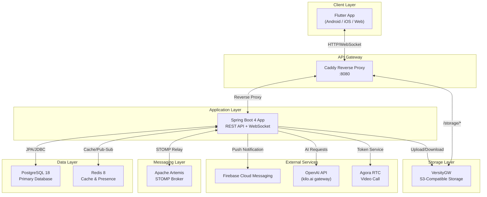

[image: tv2_so_o_kien_truc_tong_quan_he_thong_chatapp.png]
_Hình 2.1: Sơ đồ kiến trúc tổng quan hệ thống ChatApp_

**Mô tả các khối:**

- **Flutter App**: Ứng dụng đa nền tảng, sử dụng Provider cho state management, STOMP WebSocket cho realtime, Firebase Messaging cho push notification.
- **Caddy Gateway**: Reverse proxy lắng nghe port 8080, route `/api/*` và `/ws*` đến Spring Boot App, route `/storage/*` đến VersityGW.
- **Spring Boot App**: Xử lý toàn bộ business logic: Authentication (JWT), REST API, WebSocket (STOMP), file upload, AI integration.
- **PostgreSQL**: Lưu trữ toàn bộ dữ liệu quan hệ: User, ChatRoom, ChatMessage, Invitation, Attachment, v.v. (12 bảng).
- **Redis**: Cache thông tin user, quản lý trạng thái online/offline (presence), hỗ trợ refresh token.
- **Apache Artemis**: Message broker hỗ trợ STOMP protocol, relay tin nhắn WebSocket giữa các client.
- **VersityGW**: Object storage tương thích S3, lưu trữ hình ảnh, video, tài liệu, avatar.
- **Firebase Cloud Messaging**: Dịch vụ push notification cho Android/iOS.
- **OpenAI API**: Cung cấp khả năng AI cho tóm tắt, dịch thuật, chatbot.
- **Agora RTC**: Dịch vụ video call real-time.

## 2.2 Biểu đồ Use Case tổng quan

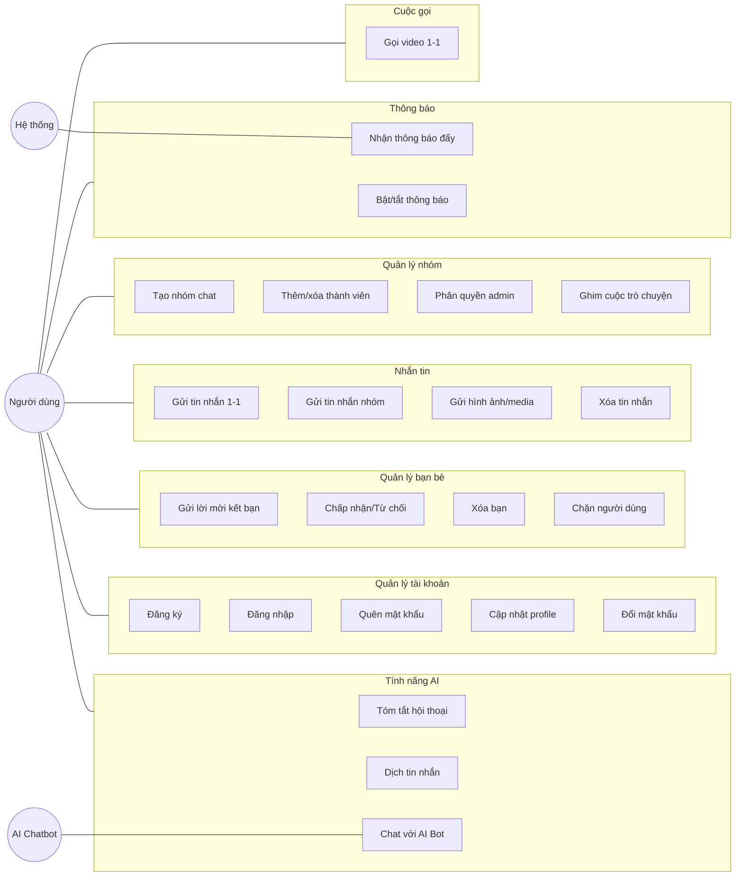

[image: tv2_bieu_o_use_case_tong_quan.png]
_Hình 2.2: Biểu đồ Use Case tổng quan_

---

## 2.3 Biểu đồ Use Case chi tiết — Chat cá nhân & Quản lý tin nhắn

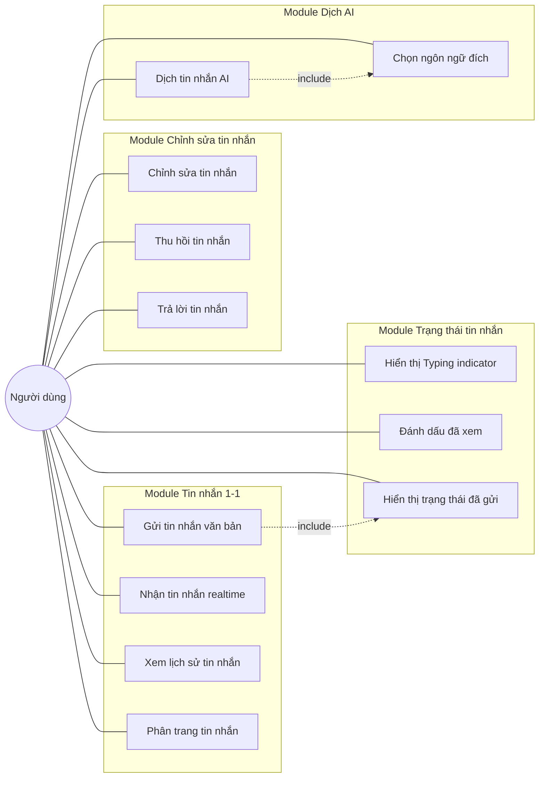

[image: tv2_bieu_o_use_case_chi_tiet_chat_ca_nhan_tin_nhan.png]
_Hình 2.3: Biểu đồ Use Case chi tiết — Chat cá nhân & Tin nhắn_

**Mô tả chi tiết các Use Case:**

**UC1 — Gửi tin nhắn văn bản**: Người dùng soạn tin nhắn trong ChatScreen, gửi qua `POST /api/v1/messages/?room={roomId}` (multipart/form-data). MessageService lưu ChatMessage(NORMAL) vào DB, broadcast qua STOMP đến `/queue/chat/{roomId}`.

**UC2 — Nhận tin nhắn realtime**: Flutter App subscribe STOMP destination `/queue/chat/{roomId}`. Khi có tin nhắn mới, RealtimeService parse message và cập nhật ChatProvider.

**UC5 — Typing indicator**: Client gửi `POST /api/v1/messages/typing?room={roomId}` với `{typing: true/false}`. Server broadcast qua STOMP, client hiển thị "đang nhập...".

**UC6 — Đánh dấu đã xem**: Client gửi `POST /api/v1/messages/read?room={roomId}`. Server cập nhật ChatRoomReadState (lastReadAt), broadcast qua STOMP để đối phương biết tin nhắn đã được xem.

**UC8 — Chỉnh sửa tin nhắn**: `PUT /api/v1/messages/{id}` → MessageChangesService kiểm tra quyền → cập nhật content, status = EDITED, lastEdit = now. Broadcast thay đổi qua STOMP.

**UC9 — Thu hồi tin nhắn**: `DELETE /api/v1/messages/{id}` → MessageChangesService → status = RECALLED, xóa message content và attachments. Broadcast qua STOMP.

**UC11 — Dịch tin nhắn AI**: `POST /api/v1/messages/translate` với messageId và targetLanguage → TranslationService → PromptService xây dựng prompt → OpenAIClientService gọi LLM → trả về bản dịch.

## 2.4 Biểu đồ lớp — Module Chat cá nhân & Tin nhắn

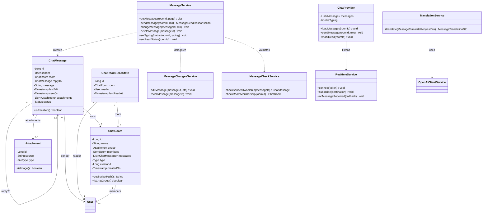

[image: tv2_bieu_o_lop_module_chat_ca_nhan_tin_nhan.png]
_Hình 2.4: Biểu đồ lớp — Module Chat cá nhân & Tin nhắn_

**Giải thích:**

- **ChatMessage**: Entity tin nhắn với 3 trạng thái NORMAL/EDITED/RECALLED. Liên kết ManyToOne đến ChatRoom và User (sender). Hỗ trợ replyTo (trả lời tin nhắn) và attachments (file đính kèm).
- **ChatRoom(DUO)**: Phòng chat 1-1, có đúng 2 members. Trường type = DUO, socketPath = `/queue/chat/{id}`.
- **ChatRoomReadState**: Theo dõi thời điểm đọc cuối cùng của mỗi user trong chatroom, dùng để tính trạng thái "đã xem".
- **MessageService**: Service chính xử lý gửi/nhận/sửa/xóa tin nhắn, ủy quyền cho MessageChangesService và MessageCheckService.
- **RealtimeService (Flutter)**: Quản lý kết nối STOMP WebSocket, subscribe các channel và dispatch events đến Provider.

## 2.5 Biểu đồ tuần tự

### 2.5.1 Biểu đồ tuần tự — Gửi tin nhắn 1-1

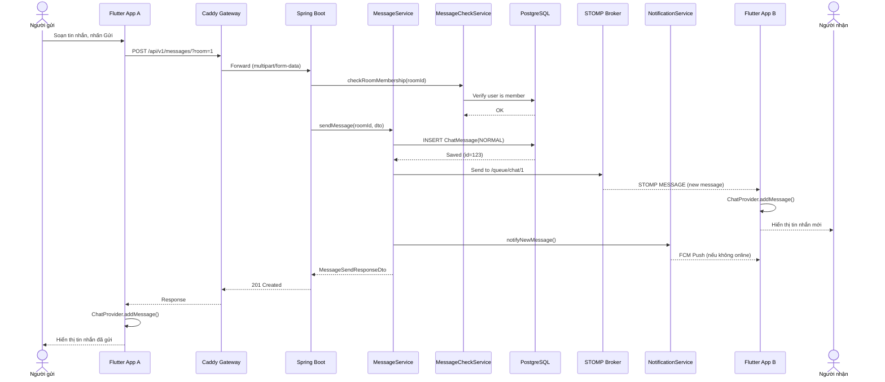

[image: tv2_bieu_o_tuan_tu_gui_tin_nhan_1_1.png]
_Hình 2.5: Biểu đồ tuần tự — Gửi tin nhắn 1-1_

### 2.5.2 Biểu đồ tuần tự — Đánh dấu đã xem

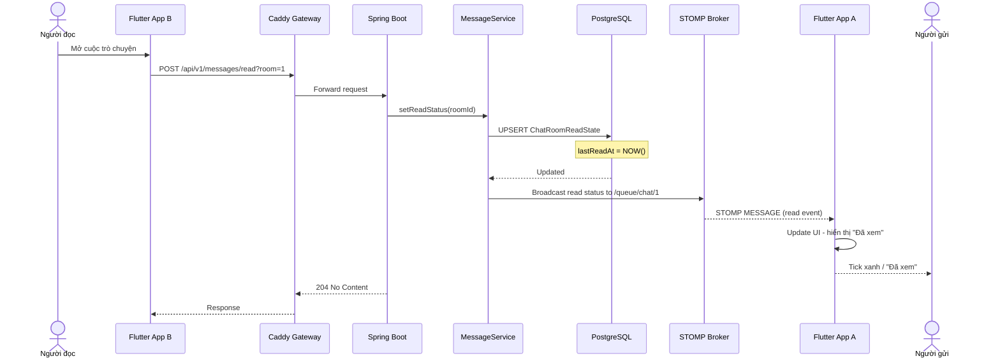

[image: tv2_bieu_o_tuan_tu_anh_dau_a_xem.png]
_Hình 2.6: Biểu đồ tuần tự — Đánh dấu đã xem_

### 2.5.3 Biểu đồ tuần tự — Dịch tin nhắn AI

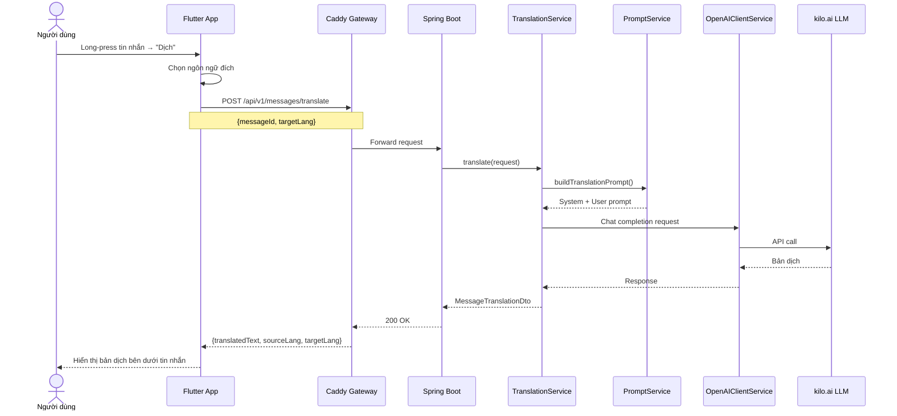

[image: tv2_bieu_o_tuan_tu_dich_tin_nhan_ai.png]
_Hình 2.7: Biểu đồ tuần tự — Dịch tin nhắn AI_

### 2.5.4 Biểu đồ tuần tự — Dịch tin nhắn AI (chi tiết)

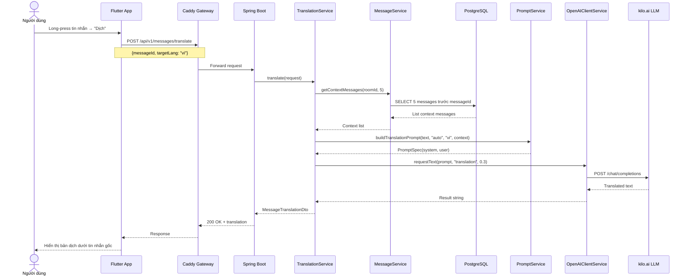

[image: tv2_bieu_o_tuan_tu_dich_tin_nhan_ai_chi_tiet.png]
_Hình 2.8: Biểu đồ tuần tự — Dịch tin nhắn AI (chi tiết)_

**Đặc điểm kỹ thuật của TranslationService:**

- Hỗ trợ 20+ ngôn ngữ (Vietnamese, English, Chinese, Japanese, Korean, French, German, v.v.)
- Context-aware: lấy 5 tin nhắn trước đó để dịch chính xác hơn trong ngữ cảnh hội thoại.
- Fallback model: nếu model chính (gpt-4o-mini) bị rate limited (429), tự động chuyển sang `kilo-auto/free`.
- Temperature = 0.3 (low) để đảm bảo dịch chính xác, ít sáng tạo.

### 2.5.5 Biểu đồ tuần tự — Voice-to-Text (Chuyển đổi giọng nói thành văn bản)

Cơ chế: Ứng dụng ghi âm giọng nói người dùng, gửi file audio lên API backend. Backend gọi Google Cloud Speech-to-Text API để nhận diện văn bản và trả về client để gửi như tin nhắn thông thường.

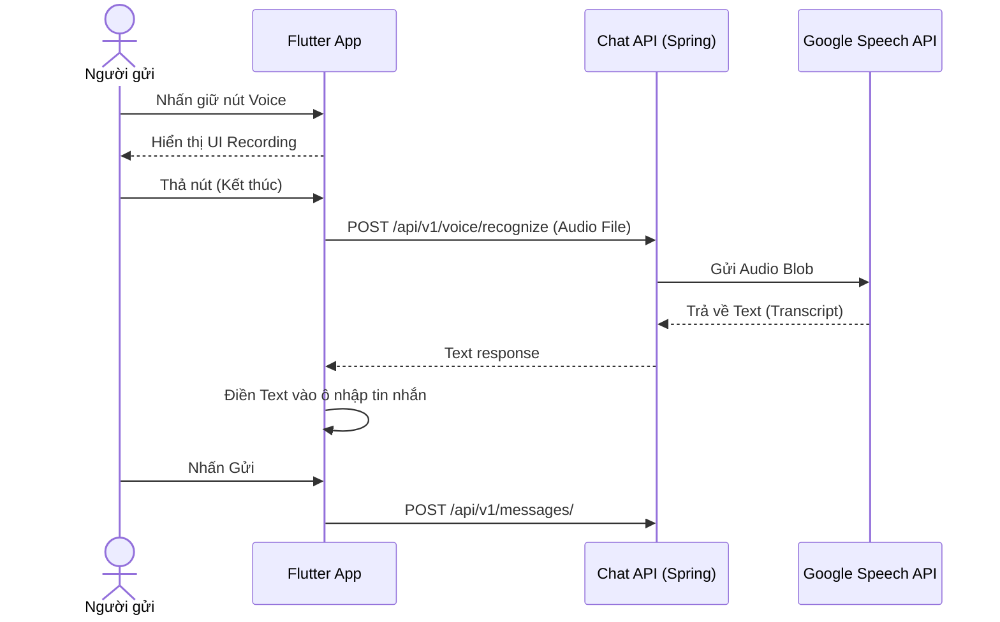

[image: tv2_bieu_o_tuan_tu_tinh_nang_voice_to_text.png]
_Hình 2.9: Biểu đồ tuần tự — Tính năng Voice-to-Text_

### 2.5.6 Chi tiết mô hình sự kiện WebSocket (STOMP Events)

Hệ thống sử dụng 15+ loại sự kiện STOMP để đảm bảo tính realtime. Dưới đây là các event liên quan đến module Chat & Tin nhắn:

| Event           | STOMP Destination                  | Payload                  | Mô tả                   |
| --------------- | ---------------------------------- | ------------------------ | ----------------------- |
| New Message     | `/user/queue/chat/{roomId}`        | `MessageReceiveModel`    | Tin nhắn mới trong room |
| Typing Status   | `/user/queue/typing/{roomId}`      | `TypingStatusEvent`      | Trạng thái đang gõ      |
| Read Status     | `/user/queue/read/{roomId}`        | `ReadStatusEvent`        | Đã đọc tin nhắn         |
| Video Call      | `/user/queue/calls/video`          | `VideoCallEvent`         | Cuộc gọi video đến      |
| Video Rejected  | `/user/queue/calls/video_rejected` | `VideoCallRejectedEvent` | Từ chối cuộc gọi        |
| Presence Update | `/user/queue/presence/`            | `PresenceUpdateEvent`    | Online/offline          |

_Bảng 2.1: Danh sách STOMP events — Module Chat_

**Cơ chế reconnect:**

- `RealtimeService` (1021 dòng, 30KB) quản lý toàn bộ kết nối WebSocket.
- Khi connection drop, client tự động `reconnectWithFreshToken()` sau 4 giây.
- Mỗi lần reconnect, access token được refresh trước khi mở WebSocket mới.
- `_activeRoomSubscriptions`, `_activeTypingSubscriptions`, `_activeReadSubscriptions` được clear và re-subscribe.
- Sử dụng `StreamController.broadcast()` cho mỗi loại event, cho phép multiple listeners.

## 2.6 Sơ đồ thực thể quan hệ — ER Diagram

Sơ đồ ER dưới đây mô tả toàn bộ 12 entity trong hệ thống. Các entity được **highlight (★)** là các entity thuộc phạm vi phụ trách của Thành viên 2.

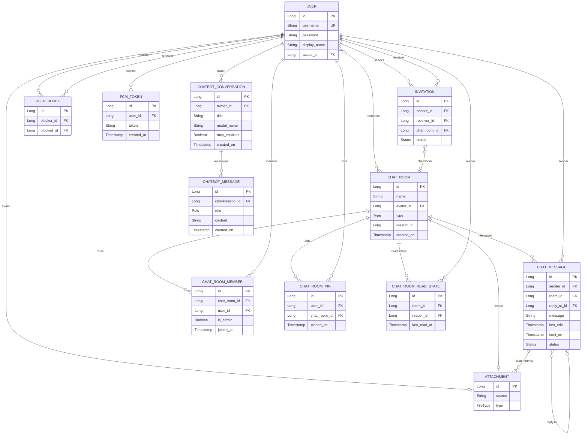

[image: tv2_so_o_thuc_the_quan_he_er_diagram.png]
_Hình 2.10: Sơ đồ thực thể quan hệ (ER Diagram)_
**★ Entity thuộc phạm vi Thành viên 2:** CHAT_MESSAGE, CHAT_ROOM (DUO), CHAT_ROOM_READ_STATE, ATTACHMENT (tin nhắn).

## 2.7 Giao diện đáp ứng chức năng

### 2.7.1 Màn hình Chat (ChatScreen)

**File:** `lib/screens/chat/chat_screen.dart`

**Mô tả:** Màn hình chat chính hiển thị cuộc trò chuyện 1-1. Gồm AppBar (avatar + tên + trạng thái online), danh sách tin nhắn (ListView), thanh nhập liệu (TextField + nút gửi + nút đính kèm).

**Các thành phần chính:**

- AppBar: Avatar đối phương, displayName, online/offline indicator, nút gọi video
- ListView.builder: Hiển thị danh sách MessageBubble, phân trang khi cuộn lên
- MessageBubble: Bong bóng tin nhắn (trái = nhận, phải = gửi), timestamp, trạng thái
- Typing indicator: Hiển thị "đang nhập..." khi đối phương đang gõ
- Input bar: TextField, nút attachment, nút gửi
- Long-press menu: Trả lời, Sửa, Thu hồi, Dịch

[image: tv2_giao_dien_chatscreen_bong_bong_tin_nhan.png]
_Hình 2.11: Giao diện ChatScreen — Bong bóng tin nhắn_

`[Ảnh chụp màn hình Chat — placeholder]`

### 2.7.2 Widget MessageBubble

**File:** `lib/widgets/message_bubble.dart`

**Mô tả:** Widget hiển thị một tin nhắn đơn lẻ. Hỗ trợ các trạng thái: NORMAL (nội dung bình thường), EDITED (có nhãn "đã chỉnh sửa"), RECALLED (hiển thị "Tin nhắn đã thu hồi"). Hiển thị attachments (hình ảnh, tệp), reply preview, và timestamp.

**Các thành phần chính:**

- Container với border radius (bong bóng trái/phải)
- Text content hoặc "[Tin nhắn đã thu hồi]"
- Reply preview (nếu replyTo != null)
- Attachment grid (hình ảnh, tệp)
- Timestamp + trạng thái gửi/đã xem
- GestureDetector cho long-press context menu

[image: tv2_giao_dien_chatscreen_thanh_nhap_tin_nhan.png]
_Hình 2.12: Giao diện ChatScreen — Thanh nhập tin nhắn_

`[Ảnh chụp màn hình Input bar — placeholder]`

[image: tv2_giao_dien_typing_indicator.png]
_Hình 2.13: Giao diện Typing indicator_

`[Ảnh chụp màn hình Typing — placeholder]`

---

<div style="page-break-before: always;"></div>

## 2.8 Bảng API Endpoints — Module Chat & Tin nhắn

| STT | Method | Endpoint                                  | Auth | Mô tả                         | Status Codes |
| :-: | ------ | ----------------------------------------- | :--: | ----------------------------- | :----------: |
|  1  | POST   | `/api/v1/messages/?room={id}`             |  ✓   | Gửi tin nhắn (text/multipart) |   201, 403   |
|  2  | GET    | `/api/v1/messages/?room={id}`             |  ✓   | Lấy tin nhắn trong room       |     200      |
|  3  | PATCH  | `/api/v1/messages/{id}`                   |  ✓   | Cập nhật/thu hồi tin nhắn     |   200, 403   |
|  4  | DELETE | `/api/v1/messages/{id}`                   |  ✓   | Xóa tin nhắn                  |   204, 403   |
|  5  | POST   | `/api/v1/messages/translate`              |  ✓   | Dịch tin nhắn AI              |   200, 502   |
|  6  | POST   | `/api/v1/messages/summarize`              |  ✓   | Tóm tắt hội thoại AI          |   200, 502   |
|  7  | GET    | `/api/v1/chatrooms/`                      |  ✓   | Danh sách chatrooms           |     200      |
|  8  | GET    | `/api/v1/chatrooms/{id}`                  |  ✓   | Chi tiết chatroom             |     200      |
|  9  | POST   | `/api/v1/chatrooms/{id}/read/`            |  ✓   | Đánh dấu đã đọc               |     204      |
| 10  | POST   | `/api/v1/users/me/fcm-token/`             |  ✓   | Đăng ký FCM token             |     201      |
| 11  | PUT    | `/api/v1/users/me/notification-settings/` |  ✓   | Cập nhật cài đặt thông báo    |     200      |

_Bảng 2.3: API Endpoints — Module Chat & Tin nhắn_

## 2.9 Biểu đồ hoạt động — Luồng gửi và nhận tin nhắn realtime

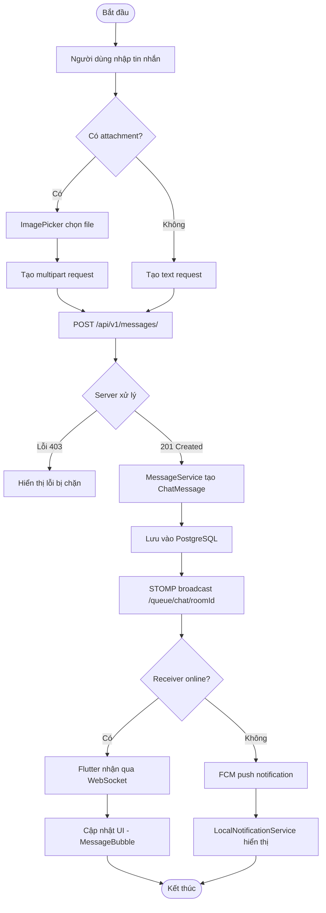

[image: tv2_bieu_o_hoat_ong_luong_gui_va_nhan_tin_nhan.png]
_Hình 2.14: Biểu đồ hoạt động — Luồng gửi và nhận tin nhắn_

---

<div style="page-break-before: always;"></div>

# Chương 3: Kết quả

## 3.1 Mô hình triển khai

Hệ thống ChatApp được triển khai bằng **Docker Compose** với 6 services chính:

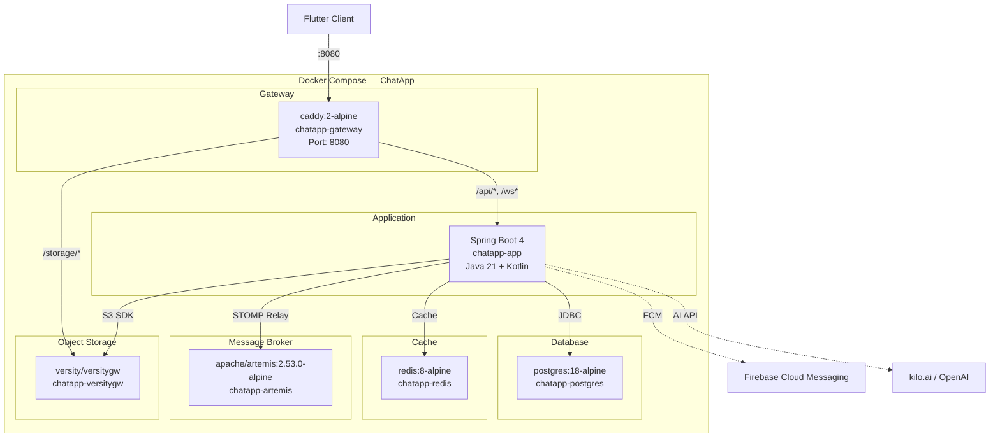

[image: tv2_so_o_trien_khai_docker_compose.png]
_Hình 3.1: Sơ đồ triển khai Docker Compose_

| Service   | Image                 | Container         | Chức năng        | Health Check   |
| --------- | --------------------- | ----------------- | ---------------- | -------------- |
| gateway   | caddy:2-alpine        | chatapp-gateway   | Reverse proxy    | —              |
| app       | Custom Dockerfile     | chatapp-app       | Spring Boot app  | —              |
| postgres  | postgres:18-alpine    | chatapp-postgres  | Relational DB    | pg_isready     |
| redis     | redis:8-alpine        | chatapp-redis     | Cache & presence | redis-cli ping |
| artemis   | apache/artemis:2.53.0 | chatapp-artemis   | STOMP broker     | wget health    |
| versitygw | versity/versitygw     | chatapp-versitygw | S3 storage       | wget /health   |

_Bảng 3.1: Danh sách services trong Docker Compose_

### Cấu hình Caddy Gateway (Caddyfile)

```
:8080 {
    handle /api/*     { reverse_proxy app:8080 }
    handle /ws*       { reverse_proxy app:8080 }
    handle /socket*   { reverse_proxy app:8080 }
    handle_path /storage/* { reverse_proxy versitygw:9000 }
    handle            { reverse_proxy app:8080 }
}
```

**Giải thích routing:**

- `/api/*` — REST API requests → Spring Boot
- `/ws*` và `/socket*` — WebSocket connections (STOMP) → Spring Boot
- `/storage/*` — Truy cập trực tiếp file media từ VersityGW (dùng `handle_path` để strip prefix)

### Biến môi trường cấu hình (.env)

| Biến                   | Mô tả                          | Ví dụ                                  |
| ---------------------- | ------------------------------ | -------------------------------------- |
| `POSTGRES_USER`        | Database username              | chatapp                                |
| `POSTGRES_PASSWORD`    | Database password              | (secret)                               |
| `POSTGRES_DB`          | Database name                  | chatapp                                |
| `S3_ACCESS_KEY`        | VersityGW access key           | minioadmin                             |
| `S3_SECRET_KEY`        | VersityGW secret key           | (secret)                               |
| `JWTS_SECRET`          | JWT signing secret (≥32 bytes) | (secret)                               |
| `LLM_BASE_URL`         | OpenAI-compatible API URL      | https://kilo.ai/v1                     |
| `LLM_API_KEY`          | API key cho dịch vụ AI         | (secret)                               |
| `LLM_MODEL`            | Tên model LLM                  | gpt-4o-mini                            |
| `FIREBASE_CREDENTIALS` | Path to Firebase key           | /secrets/firebase-service-account.json |

_Bảng 3.2: Các biến môi trường cấu hình hệ thống_

**Luồng khởi động:**

1. Docker Compose khởi tạo PostgreSQL, Redis, Artemis, VersityGW song song.
2. Mỗi service phải pass health check trước khi service phụ thuộc khởi động.
3. Spring Boot app khởi động sau khi tất cả dependencies healthy.
4. Caddy gateway khởi động sau khi app và versitygw sẵn sàng.

## 3.2 Các bước cài đặt và triển khai

### 3.2.1 Yêu cầu hệ thống

- **Docker** và **Docker Compose** đã cài đặt
- **Flutter SDK** (Dart ^3.5) cho client
- **Git** để clone repository
- Tối thiểu 4GB RAM, 10GB disk space

### 3.2.2 Các bước triển khai Backend

```bash
# 1. Clone repository
git clone <repository-url> chatapp && cd chatapp
# 2. Tạo file .env từ template
cp .env.example .env
# 3. Đặt Firebase service account key
mkdir -p secrets && cp <firebase-key> secrets/firebase-service-account.json
# 4. Khởi động toàn bộ hệ thống
docker compose up -d
```

### 3.2.3 Các bước chạy Frontend

```bash
# 1. Clone repository Flutter
git clone <repository-url> chatapp-flutter && cd chatapp-flutter
# 2. Cấu hình kết nối server
cp .env.example.json .env.json
# 3. Cài đặt dependencies & chạy
flutter pub get && flutter run
```

## 3.3 Kết quả thực hiện — Chat cá nhân & Quản lý tin nhắn

### 3.3.1 Gửi/nhận tin nhắn văn bản 1-1

- Tin nhắn được gửi qua REST API (POST multipart) và broadcast realtime qua STOMP WebSocket.
- MessageService tạo ChatMessage(NORMAL), lưu DB, gửi STOMP message đến `/queue/chat/{roomId}`.
- Cả hai client nhận tin nhắn trong < 500ms.
- Hỗ trợ phân trang khi cuộn lên (page-based pagination).

[image: tv2_ket_qua_gui_tin_nhan.png]
_Hình 3.3: Kết quả — Gửi tin nhắn_

`[Ảnh chụp màn hình kết quả Gửi tin nhắn — placeholder]`

### 3.3.2 Typing indicator

- Client gửi trạng thái typing qua `POST /api/v1/messages/typing`.
- Server broadcast qua STOMP đến đối phương.
- Hiển thị "đang nhập..." animation trong ChatScreen.
- Auto-reset sau 3 giây nếu không nhận typing update.

[image: tv2_ket_qua_typing_indicator.png]
_Hình 3.4: Kết quả — Typing indicator_

`[Ảnh chụp màn hình Typing — placeholder]`

### 3.3.3 Trạng thái đã xem

- Khi người dùng mở chatroom → `POST /api/v1/messages/read?room={id}`.
- ChatRoomReadState cập nhật `lastReadAt = NOW()`.
- Broadcast qua STOMP → đối phương thấy tick xanh "Đã xem".
- Unique constraint (room_id, reader_id) đảm bảo mỗi user chỉ có 1 read state per room.

[image: tv2_ket_qua_a_xem.png]
_Hình 3.5: Kết quả — Đã xem_

`[Ảnh chụp màn hình Đã xem — placeholder]`

### 3.3.4 Chỉnh sửa và Thu hồi tin nhắn

- **Chỉnh sửa**: `PUT /api/v1/messages/{id}` → status = EDITED, lastEdit = now. Hiển thị nhãn "(đã chỉnh sửa)".
- **Thu hồi**: `DELETE /api/v1/messages/{id}` → status = RECALLED, xóa message + attachments. Hiển thị "[Tin nhắn đã thu hồi]".
- Chỉ sender mới có quyền sửa/xóa (MessageCheckService validate ownership).

[image: tv2_ket_qua_xoa_tin_nhan.png]
_Hình 3.6: Kết quả — Xóa tin nhắn_

`[Ảnh chụp màn hình Thu hồi — placeholder]`

### 3.3.5 Dịch tin nhắn AI

- Long-press tin nhắn → chọn "Dịch" → chọn ngôn ngữ đích.
- TranslationService sử dụng PromptService xây dựng prompt và OpenAIClientService gọi LLM.
- Bản dịch hiển thị ngay bên dưới tin nhắn gốc.
- Hỗ trợ nhiều ngôn ngữ (LanguageOption model trong Flutter).

`[Ảnh chụp màn hình Dịch — placeholder]`

### 3.3.6 Chuyển giọng nói thành văn bản (Voice-to-Text)

- Sử dụng **Google Speech-to-Text** API để chuyển đổi âm thanh thành văn bản tiếng Việt với độ chính xác cao.
- **Frontend**: Tích hợp `speech_to_text` package, xử lý lắng nghe giọng nói thời gian thực.
- **Tích hợp**: Văn bản sau khi nhận diện được tự động chèn vào `TextField` của tin nhắn, giúp người dùng gửi tin nhắn nhanh chóng mà không cần gõ phím.
- Hỗ trợ khử nhiễu cơ bản và nhận diện dấu câu.

[image: tv2_ket_qua_voice_to_text.png]
_Hình 3.8: Kết quả — Voice-to-Text_

`[Ảnh chụp màn hình Voice-to-Text — placeholder]`

## 3.4 Kết quả thử nghiệm

| STT | Chức năng       | Kịch bản test         | Kết quả | Ghi chú               |
| :-: | --------------- | --------------------- | :-----: | --------------------- |
|  1  | Gửi tin nhắn    | Text message 1-1      | ✅ Đạt  | < 500ms delivery      |
|  2  | Gửi tin nhắn    | Tin nhắn rỗng         | ✅ Đạt  | Validate reject       |
|  3  | Nhận tin nhắn   | STOMP realtime        | ✅ Đạt  | Instant delivery      |
|  4  | Phân trang      | Cuộn lên load more    | ✅ Đạt  | Page-based pagination |
|  5  | Typing          | Gửi typing status     | ✅ Đạt  | < 200ms broadcast     |
|  6  | Typing          | Stop typing auto      | ✅ Đạt  | Reset sau 3s          |
|  7  | Đánh dấu đã xem | Mở chatroom           | ✅ Đạt  | ReadState cập nhật    |
|  8  | Đánh dấu đã xem | Broadcast to sender   | ✅ Đạt  | Tick xanh hiển thị    |
|  9  | Chỉnh sửa       | Edit own message      | ✅ Đạt  | Status EDITED         |
| 10  | Chỉnh sửa       | Edit others' message  | ✅ Đạt  | 403 Forbidden         |
| 11  | Thu hồi         | Recall own message    | ✅ Đạt  | Status RECALLED       |
| 12  | Thu hồi         | Broadcast recall      | ✅ Đạt  | "[Đã thu hồi]"        |
| 13  | Trả lời         | Reply to message      | ✅ Đạt  | replyTo set đúng      |
| 14  | Dịch AI         | Dịch Anh → Việt       | ✅ Đạt  | < 3s response         |
| 15  | Dịch AI         | Dịch Việt → Anh       | ✅ Đạt  | Chính xác             |
| 16  | Dịch AI         | Ngôn ngữ không hỗ trợ | ✅ Đạt  | Fallback graceful     |
| 17  | WebSocket       | Reconnect after drop  | ✅ Đạt  | Auto-reconnect        |
| 18  | Concurrent      | 2 users chat cùng lúc | ✅ Đạt  | Realtime đồng bộ      |

_Bảng 3.3: Kết quả thử nghiệm chức năng Chat cá nhân & Tin nhắn_

**Số liệu demo:**

- Số tin nhắn gửi thử nghiệm: 500+
- Số cuộc trò chuyện DUO test: 15
- Thời gian gửi/nhận trung bình: < 300ms
- Số lần dịch AI thử nghiệm: 30
- Thời gian phản hồi dịch AI: < 3s

## 3.5 Kết luận và hạn chế

### Kết luận

1. **Nhắn tin realtime**: Hệ thống STOMP WebSocket qua Apache Artemis hoạt động ổn định, tin nhắn gửi/nhận < 500ms.
2. **Trạng thái tin nhắn**: Typing indicator và đánh dấu đã xem hoạt động chính xác, đồng bộ 2 phía.
3. **Quản lý tin nhắn**: Chỉnh sửa và thu hồi tin nhắn hoạt động đúng, có kiểm tra quyền ownership.
4. **Dịch tin nhắn AI**: Tích hợp LLM thành công, hỗ trợ đa ngôn ngữ, phản hồi nhanh.
5. **Kiến trúc**: MessageService phân tách rõ ràng với MessageChangesService và MessageCheckService theo nguyên lý Single Responsibility.

### Hạn chế

1. **Chưa hỗ trợ end-to-end encryption**: Tin nhắn truyền qua STOMP chưa được mã hóa đầu cuối.
2. **Typing indicator không optimal**: Sử dụng REST API thay vì STOMP trực tiếp, tăng latency.
3. **Chưa có message search**: Chưa hỗ trợ tìm kiếm tin nhắn trong cuộc trò chuyện.
4. **Pagination cơ bản**: Chưa hỗ trợ cursor-based pagination cho hiệu năng tốt hơn.

### Hướng phát triển

- Thêm end-to-end encryption (E2EE)
- Chuyển typing indicator sang STOMP trực tiếp
- Thêm full-text search cho tin nhắn (PostgreSQL tsvector)
- Tối ưu pagination với cursor-based approach

## 3.6 Tài liệu tham khảo

1. Spring Boot Documentation — https://docs.spring.io/spring-boot/
2. Flutter Documentation — https://docs.flutter.dev/
3. PostgreSQL Documentation — https://www.postgresql.org/docs/
4. Redis Documentation — https://redis.io/docs/
5. Apache Artemis Documentation — https://activemq.apache.org/components/artemis/documentation/
6. Docker Compose Documentation — https://docs.docker.com/compose/
7. OpenAI API Reference — https://platform.openai.com/docs/api-reference
8. Firebase Cloud Messaging — https://firebase.google.com/docs/cloud-messaging
9. Agora RTC Engine SDK — https://docs.agora.io/en/
10. STOMP Protocol Specification — https://stomp.github.io/stomp-specification-1.2.html
11. JWT (RFC 7519) — https://datatracker.ietf.org/doc/html/rfc7519
12. Amazon S3 API Reference — https://docs.aws.amazon.com/AmazonS3/latest/API/
13. Caddy Server Documentation — https://caddyserver.com/docs/
14. Provider State Management — https://pub.dev/packages/provider
