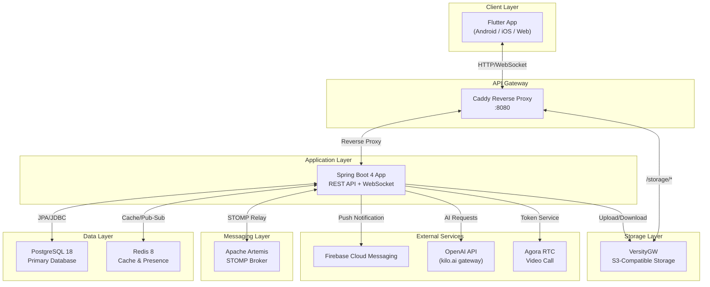
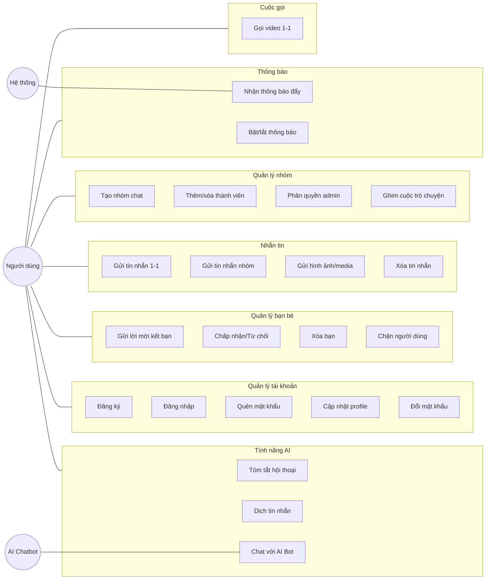
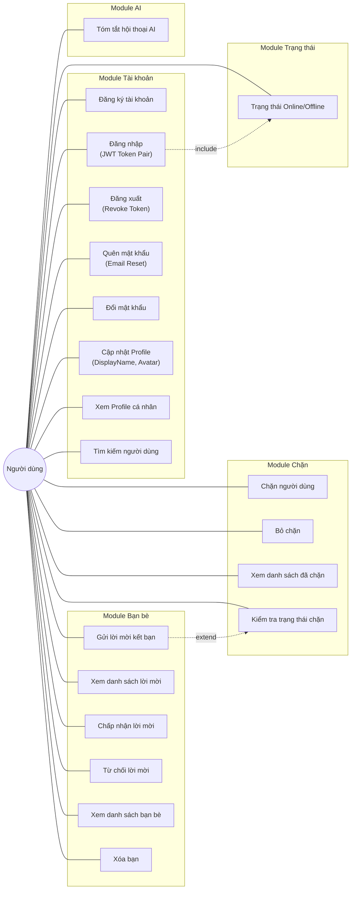
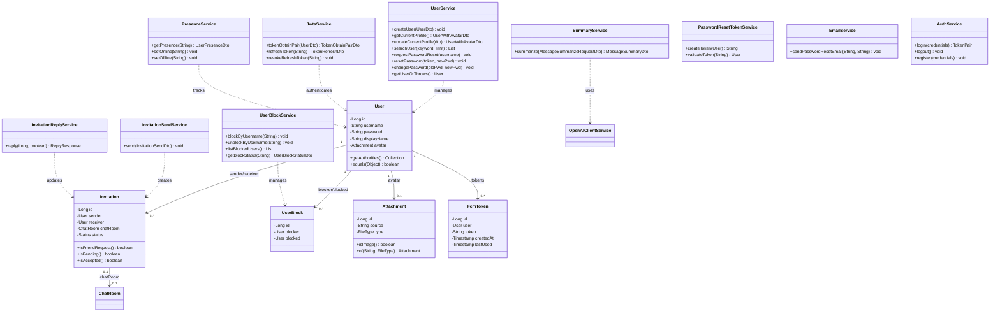
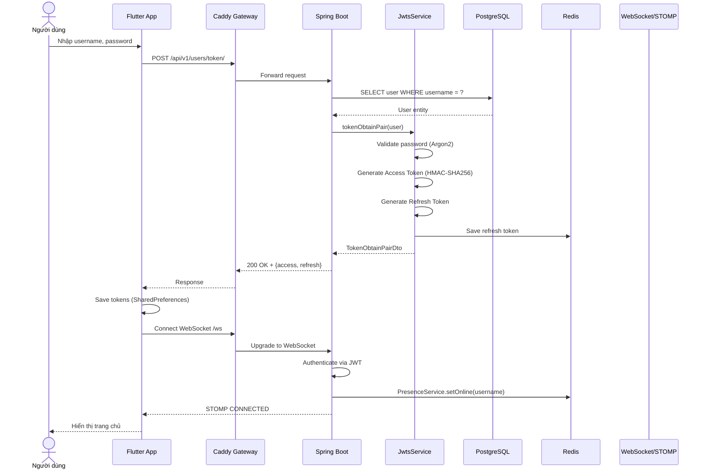
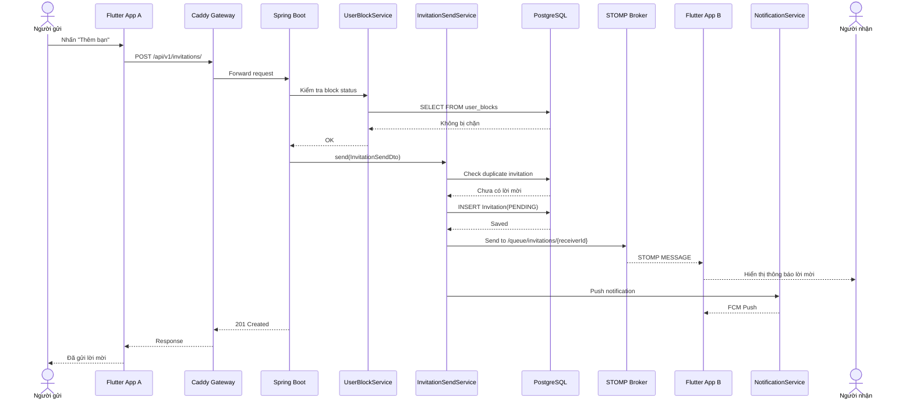
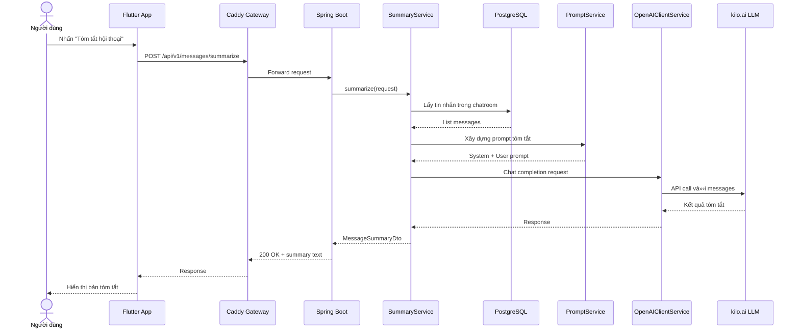
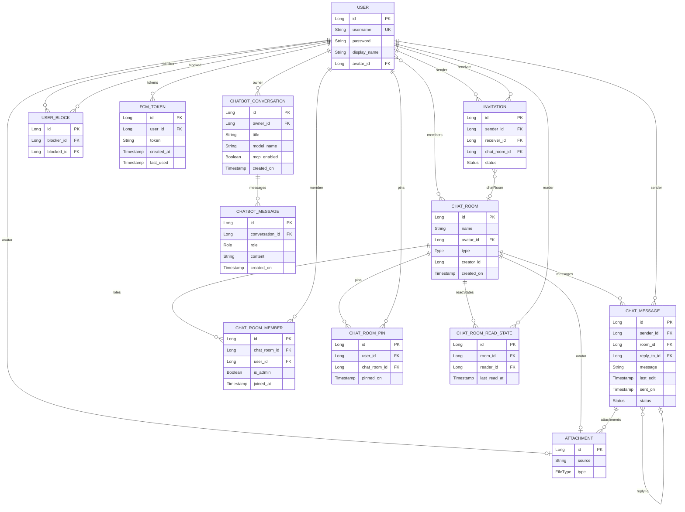
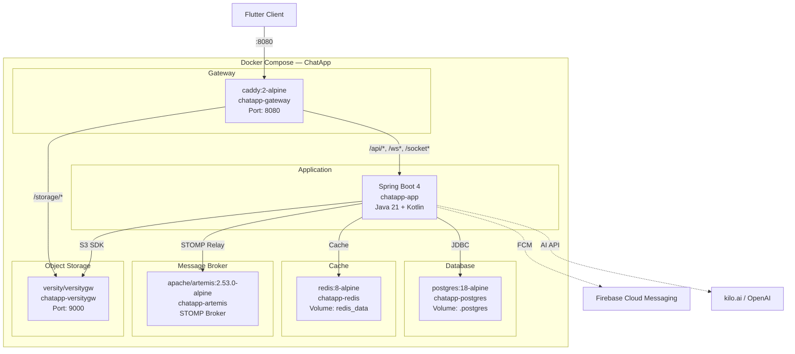

# BẢNG PHÂN CÔNG NHIỆM VỤ

| STT | Họ và tên | MSSV | Nhiệm vụ cụ thể | Đóng góp (%) |
|:---:|-----------|------|------------------|:------------:|
| 1 | Nguyễn Văn Duy | B22DCCN154 | Gửi hình ảnh/media, Thông báo đẩy (FCM), Chatbot AI streaming, Video Call (Agora) | 25% |
| 2 | Nguyễn Hoàng Hiệp | B22DCCN298 | Chat cá nhân 1-1, Gửi/nhận tin nhắn, Typing indicator, Trạng thái đã xem, Xóa tin nhắn, Dịch tin nhắn AI, Voice-to-Text | 25% |
| 3 | Nguyễn Quang Minh | B22DCCN538 | Tài khoản (Đăng ký, Đăng nhập, Quên MK, Profile), Quản lý bạn bè (Lời mời, Chặn, Xóa bạn), Trạng thái online, Tóm tắt AI | 25% |
| 4 | Đặng Hữu Hoàng Quân | B22DCCN658 | Danh sách cuộc trò chuyện, Tìm kiếm, Ghim chat, Tạo nhóm, Quản lý thành viên nhóm, Phân quyền admin | 25% |

*Bảng 0.1: Bảng phân công nhiệm vụ các thành viên*

---

# MỤC LỤC
---

<div style="page-break-before: always;"></div>

# DANH SÁCH VIẾT TẮT

| Viết tắt | Ý nghĩa |
|----------|---------|
| API | Application Programming Interface |
| CRUD | Create, Read, Update, Delete |
| DTO | Data Transfer Object |
| FCM | Firebase Cloud Messaging |
| GVHD | Giảng viên hướng dẫn |
| HTTP | HyperText Transfer Protocol |
| JPA | Java Persistence API |
| JWT | JSON Web Token |
| LLM | Large Language Model |
| MSSV | Mã số sinh viên |
| ORM | Object-Relational Mapping |
| REST | Representational State Transfer |
| S3 | Simple Storage Service |
| SDK | Software Development Kit |
| SQL | Structured Query Language |
| SSE | Server-Sent Events |
| STOMP | Simple Text Oriented Messaging Protocol |
| UI | User Interface |
| UML | Unified Modeling Language |
| WebSocket | Giao thức truyền thông hai chiều thời gian thực |

*Bảng 0.2: Danh sách viết tắt*

---

# DANH SÁCH HÌNH

| Ký hiệu | Mô tả |
|----------|-------|
| Hình 2.1 | Sơ đồ kiến trúc tổng quan hệ thống ChatApp |
| Hình 2.2 | Biểu đồ Use Case tổng quan |
| Hình 2.3 | Biểu đồ Use Case chi tiết — Tài khoản & Bạn bè |
| Hình 2.4 | Biểu đồ lớp — Module Tài khoản & Bạn bè |
| Hình 2.5 | Biểu đồ tuần tự — Đăng nhập & JWT |
| Hình 2.6 | Biểu đồ tuần tự — Gửi lời mời kết bạn |
| Hình 2.7 | Biểu đồ tuần tự — Tóm tắt hội thoại AI |
| Hình 2.8 | Sơ đồ thực thể quan hệ (ER Diagram) |
| Hình 2.9 | Giao diện Đăng nhập |
| Hình 3.1 | Sơ đồ triển khai Docker Compose |
| Hình 3.2 | Kết quả — Đăng ký |
| Hình 3.3 | Kết quả — Bạn bè |
| Hình 3.4 | Kết quả — Lời mời kết bạn |

*Bảng 0.3: Danh sách hình*

---

# DANH SÁCH BẢNG

| Ký hiệu | Mô tả |
|----------|-------|
| Bảng 1.1 | Yêu cầu chức năng |
| Bảng 1.2 | Yêu cầu phi chức năng |
| Bảng 1.3 | So sánh lựa chọn công nghệ |
| Bảng 3.1 | Danh sách services trong Docker Compose |
| Bảng 3.2 | Kết quả thử nghiệm chức năng Tài khoản & Bạn bè |

*Bảng 0.4: Danh sách bảng*

---

<div style="page-break-before: always;"></div>

# Chương 1: Mở đầu

## 1.1 Giới thiệu ứng dụng và lý do thực hiện

Trong thời đại công nghệ số hiện nay, nhu cầu giao tiếp trực tuyến ngày càng tăng cao. Các ứng dụng nhắn tin đã trở thành công cụ không thể thiếu trong cuộc sống hàng ngày, từ trao đổi công việc đến kết nối bạn bè, gia đình. Thị trường hiện nay có nhiều ứng dụng nhắn tin phổ biến như Zalo, Messenger, Telegram, mỗi ứng dụng đều có những ưu điểm và hạn chế riêng.

**ChatApp** là ứng dụng nhắn tin trực tuyến được phát triển bởi nhóm 4 sinh viên với mục tiêu xây dựng một hệ thống hoàn chỉnh, áp dụng các kiến thức kiến trúc phần mềm đã học. Ứng dụng hỗ trợ nhắn tin cá nhân, nhắn tin nhóm, gửi hình ảnh/tệp, gọi video, và tích hợp trí tuệ nhân tạo (AI) cho các tính năng tóm tắt, dịch thuật và chatbot.

**Lý do thực hiện:**

- **Nhu cầu thực tế**: Xây dựng một sản phẩm phần mềm hoàn chỉnh từ thiết kế đến triển khai, giúp sinh viên vận dụng kiến thức lý thuyết vào thực hành.
- **Kiến trúc hiện đại**: Áp dụng kiến trúc Client-Server với API Gateway, message broker, cache layer, và object storage — đại diện cho các mô hình kiến trúc phần mềm phổ biến trong ngành.
- **Công nghệ tiên tiến**: Sử dụng Spring Boot 4, Flutter, WebSocket (STOMP), Redis, Docker — các công nghệ được sử dụng rộng rãi trong các doanh nghiệp phần mềm.
- **Tích hợp AI**: Tận dụng Large Language Model (LLM) thông qua OpenAI API để cung cấp các tính năng thông minh như tóm tắt hội thoại, dịch tin nhắn, và chatbot hỗ trợ.

## 1.2 Concept và mục tiêu

### Concept

ChatApp được thiết kế theo mô hình **Client-Server** với kiến trúc phân lớp rõ ràng:

- **Client**: Ứng dụng Flutter đa nền tảng (Android, iOS, Web) cung cấp giao diện người dùng trực quan, mượt mà.
- **API Gateway**: Caddy reverse proxy đóng vai trò điểm truy cập duy nhất, phân phối request đến đúng service.
- **Backend**: Spring Boot 4 application xử lý toàn bộ business logic, xác thực, và quản lý dữ liệu.
- **Hạ tầng hỗ trợ**: PostgreSQL (database), Redis (cache & presence), Apache Artemis (message broker), VersityGW (S3-compatible object storage).

### Mục tiêu

1. Xây dựng hệ thống nhắn tin thời gian thực hỗ trợ chat 1-1 và chat nhóm.
2. Tích hợp gửi/nhận đa phương tiện (hình ảnh, video, tài liệu, âm thanh).
3. Triển khai hệ thống thông báo đẩy (push notification) qua Firebase Cloud Messaging.
4. Tích hợp các tính năng AI: tóm tắt hội thoại, dịch tin nhắn, chatbot thông minh.
5. Hỗ trợ gọi video qua Agora RTC Engine.
6. Đảm bảo bảo mật với JWT authentication và mã hóa mật khẩu.
7. Triển khai dễ dàng với Docker Compose.

## 1.3 Phân tích yêu cầu

### 1.3.1 Yêu cầu chức năng

| STT | Mã | Yêu cầu | Mô tả |
|:---:|-----|---------|-------|
| 1 | FR-01 | Đăng ký tài khoản | Người dùng tạo tài khoản với username và password |
| 2 | FR-02 | Đăng nhập | Xác thực bằng username/password, trả về JWT token pair |
| 3 | FR-03 | Quên mật khẩu | Gửi email chứa link reset mật khẩu |
| 4 | FR-04 | Đổi mật khẩu | Thay đổi mật khẩu khi đã đăng nhập |
| 5 | FR-05 | Cập nhật profile | Thay đổi displayName và avatar |
| 6 | FR-06 | Quản lý bạn bè | Gửi/nhận/chấp nhận/từ chối lời mời kết bạn |
| 7 | FR-07 | Chặn người dùng | Chặn/bỏ chặn user, ngăn gửi tin nhắn và lời mời |
| 8 | FR-08 | Nhắn tin 1-1 | Gửi/nhận tin nhắn văn bản thời gian thực (DUO) |
| 9 | FR-09 | Nhắn tin nhóm | Tạo nhóm (≥3 người), gửi tin nhắn trong nhóm |
| 10 | FR-10 | Gửi media | Upload hình ảnh, video, tài liệu, âm thanh |
| 11 | FR-11 | Trạng thái tin nhắn | Typing indicator, đã gửi, đã xem |
| 12 | FR-12 | Xóa tin nhắn | Thu hồi (recall) tin nhắn đã gửi |
| 13 | FR-13 | Ghim cuộc trò chuyện | Ghim/bỏ ghim chatroom lên đầu danh sách |
| 14 | FR-14 | Tìm kiếm | Tìm kiếm người dùng theo keyword |
| 15 | FR-15 | Thông báo đẩy | Push notification khi có tin nhắn mới, lời mời |
| 16 | FR-16 | Tóm tắt AI | Tóm tắt nội dung hội thoại bằng LLM |
| 17 | FR-17 | Dịch tin nhắn AI | Dịch nội dung tin nhắn sang ngôn ngữ chọn |
| 18 | FR-18 | Chatbot AI | Trò chuyện với AI chatbot, hỗ trợ streaming SSE |
| 19 | FR-19 | Gọi video | Video call 1-1 qua Agora RTC |
| 20 | FR-20 | Trạng thái online | Hiển thị trạng thái online/offline (Redis presence) |
| 21 | FR-21 | Voice-to-Text | Chuyển giọng nói thành văn bản qua Google Speech |

*Bảng 1.1: Yêu cầu chức năng*

### 1.3.2 Yêu cầu phi chức năng

| STT | Mã | Yêu cầu | Mô tả |
|:---:|-----|---------|-------|
| 1 | NFR-01 | Hiệu năng | Tin nhắn gửi/nhận trong < 500ms qua WebSocket |
| 2 | NFR-02 | Bảo mật | JWT authentication, mã hóa password với Argon2 |
| 3 | NFR-03 | Khả dụng | Hệ thống hoạt động 24/7 với Docker containerization |
| 4 | NFR-04 | Khả năng mở rộng | Kiến trúc tách biệt cho phép scale từng service |
| 5 | NFR-05 | Tương thích | Hỗ trợ Android, iOS, Web qua Flutter |
| 6 | NFR-06 | Cache | Redis cache cho user info và presence |
| 7 | NFR-07 | Lưu trữ | S3-compatible storage cho media files |
| 8 | NFR-08 | Triển khai | Docker Compose one-command deployment |

*Bảng 1.2: Yêu cầu phi chức năng*

## 1.4 Lựa chọn công nghệ

| Thành phần | Công nghệ | Phiên bản | Lý do lựa chọn |
|------------|-----------|-----------|-----------------|
| **Backend Framework** | Spring Boot | 4.0.5 | Framework Java phổ biến nhất, hệ sinh thái lớn, hỗ trợ WebSocket, Security, JPA, Mail |
| **Ngôn ngữ Backend** | Java + Kotlin | Java 21, Kotlin 2.2 | Java 21 với virtual threads, Kotlin bổ sung cú pháp ngắn gọn cho một số service |
| **Frontend Framework** | Flutter | Dart SDK ^3.5 | Đa nền tảng (Android, iOS, Web), hot reload, hiệu năng native |
| **Database** | PostgreSQL | 18 | RDBMS mã nguồn mở mạnh mẽ, hỗ trợ ACID, JSON, full-text search |
| **Cache** | Redis | 8 | In-memory cache nhanh, hỗ trợ pub/sub cho presence tracking |
| **Message Broker** | Apache Artemis| Message broker hỗ trợ STOMP/JMS | 2.53.0 | JMS broker hỗ trợ STOMP protocol, tích hợp tốt với Spring WebSocket |
| **Object Storage** | VersityGW | Latest | S3-compatible, tự host, lưu trữ hình ảnh/tệp đính kèm |
| **API Gateway** | Caddy | 2 Alpine | Reverse proxy tự động HTTPS, cấu hình đơn giản, hiệu năng cao |
| **Push Notification** | Firebase Admin SDK | 9.8.0 | Dịch vụ push notification miễn phí, đáng tin cậy, hỗ trợ Android/iOS |
| **Video Call** | Agora RTC | 6.2.0 | SDK video call chất lượng cao, low latency |
| **AI Service** | OpenAI Java SDK | 4.30.0 | Tích hợp LLM cho tóm tắt, dịch thuật, chatbot |
| **State Management** | Provider | 6.1.2 | Quản lý state đơn giản, official recommendation từ Flutter team |
| **Containerization** | Docker Compose | — | Triển khai multi-service dễ dàng, reproducible environment |

*Bảng 1.3: So sánh lựa chọn công nghệ*

---

<div style="page-break-before: always;"></div>

# Chương 2: Phân tích thiết kế

## 2.1 Kiến trúc tổng quan

Hệ thống ChatApp được thiết kế theo kiến trúc **Client-Server** với API Gateway pattern. Toàn bộ hạ tầng được container hóa bằng Docker Compose gồm 7 services hoạt động phối hợp.



[image: tv1_so_o_kien_truc_tong_quan_he_thong_chatapp.png]
*Hình 2.1: Sơ đồ kiến trúc tổng quan hệ thống ChatApp*

**Mô tả các khối:**

- **Flutter App**: Ứng dụng đa nền tảng, sử dụng Provider cho state management, STOMP WebSocket cho realtime, Firebase Messaging cho push notification.
- **Caddy Gateway**: Reverse proxy lắng nghe port 8080, route `/api/*` và `/ws*` đến Spring Boot App, route `/storage/*` đến VersityGW.
- **Spring Boot App**: Xử lý toàn bộ business logic: Authentication (JWT), REST API, WebSocket (STOMP), file upload, AI integration.
- **PostgreSQL**: Lưu trữ toàn bộ dữ liệu quan hệ: User, ChatRoom, ChatMessage, Invitation, Attachment, v.v. (12 bảng).
- **Redis**: Cache thông tin user, quản lý trạng thái online/offline (presence), hỗ trợ refresh token.
- **Apache Artemis**: Message broker hỗ trợ STOMP protocol, relay tin nhắn WebSocket giữa các client.
- **VersityGW**: Object storage tương thích S3, lưu trữ hình ảnh, video, tài liệu, avatar.
- **Firebase Cloud Messaging**: Dịch vụ push notification cho Android/iOS.
- **OpenAI API**: Cung cấp khả năng AI cho tóm tắt, dịch thuật, chatbot.
- **Agora RTC**: Dịch vụ video call real-time.

## 2.2 Biểu đồ Use Case tổng quan



[image: tv1_bieu_o_use_case_tong_quan.png]
*Hình 2.2: Biểu đồ Use Case tổng quan*

---

## 2.3 Biểu đồ Use Case chi tiết — Tài khoản & Quản lý bạn bè

Phần này trình bày chi tiết các Use Case thuộc phạm vi phụ trách của Thành viên 1, bao gồm module Tài khoản (Authentication) và module Quản lý bạn bè (Friend Management).



[image: tv1_bieu_o_use_case_chi_tiet_tai_khoan_ban_be.png]
*Hình 2.3: Biểu đồ Use Case chi tiết — Tài khoản & Bạn bè*

**Mô tả chi tiết các Use Case:**

**UC1 — Đăng ký tài khoản**: Người dùng cung cấp username và password. Hệ thống kiểm tra tính duy nhất của username, mã hóa password bằng Argon2, lưu vào PostgreSQL. API: `POST /api/v1/users/register/`.

**UC2 — Đăng nhập**: Xác thực username/password, trả về JWT token pair (access token + refresh token). Access token dùng để xác thực các request tiếp theo. API: `POST /api/v1/users/token/`.

**UC3 — Đăng xuất**: Revoke refresh token hiện tại, ngăn việc refresh thêm access token mới. API: `POST /api/v1/users/token/revoke/`.

**UC4 — Quên mật khẩu**: Gửi email chứa token reset mật khẩu qua EmailService. Người dùng click link → xác nhận token → đặt mật khẩu mới. API: `POST /api/v1/users/password/reset-request/` và `POST /api/v1/users/password/reset-confirm/`.

**UC6 — Cập nhật Profile**: Upload avatar mới (multipart) → AttachmentService lưu lên S3 → cập nhật User entity. Cho phép thay đổi displayName. API: `PUT /api/v1/users/me/` (multipart/form-data).

**UC9 — Gửi lời mời kết bạn**: Kiểm tra trạng thái chặn (UserBlock) → kiểm tra duplicate invitation → tạo Invitation(PENDING) → STOMP notify receiver. API: `POST /api/v1/invitations/`.

**UC11/12 — Chấp nhận/Từ chối lời mời**: Cập nhật Invitation status thành ACCEPTED hoặc REJECTED. Nếu chấp nhận → tạo ChatRoom(DUO) giữa 2 người. API: `PATCH /api/v1/invitations/{id}`.

**UC15 — Chặn người dùng**: Tạo record UserBlock, ngăn mọi tương tác giữa 2 user. API: `POST /api/v1/users/{username}/block/`.

**UC19 — Trạng thái Online**: Khi kết nối WebSocket → PresenceService cập nhật Redis set online. Khi disconnect → cập nhật lastSeen timestamp. API: `GET /api/v1/users/{username}/presence/`.

**UC20 — Tóm tắt hội thoại AI**: Gửi nội dung tin nhắn đến SummaryService → OpenAIClientService → LLM xử lý → trả về bản tóm tắt. API: `POST /api/v1/messages/summarize`.

## 2.4 Biểu đồ lớp — Module Tài khoản & Bạn bè



[image: tv1_bieu_o_lop_module_tai_khoan_ban_be.png]
*Hình 2.4: Biểu đồ lớp — Module Tài khoản & Bạn bè*

**Giải thích:**

- **User**: Entity trung tâm, implement `UserDetails` của Spring Security. Chứa thông tin cơ bản (username, password, displayName) và liên kết ManyToOne đến Attachment cho avatar.
- **Invitation**: Quản lý lời mời kết bạn với trạng thái PENDING/ACCEPTED/REJECTED. Nếu `chatRoom == null` thì đây là friend request, ngược lại là group invitation.
- **UserBlock**: Quan hệ chặn giữa 2 user (blocker → blocked), có unique constraint.
- **Attachment**: Lưu trữ file đính kèm với 5 loại: IMAGE, VIDEO, RAW, DOCUMENT, AUDIO.
- **Service layer**: Mỗi service đảm nhận một nghiệp vụ riêng biệt, tuân theo nguyên lý Single Responsibility.

## 2.5 Biểu đồ tuần tự

### 2.5.1 Biểu đồ tuần tự — Đăng nhập & JWT



[image: tv1_bieu_o_tuan_tu_ang_nhap_jwt.png]
*Hình 2.5: Biểu đồ tuần tự — Đăng nhập & JWT*

**Mô tả luồng:**
1. Người dùng nhập thông tin đăng nhập trên Flutter App.
2. App gửi POST request đến API Gateway (Caddy).
3. Spring Boot truy vấn PostgreSQL để lấy User entity.
4. JwtsService xác thực mật khẩu bằng Argon2, tạo JWT access token (HMAC-SHA256 signed) và refresh token.
5. Refresh token được lưu vào Redis để quản lý session.
6. Client nhận token pair, lưu vào SharedPreferences.
7. Client thiết lập kết nối WebSocket (STOMP) qua `/ws`.
8. PresenceService cập nhật trạng thái online trong Redis.

### 2.5.2 Biểu đồ tuần tự — Gửi lời mời kết bạn



[image: tv1_bieu_o_tuan_tu_gui_loi_moi_ket_ban.png]
*Hình 2.6: Biểu đồ tuần tự — Gửi lời mời kết bạn*

**Mô tả luồng:**
1. Người gửi tìm kiếm và chọn người dùng muốn kết bạn.
2. Hệ thống kiểm tra trạng thái block giữa 2 user qua UserBlockService.
3. InvitationSendService kiểm tra không có duplicate invitation đang PENDING.
4. Tạo Invitation với status PENDING và lưu vào database.
5. Gửi thông báo realtime qua STOMP đến người nhận.
6. Đồng thời gửi push notification qua Firebase Cloud Messaging.

### 2.5.3 Biểu đồ tuần tự — Tóm tắt hội thoại AI



[image: tv1_bieu_o_tuan_tu_tom_tat_hoi_thoai_ai.png]
*Hình 2.7: Biểu đồ tuần tự — Tóm tắt hội thoại AI*

**Mô tả luồng:**
1. Người dùng yêu cầu tóm tắt hội thoại trong một chatroom.
2. SummaryService lấy danh sách tin nhắn từ database.
3. PromptService xây dựng prompt tiếng Việt (system prompt yêu cầu tóm tắt ngắn gọn, giữ key facts).
4. OpenAIClientService gửi request đến kilo.ai gateway (tương thích OpenAI API).
5. Nếu model chính bị rate limited (429), tự động fallback sang model dự phòng (`kilo-auto/free`).
6. LLM xử lý và trả về bản tóm tắt tiếng Việt.

## 2.6 Sơ đồ thực thể quan hệ — ER Diagram

Sơ đồ ER dưới đây mô tả toàn bộ 12 entity trong hệ thống. Các entity được **highlight (★)** là các entity thuộc phạm vi phụ trách của Thành viên 1.


[image: tv1_so_o_thuc_the_quan_he_er_diagram.png]
*Hình 2.8: Sơ đồ thực thể quan hệ (ER Diagram)*

**★ Entity thuộc phạm vi Thành viên 1:** USER, INVITATION, USER_BLOCK, ATTACHMENT (avatar), FCM_TOKEN.

**Giải thích các quan hệ chính:**
- **USER ↔ INVITATION**: Quan hệ 1-N, một user có thể gửi/nhận nhiều lời mời. Foreign keys: `sender_id`, `receiver_id`.
- **USER ↔ USER_BLOCK**: Quan hệ 1-N, một user có thể chặn nhiều user khác. Unique constraint `(blocker_id, blocked_id)` ngăn chặn duplicate.
- **USER → ATTACHMENT**: Quan hệ N-1 (nullable), avatar là một Attachment có `FileType = IMAGE`. Khi user cập nhật avatar, Attachment cũ bị xóa khỏi S3.
- **INVITATION → CHAT_ROOM**: Nullable foreign key. Nếu `chat_room_id IS NULL` → friend request (tạo ChatRoom DUO khi accept). Nếu có giá trị → group invitation.

**Chi tiết các trường quan trọng:**

| Entity | Trường | Kiểu | Constraint | Mô tả |
|--------|--------|------|-----------|-------|
| USER | username | String | UNIQUE, NOT NULL | Tên đăng nhập duy nhất |
| USER | password | String | NOT NULL | Mã hóa Argon2 |
| USER | display_name | String | Nullable | Tên hiển thị |
| INVITATION | status | Enum | NOT NULL | PENDING / ACCEPTED / REJECTED |
| USER_BLOCK | (blocker, blocked) | — | UNIQUE | Ngăn duplicate block |

*Bảng 2.1: Chi tiết các trường entity — Module Tài khoản & Bạn bè*


## 2.7 Giao diện đáp ứng chức năng

Phần này mô tả các giao diện Flutter thuộc phạm vi phụ trách của Thành viên 1.

### 2.7.1 Màn hình Đăng nhập (LoginScreen)

**File:** `lib/screens/auth/login_screen.dart`

**Mô tả:** Màn hình đầu tiên khi mở ứng dụng. Gồm 2 trường nhập liệu (username, password), nút 'Đăng nhập', link 'Quên mật khẩu' và link 'Đăng ký'. Sử dụng `AuthProvider` để gọi `AuthService.login()` và lưu JWT token vào `SharedPreferences`.

**Các thành phần chính:**
- TextFormField cho username (validate không rỗng)
- TextFormField cho password (obscureText = true)
- ElevatedButton 'Đăng nhập'
- TextButton 'Quên mật khẩu?' → ForgotPasswordScreen
- TextButton 'Chưa có tài khoản? Đăng ký' → RegisterScreen

[image: tv1_giao_dien_ang_nhap.png]
*Hình 2.9: Giao diện Đăng nhập*

`[Ảnh chụp màn hình Đăng nhập — placeholder]`


---

<div style="page-break-before: always;"></div>

# Chương 3: Kết quả

## 3.1 Mô hình triển khai

Hệ thống ChatApp được triển khai bằng **Docker Compose** với 6 services chính hoạt động trên cùng một Docker network:



[image: tv1_so_o_trien_khai_docker_compose.png]
*Hình 3.1: Sơ đồ triển khai Docker Compose*

| Service | Image | Chức năng |
|---------|-------|-----------|
| gateway | caddy:2-alpine | Reverse proxy & routing |
| app | Custom Dockerfile | Spring Boot application |
| postgres | postgres:18-alpine | Relational database |
| redis | redis:8-alpine | Cache & presence layer |
| artemis | apache/artemis:2.53.0-alpine | STOMP message broker |
| versitygw | versity/versitygw:latest | S3-compatible object storage |

*Bảng 3.1: Danh sách services trong Docker Compose*

## 3.2 Các bước cài đặt và triển khai

### 3.2.1 Backend

```bash
git clone <repository-url> chatapp && cd chatapp
cp .env.example .env
mkdir -p secrets && cp <firebase-key> secrets/firebase-service-account.json
docker compose up -d
```

### 3.2.2 Frontend

```bash
git clone <repository-url> chatapp-flutter && cd chatapp-flutter
cp .env.example.json .env.json
flutter pub get && flutter run
```

## 3.3 Kết quả thực hiện — Tài khoản & Bạn bè

### 3.3.1 Đăng ký tài khoản

- Người dùng nhập username và password để tạo tài khoản mới.
- Password được mã hóa bằng Argon2 trước khi lưu vào PostgreSQL.

[image: tv1_ket_qua_ang_ky.png]
*Hình 3.2: Kết quả — Đăng ký*

`[Ảnh chụp màn hình kết quả Đăng ký — placeholder]`

### 3.3.2 Đăng nhập & JWT Authentication

- Xác thực username/password → JWT access token (HMAC-SHA256) + refresh token.
- Refresh token lưu trong Redis, tự động kết nối WebSocket sau đăng nhập.

### 3.3.3 Quên mật khẩu

- EmailService gửi token reset qua email, PasswordResetTokenService quản lý thời hạn.

### 3.3.4 Cập nhật Profile

- Thay đổi displayName và avatar qua multipart/form-data → S3.

### 3.3.5 Quản lý bạn bè

- **Gửi lời mời**: Tìm kiếm user → gửi Invitation(PENDING) → STOMP notify + FCM push.
- **Chấp nhận**: Invitation → ACCEPTED → tạo ChatRoom(DUO) giữa 2 user.
- **Từ chối**: Invitation → REJECTED.
- **Xóa bạn**: Xóa ChatRoom(DUO) và các dữ liệu liên quan.

[image: tv1_ket_qua_ban_be.png]
*Hình 3.3: Kết quả — Bạn bè*

`[Ảnh chụp màn hình kết quả Bạn bè — placeholder]`

[image: tv1_ket_qua_loi_moi_ket_ban.png]
*Hình 3.4: Kết quả — Lời mời kết bạn*

`[Ảnh chụp màn hình kết quả Lời mời — placeholder]`

### 3.3.6 Chặn người dùng

- Tạo UserBlock record (blocker, blocked) với unique constraint.
- Khi bị chặn: không thể gửi lời mời, không thể nhắn tin.
- Xem danh sách user đã chặn và bỏ chặn.

### 3.3.7 Trạng thái Online/Offline

- PresenceService sử dụng Redis Set để quản lý danh sách user online.
- Khi connect WebSocket → `setOnline(username)` → thêm vào Redis Set.
- Khi disconnect → `setOffline(username)` → xóa khỏi Set, cập nhật `lastSeen`.
- Client query presence: `GET /api/v1/users/{username}/presence/`.

### 3.3.8 Tóm tắt hội thoại AI

- Gửi nội dung hội thoại đến SummaryService.
- PromptService xây dựng system prompt + user prompt phù hợp.
- OpenAIClientService gọi LLM qua kilo.ai gateway.
- Trả về bản tóm tắt ngắn gọn hiển thị trên client.

## 3.4 Kết quả thử nghiệm

| STT | Chức năng | Kịch bản test | Kết quả | Ghi chú |
|:---:|-----------|---------------|:-------:|---------|
| 1 | Đăng ký | Tạo tài khoản mới | ✅ Đạt | Username unique, Argon2 hash |
| 2 | Đăng ký | Username trùng | ✅ Đạt | Trả lỗi 409 Conflict |
| 3 | Đăng nhập | Đúng credentials | ✅ Đạt | JWT pair trả về thành công |
| 4 | Đăng nhập | Sai password | ✅ Đạt | Trả lỗi 401 Unauthorized |
| 5 | Refresh token | Token hợp lệ | ✅ Đạt | Access token mới trả về |
| 6 | Refresh token | Token đã revoke | ✅ Đạt | Trả lỗi 401 |
| 7 | Quên MK | Gửi email reset | ✅ Đạt | Email nhận trong < 30s |
| 8 | Đổi MK | Password cũ đúng | ✅ Đạt | Cập nhật thành công |
| 9 | Profile | Cập nhật displayName | ✅ Đạt | Lưu và hiển thị đúng |
| 10 | Profile | Upload avatar | ✅ Đạt | File lên S3, URL đúng |
| 11 | Gửi lời mời | User chưa kết bạn | ✅ Đạt | Invitation PENDING tạo |
| 12 | Gửi lời mời | User đã bị chặn | ✅ Đạt | Trả lỗi, không tạo |
| 13 | Gửi lời mời | Đã có lời mời PENDING | ✅ Đạt | Trả lỗi duplicate |
| 14 | Chấp nhận | Reply accept | ✅ Đạt | ChatRoom(DUO) tạo |
| 15 | Từ chối | Reply reject | ✅ Đạt | Status → REJECTED |
| 16 | Xóa bạn | Xóa chatroom DUO | ✅ Đạt | Room và data xóa |
| 17 | Chặn | Block user | ✅ Đạt | UserBlock record tạo |
| 18 | Bỏ chặn | Unblock user | ✅ Đạt | Record xóa thành công |
| 19 | Online | Connect WebSocket | ✅ Đạt | Redis set cập nhật |
| 20 | Offline | Disconnect | ✅ Đạt | lastSeen cập nhật |
| 21 | Tóm tắt AI | Tóm tắt 50 tin nhắn | ✅ Đạt | Trả về < 5s |
| 22 | STOMP notify | Lời mời realtime | ✅ Đạt | Receiver nhận < 1s |

*Bảng 3.2: Kết quả thử nghiệm chức năng Tài khoản & Bạn bè*

**Số liệu demo:**
- Số user đăng ký thử nghiệm: 10
- Số lời mời kết bạn gửi: 25
- Số cuộc trò chuyện DUO tạo: 15
- Số lần tóm tắt AI: 8
- Thời gian phản hồi trung bình API: < 200ms
- Thời gian push notification: < 2s

## 3.5 Kết luận và hạn chế

### Kết luận

Qua quá trình phát triển ứng dụng ChatApp, nhóm đã hoàn thành được các mục tiêu đề ra:

1. **Xây dựng hệ thống hoàn chỉnh**: Backend (Spring Boot 4 + Kotlin) và Frontend (Flutter) hoạt động ổn định, triển khai được bằng Docker Compose.
2. **Module Tài khoản**: Hệ thống xác thực JWT đầy đủ (đăng ký, đăng nhập, refresh, revoke, reset password) hoạt động chính xác và bảo mật.
3. **Module Bạn bè**: Luồng kết bạn hoàn chỉnh (gửi/nhận/chấp nhận/từ chối lời mời, xóa bạn, chặn) với thông báo realtime qua STOMP và push notification.
4. **Trạng thái Online**: PresenceService quản lý trạng thái user qua Redis, cập nhật real-time.
5. **Tóm tắt AI**: Tích hợp LLM thành công cho tính năng tóm tắt hội thoại, phản hồi nhanh.

### Hạn chế

1. **Chưa có email verification**: Đăng ký chưa yêu cầu xác thực email.
2. **Avatar chưa resize**: Upload avatar chưa tự động resize/compress, có thể ảnh hưởng bandwidth.
3. **Presence không persist**: Nếu Redis restart, trạng thái online bị mất (sẽ tự phục hồi khi user reconnect).
4. **Chưa có rate limiting**: API chưa giới hạn số request, có thể bị abuse.
5. **Test coverage**: Chưa có unit test tự động cho toàn bộ service layer.

### Hướng phát triển

- Thêm xác thực email khi đăng ký
- Tích hợp OAuth2 (Google, Facebook login)
- Thêm two-factor authentication (2FA)
- Tối ưu avatar upload (resize, compression)
- Thêm rate limiting và API throttling

## 3.6 Tài liệu tham khảo

1. Spring Boot Documentation — https://docs.spring.io/spring-boot/
2. Flutter Documentation — https://docs.flutter.dev/
3. PostgreSQL Documentation — https://www.postgresql.org/docs/
4. Redis Documentation — https://redis.io/docs/
5. Apache Artemis Documentation — https://activemq.apache.org/components/artemis/documentation/
6. Docker Compose Documentation — https://docs.docker.com/compose/
7. OpenAI API Reference — https://platform.openai.com/docs/api-reference
8. Firebase Cloud Messaging — https://firebase.google.com/docs/cloud-messaging
9. Agora RTC Engine SDK — https://docs.agora.io/en/
10. STOMP Protocol Specification — https://stomp.github.io/stomp-specification-1.2.html
11. JWT (RFC 7519) — https://datatracker.ietf.org/doc/html/rfc7519
12. Amazon S3 API Reference — https://docs.aws.amazon.com/AmazonS3/latest/API/
13. Caddy Server Documentation — https://caddyserver.com/docs/
14. Provider State Management — https://pub.dev/packages/provider

