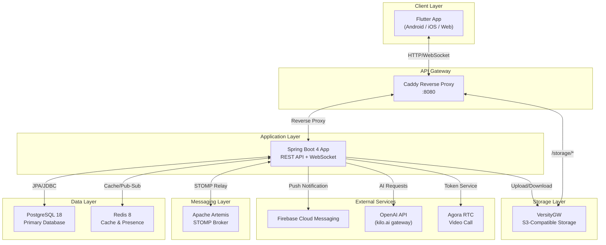
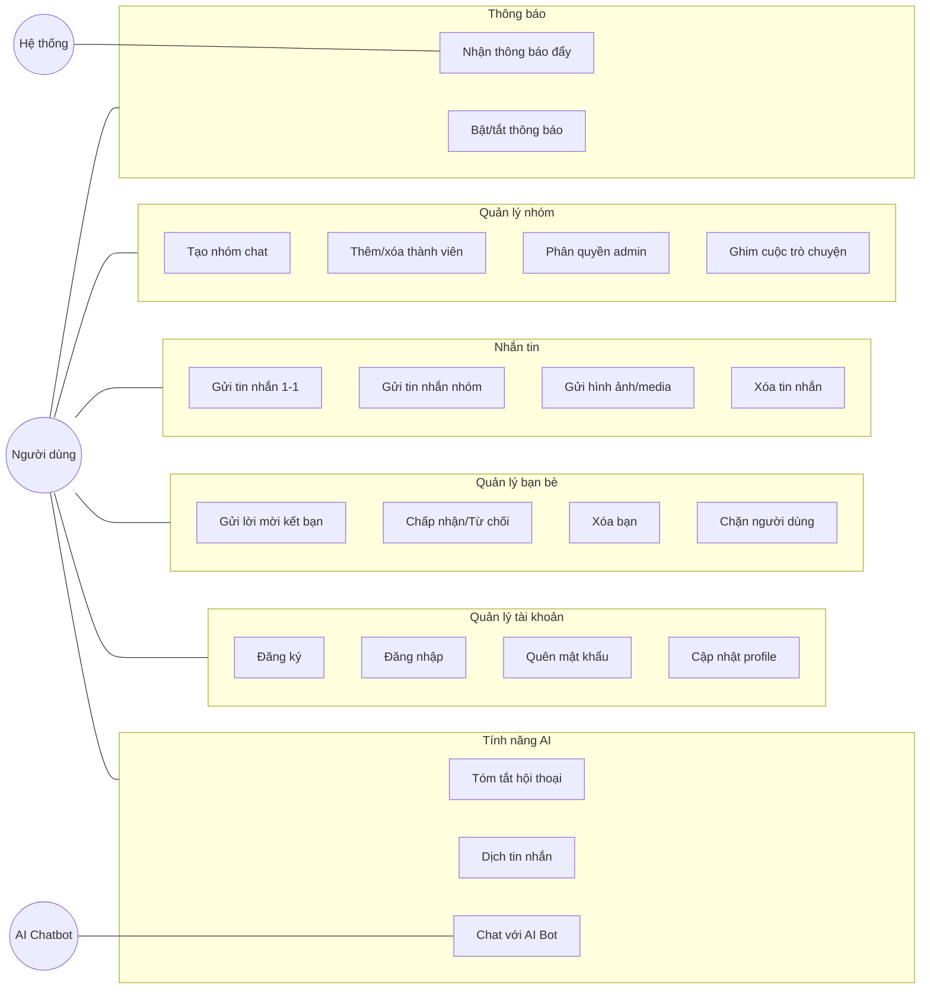
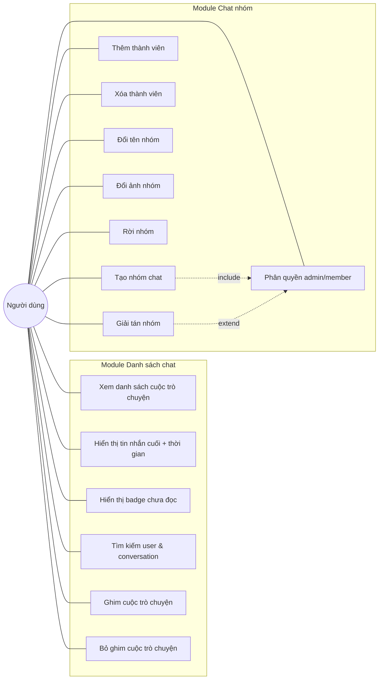
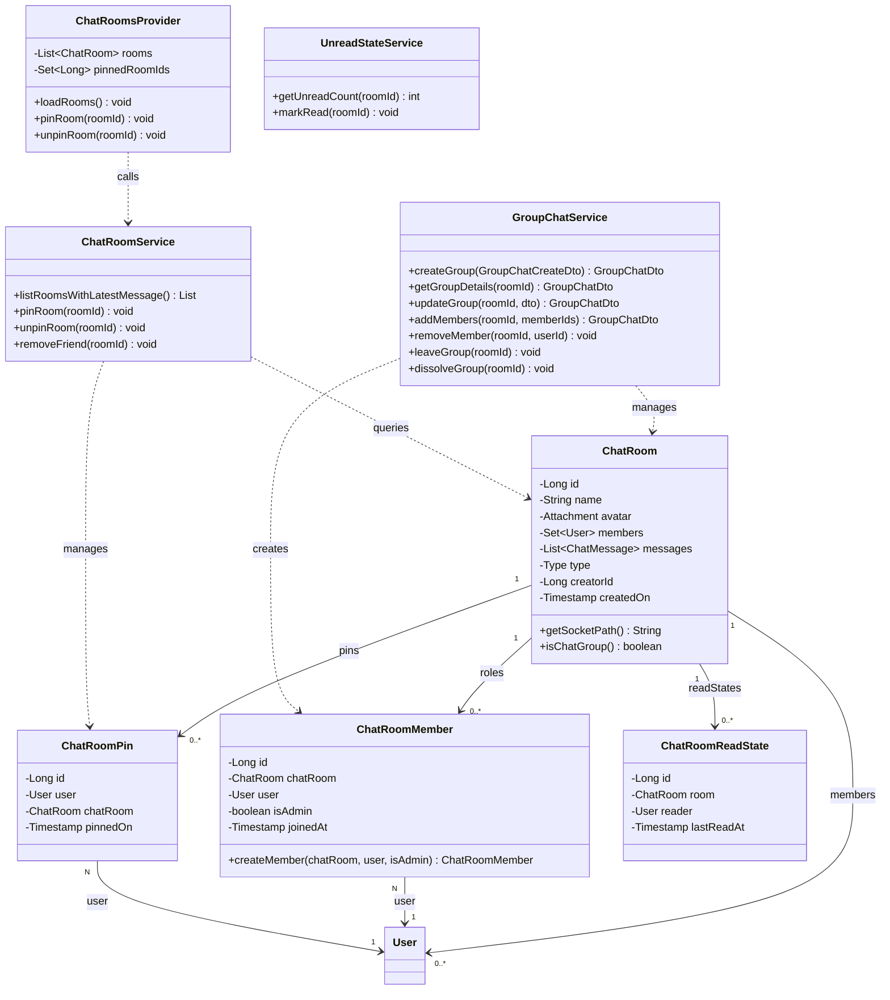
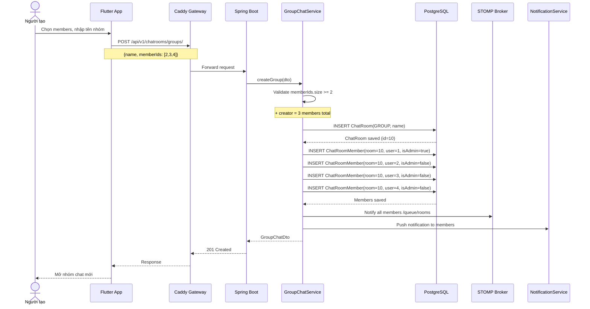
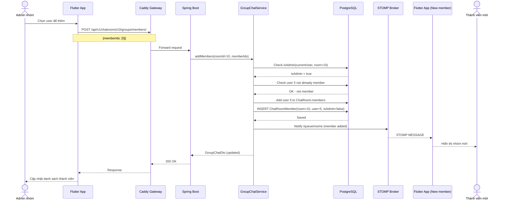
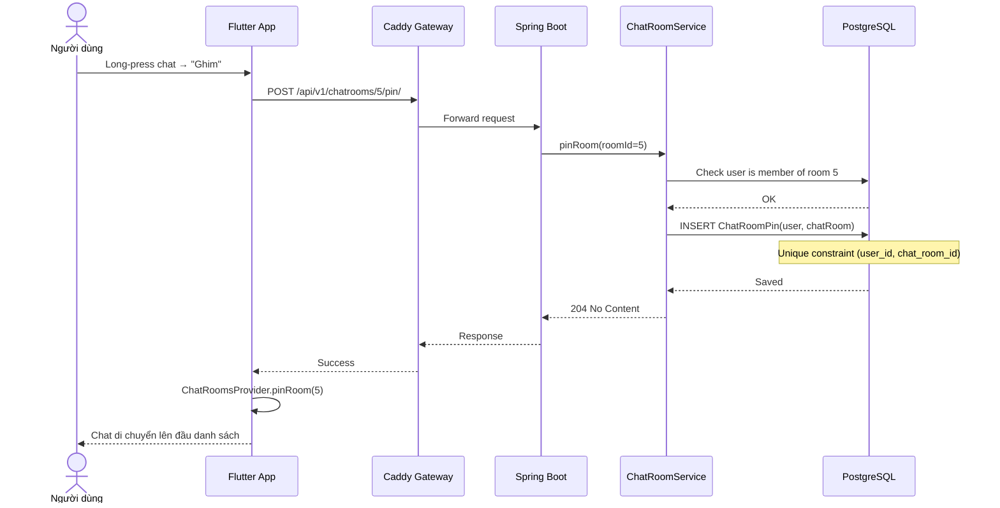
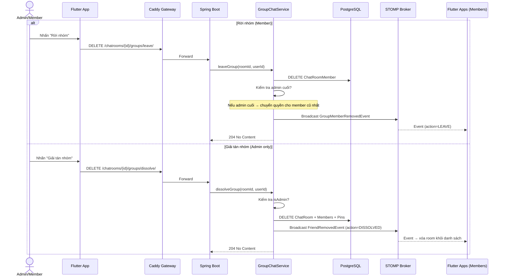
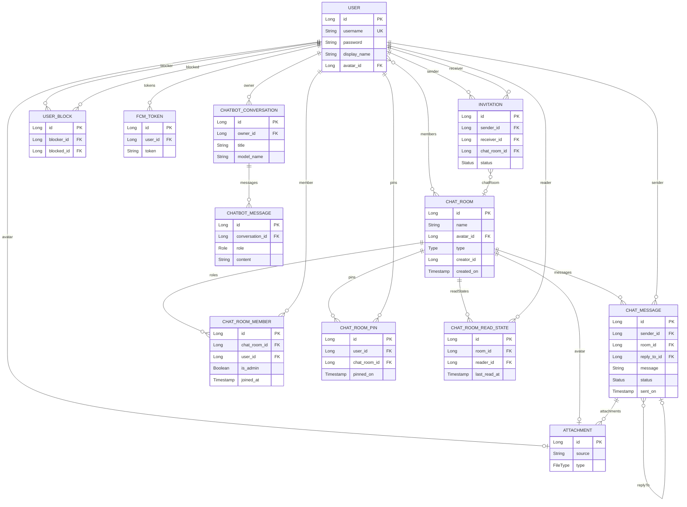
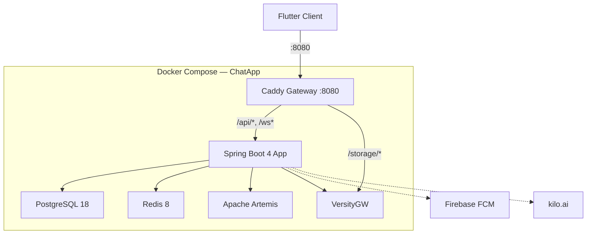

# BẢNG PHÂN CÔNG NHIỆM VỤ

| STT | Họ và tên | MSSV | Nhiệm vụ cụ thể | Đóng góp (%) |
|:---:|-----------|------|------------------|:------------:|
| 1 | Nguyễn Văn Duy | B22DCCN154 | Gửi hình ảnh/media, Thông báo đẩy (FCM), Chatbot AI streaming, Video Call (Agora) | 25% |
| 2 | Nguyễn Hoàng Hiệp | B22DCCN298 | Chat cá nhân 1-1, Gửi/nhận tin nhắn, Typing indicator, Trạng thái đã xem, Xóa tin nhắn, Dịch tin nhắn AI, Voice-to-Text | 25% |
| 3 | Nguyễn Quang Minh | B22DCCN538 | Tài khoản (Đăng ký, Đăng nhập, Quên MK, Profile), Quản lý bạn bè (Lời mời, Chặn, Xóa bạn), Trạng thái online, Tóm tắt AI | 25% |
| 4 | Đặng Hữu Hoàng Quân | B22DCCN658 | Danh sách cuộc trò chuyện, Tìm kiếm, Ghim chat, Tạo nhóm, Quản lý thành viên nhóm, Phân quyền admin | 25% |

*Bảng 0.1: Bảng phân công nhiệm vụ các thành viên*

---

# MỤC LỤC
---

<div style="page-break-before: always;"></div>

# DANH SÁCH VIẾT TẮT

| Viết tắt | Ý nghĩa |
|----------|---------|
| API | Application Programming Interface |
| DTO | Data Transfer Object |
| FCM | Firebase Cloud Messaging |
| GVHD | Giảng viên hướng dẫn |
| HTTP | HyperText Transfer Protocol |
| JPA | Java Persistence API |
| JWT | JSON Web Token |
| LLM | Large Language Model |
| MCP | Model Context Protocol |
| MSSV | Mã số sinh viên |
| ORM | Object-Relational Mapping |
| REST | Representational State Transfer |
| S3 | Simple Storage Service |
| SDK | Software Development Kit |
| SSE | Server-Sent Events |
| STOMP | Simple Text Oriented Messaging Protocol |
| UI | User Interface |
| UML | Unified Modeling Language |
| WebSocket | Giao thức truyền thông hai chiều thời gian thực |

*Bảng 0.2: Danh sách viết tắt*

---

# DANH SÁCH HÌNH

| Ký hiệu | Mô tả |
|----------|-------|
| Hình 2.1 | Sơ đồ kiến trúc tổng quan hệ thống ChatApp |
| Hình 2.2 | Biểu đồ Use Case tổng quan |
| Hình 2.3 | Biểu đồ Use Case chi tiết — Danh sách chat & Chat nhóm |
| Hình 2.4 | Biểu đồ lớp — Module Danh sách chat & Chat nhóm |
| Hình 2.5 | Biểu đồ tuần tự — Tạo nhóm chat |
| Hình 2.6 | Biểu đồ tuần tự — Thêm thành viên vào nhóm |
| Hình 2.7 | Biểu đồ tuần tự — Ghim cuộc trò chuyện |
| Hình 2.8 | Biểu đồ tuần tự — Rời nhóm & Giải tán nhóm |
| Hình 2.9 | Sơ đồ thực thể quan hệ (ER Diagram) |
| Hình 2.10 | Giao diện Danh sách cuộc trò chuyện |
| Hình 2.11 | Giao diện Tạo nhóm |
| Hình 2.12 | Giao diện Quản lý thành viên nhóm |
| Hình 2.13 | Giao diện Trang chủ (Tabs) |
| Hình 3.1 | Sơ đồ triển khai Docker Compose |
| Hình 3.2 | Kết quả — Danh sách chat |
| Hình 3.3 | Kết quả — Tạo nhóm |
| Hình 3.4 | Kết quả — Quản lý thành viên |
| Hình 3.5 | Kết quả — Ghim chat |
| Hình 3.6 | Kết quả — Tìm kiếm người dùng |

*Bảng 0.3: Danh sách hình*

---

# DANH SÁCH BẢNG

| Ký hiệu | Mô tả |
|----------|-------|
| Bảng 1.1 | Yêu cầu chức năng |
| Bảng 1.2 | Yêu cầu phi chức năng |
| Bảng 1.3 | So sánh lựa chọn công nghệ |
| Bảng 3.1 | Danh sách services trong Docker Compose |
| Bảng 3.2 | Kết quả thử nghiệm chức năng Danh sách chat & Chat nhóm |

*Bảng 0.4: Danh sách bảng*

---

<div style="page-break-before: always;"></div>

# Chương 1: Mở đầu

## 1.1 Giới thiệu ứng dụng và lý do thực hiện

Trong thời đại công nghệ số hiện nay, nhu cầu giao tiếp trực tuyến ngày càng tăng cao. Các ứng dụng nhắn tin đã trở thành công cụ không thể thiếu trong cuộc sống hàng ngày, từ trao đổi công việc đến kết nối bạn bè, gia đình. Thị trường hiện nay có nhiều ứng dụng nhắn tin phổ biến như Zalo, Messenger, Telegram, mỗi ứng dụng đều có những ưu điểm và hạn chế riêng.

**ChatApp** là ứng dụng nhắn tin trực tuyến được phát triển bởi nhóm 4 sinh viên với mục tiêu xây dựng một hệ thống hoàn chỉnh, áp dụng các kiến thức kiến trúc phần mềm đã học. Ứng dụng hỗ trợ nhắn tin cá nhân, nhắn tin nhóm, gửi hình ảnh/tệp, gọi video, và tích hợp trí tuệ nhân tạo (AI) cho các tính năng tóm tắt, dịch thuật và chatbot.

**Lý do thực hiện:**

- **Nhu cầu thực tế**: Xây dựng một sản phẩm phần mềm hoàn chỉnh từ thiết kế đến triển khai, giúp sinh viên vận dụng kiến thức lý thuyết vào thực hành.
- **Kiến trúc hiện đại**: Áp dụng kiến trúc Client-Server với API Gateway, message broker, cache layer, và object storage — đại diện cho các mô hình kiến trúc phần mềm phổ biến trong ngành.
- **Công nghệ tiên tiến**: Sử dụng Spring Boot 4, Flutter, WebSocket (STOMP), Redis, Docker — các công nghệ được sử dụng rộng rãi trong các doanh nghiệp phần mềm.
- **Tích hợp AI**: Tận dụng Large Language Model (LLM) thông qua OpenAI API để cung cấp các tính năng thông minh như tóm tắt hội thoại, dịch tin nhắn, và chatbot hỗ trợ.

## 1.2 Concept và mục tiêu

### Concept

ChatApp được thiết kế theo mô hình **Client-Server** với kiến trúc phân lớp rõ ràng:

- **Client**: Ứng dụng Flutter đa nền tảng (Android, iOS, Web) cung cấp giao diện người dùng trực quan, mượt mà.
- **API Gateway**: Caddy reverse proxy đóng vai trò điểm truy cập duy nhất, phân phối request đến đúng service.
- **Backend**: Spring Boot 4 application xử lý toàn bộ business logic, xác thực, và quản lý dữ liệu.
- **Hạ tầng hỗ trợ**: PostgreSQL (database), Redis (cache & presence), Apache Artemis (message broker), VersityGW (S3-compatible object storage).

### Mục tiêu

1. Xây dựng hệ thống nhắn tin thời gian thực hỗ trợ chat 1-1 và chat nhóm.
2. Tích hợp gửi/nhận đa phương tiện (hình ảnh, video, tài liệu, âm thanh).
3. Triển khai hệ thống thông báo đẩy (push notification) qua Firebase Cloud Messaging.
4. Tích hợp các tính năng AI: tóm tắt hội thoại, dịch tin nhắn, chatbot thông minh.
5. Hỗ trợ gọi video qua Agora RTC Engine.
6. Đảm bảo bảo mật với JWT authentication và mã hóa mật khẩu.
7. Triển khai dễ dàng với Docker Compose.

## 1.3 Phân tích yêu cầu

### 1.3.1 Yêu cầu chức năng

| STT | Mã | Yêu cầu | Mô tả |
|:---:|-----|---------|-------|
| 1 | FR-01 | Đăng ký tài khoản | Người dùng tạo tài khoản với username và password |
| 2 | FR-02 | Đăng nhập | Xác thực bằng username/password, trả về JWT token pair |
| 3 | FR-03 | Quên mật khẩu | Gửi email chứa link reset mật khẩu |
| 4 | FR-04 | Đổi mật khẩu | Thay đổi mật khẩu khi đã đăng nhập |
| 5 | FR-05 | Cập nhật profile | Thay đổi displayName và avatar |
| 6 | FR-06 | Quản lý bạn bè | Gửi/nhận/chấp nhận/từ chối lời mời kết bạn |
| 7 | FR-07 | Chặn người dùng | Chặn/bỏ chặn user, ngăn gửi tin nhắn và lời mời |
| 8 | FR-08 | Nhắn tin 1-1 | Gửi/nhận tin nhắn văn bản thời gian thực (DUO) |
| 9 | FR-09 | Nhắn tin nhóm | Tạo nhóm (≥3 người), gửi tin nhắn trong nhóm |
| 10 | FR-10 | Gửi media | Upload hình ảnh, video, tài liệu, âm thanh |
| 11 | FR-11 | Trạng thái tin nhắn | Typing indicator, đã gửi, đã xem |
| 12 | FR-12 | Xóa tin nhắn | Thu hồi (recall) tin nhắn đã gửi |
| 13 | FR-13 | Ghim cuộc trò chuyện | Ghim/bỏ ghim chatroom lên đầu danh sách |
| 14 | FR-14 | Tìm kiếm | Tìm kiếm người dùng theo keyword |
| 15 | FR-15 | Thông báo đẩy | Push notification khi có tin nhắn mới, lời mời |
| 16 | FR-16 | Tóm tắt AI | Tóm tắt nội dung hội thoại bằng LLM |
| 17 | FR-17 | Dịch tin nhắn AI | Dịch nội dung tin nhắn sang ngôn ngữ chọn |
| 18 | FR-18 | Chatbot AI | Trò chuyện với AI chatbot, hỗ trợ streaming SSE |
| 19 | FR-19 | Gọi video | Video call 1-1 qua Agora RTC |
| 20 | FR-20 | Trạng thái online | Hiển thị trạng thái online/offline (Redis presence) |
| 21 | FR-21 | Voice-to-Text | Chuyển giọng nói thành văn bản qua Google Speech |

*Bảng 1.1: Yêu cầu chức năng*

### 1.3.2 Yêu cầu phi chức năng

| STT | Mã | Yêu cầu | Mô tả |
|:---:|-----|---------|-------|
| 1 | NFR-01 | Hiệu năng | Tin nhắn gửi/nhận trong < 500ms qua WebSocket |
| 2 | NFR-02 | Bảo mật | JWT authentication, mã hóa password với Argon2 |
| 3 | NFR-03 | Khả dụng | Hệ thống hoạt động 24/7 với Docker containerization |
| 4 | NFR-04 | Khả năng mở rộng | Kiến trúc tách biệt cho phép scale từng service |
| 5 | NFR-05 | Tương thích | Hỗ trợ Android, iOS, Web qua Flutter |
| 6 | NFR-06 | Cache | Redis cache cho user info và presence |
| 7 | NFR-07 | Lưu trữ | S3-compatible storage cho media files |
| 8 | NFR-08 | Triển khai | Docker Compose one-command deployment |

*Bảng 1.2: Yêu cầu phi chức năng*

## 1.4 Lựa chọn công nghệ

| Thành phần | Công nghệ | Phiên bản | Lý do lựa chọn |
|------------|-----------|-----------|-----------------|
| **Backend Framework** | Spring Boot | 4.0.5 | Framework Java phổ biến nhất, hỗ trợ WebSocket, Security, JPA |
| **Ngôn ngữ Backend** | Java + Kotlin | Java 21, Kotlin 2.2 | Java 21 virtual threads, Kotlin cú pháp ngắn gọn |
| **Frontend Framework** | Flutter | Dart SDK ^3.5 | Đa nền tảng, hot reload, hiệu năng native |
| **Database** | PostgreSQL | 18 | RDBMS mạnh mẽ, hỗ trợ ACID, JSON |
| **Cache** | Redis | 8 | In-memory cache, pub/sub cho presence |
| **Message Broker** | Apache Artemis| Message broker hỗ trợ STOMP/JMS | 2.53.0 | STOMP protocol, tích hợp Spring WebSocket |
| **Object Storage** | VersityGW | Latest | S3-compatible, tự host |
| **API Gateway** | Caddy | 2 Alpine | Reverse proxy, tự động HTTPS |
| **Push Notification** | Firebase Admin SDK | 9.8.0 | Push notification miễn phí |
| **Video Call** | Agora RTC | 6.2.0 | Video call chất lượng cao |
| **AI Service** | OpenAI Java SDK | 4.30.0 | Tích hợp LLM |
| **State Management** | Provider | 6.1.2 | Quản lý state đơn giản |
| **Containerization** | Docker Compose | — | Triển khai multi-service |

*Bảng 1.3: So sánh lựa chọn công nghệ*

---

<div style="page-break-before: always;"></div>

# Chương 2: Phân tích thiết kế

## 2.1 Kiến trúc tổng quan

Hệ thống ChatApp được thiết kế theo kiến trúc **Client-Server** với API Gateway pattern. Toàn bộ hạ tầng được container hóa bằng Docker Compose gồm 6 services hoạt động phối hợp.



[image: tv3_so_o_kien_truc_tong_quan_he_thong_chatapp.png]
*Hình 2.1: Sơ đồ kiến trúc tổng quan hệ thống ChatApp*

**Mô tả các khối:**

- **Flutter App**: Ứng dụng đa nền tảng, Provider state management, STOMP WebSocket realtime, Firebase Messaging push notification.
- **Caddy Gateway**: Reverse proxy port 8080, route `/api/*` và `/ws*` → Spring Boot, `/storage/*` → VersityGW.
- **Spring Boot App**: Business logic, JWT Auth, REST API, WebSocket (STOMP), file upload, AI integration.
- **PostgreSQL**: Dữ liệu quan hệ — 12 bảng (User, ChatRoom, ChatMessage, Invitation, Attachment, v.v.).
- **Redis**: Cache user info, quản lý presence online/offline, refresh token.
- **Apache Artemis**: STOMP message broker, relay tin nhắn WebSocket.
- **VersityGW**: S3-compatible object storage cho media files.

## 2.2 Biểu đồ Use Case tổng quan



[image: tv3_bieu_o_use_case_tong_quan.png]
*Hình 2.2: Biểu đồ Use Case tổng quan*

---

## 2.3 Biểu đồ Use Case chi tiết — Danh sách chat & Chat nhóm



[image: tv3_bieu_o_use_case_chi_tiet_danh_sach_chat_chat_nhom.png]
*Hình 2.3: Biểu đồ Use Case chi tiết — Danh sách chat & Chat nhóm*

**Mô tả chi tiết các Use Case:**

**UC1 — Xem danh sách cuộc trò chuyện**: Hiển thị tất cả ChatRoom (DUO + GROUP) mà user là thành viên, sắp xếp theo thời gian tin nhắn cuối. API: `GET /api/v1/chatrooms/`.

**UC3 — Badge chưa đọc**: So sánh `ChatRoomReadState.lastReadAt` với `sentOn` của tin nhắn cuối để tính unread count. UnreadStateService (Flutter) quản lý state.

**UC5 — Ghim cuộc trò chuyện**: Tạo ChatRoomPin record (user_id, chat_room_id). Cuộc trò chuyện được ghim hiển thị lên đầu danh sách. API: `POST /api/v1/chatrooms/{roomId}/pin/`.

**UC7 — Tạo nhóm chat**: Yêu cầu ≥3 thành viên (bao gồm người tạo). GroupChatService validate số lượng → tạo ChatRoom(GROUP) + ChatRoomMember records. Người tạo tự động là admin. API: `POST /api/v1/chatrooms/groups/`.

**UC8 — Thêm thành viên**: Chỉ admin mới được thêm. GroupChatService kiểm tra quyền → tạo ChatRoomMember mới → STOMP notify. API: `POST /api/v1/chatrooms/{roomId}/groups/members/`.

**UC9 — Xóa thành viên**: Chỉ admin mới được xóa (trừ chính mình). GroupChatService kiểm tra quyền → xóa ChatRoomMember + xóa khỏi ChatRoom.members. API: `DELETE /api/v1/chatrooms/{roomId}/groups/members/{userId}/`.

**UC10 — Phân quyền admin**: ChatRoomMember.isAdmin = true/false. Admin có quyền thêm/xóa thành viên, đổi tên/ảnh nhóm, giải tán nhóm.

**UC13 — Rời nhóm**: Thành viên tự rời khỏi nhóm. Nếu là admin cuối cùng → chuyển quyền admin cho thành viên khác. API: `DELETE /api/v1/chatrooms/{roomId}/groups/leave/`.

**UC14 — Giải tán nhóm**: Chỉ admin mới được giải tán. Xóa toàn bộ ChatRoom, ChatRoomMember, ChatRoomPin liên quan. API: `DELETE /api/v1/chatrooms/{roomId}/groups/dissolve/`.

## 2.4 Biểu đồ lớp — Module Danh sách chat & Chat nhóm



[image: tv3_bieu_o_lop_module_danh_sach_chat_chat_nhom.png]
*Hình 2.4: Biểu đồ lớp — Module Danh sách chat & Chat nhóm*

**Giải thích:**

- **ChatRoom(GROUP)**: Phòng chat nhóm, type = GROUP, ≥3 members. Có name, avatar, creatorId.
- **ChatRoomMember**: Quản lý vai trò trong nhóm (isAdmin). Unique constraint (chat_room_id, user_id). Bảng `chat_room_member_roles`.
- **ChatRoomPin**: Ghim cuộc trò chuyện. Unique constraint (user_id, chat_room_id). Index trên cả 2 cột.
- **GroupChatService**: Service lớn nhất (~22KB), xử lý toàn bộ logic nhóm chat.
- **ChatRoomsProvider (Flutter)**: Provider quản lý danh sách chatrooms, pinnedRoomIds, unread counts.

## 2.5 Biểu đồ tuần tự

### 2.5.1 Biểu đồ tuần tự — Tạo nhóm chat



[image: tv3_bieu_o_tuan_tu_tao_nhom_chat.png]
*Hình 2.5: Biểu đồ tuần tự — Tạo nhóm chat*

### 2.5.2 Biểu đồ tuần tự — Thêm thành viên vào nhóm



[image: tv3_bieu_o_tuan_tu_them_thanh_vien_vao_nhom.png]
*Hình 2.6: Biểu đồ tuần tự — Thêm thành viên vào nhóm*

### 2.5.3 Biểu đồ tuần tự — Ghim cuộc trò chuyện



[image: tv3_bieu_o_tuan_tu_ghim_cuoc_tro_chuyen.png]
*Hình 2.7: Biểu đồ tuần tự — Ghim cuộc trò chuyện*


### 2.5.4 Biểu đồ tuần tự — Rời nhóm & Giải tán nhóm



[image: tv3_bieu_o_tuan_tu_roi_nhom_giai_tan_nhom.png]
*Hình 2.8: Biểu đồ tuần tự — Rời nhóm & Giải tán nhóm*


## 2.6 Sơ đồ thực thể quan hệ — ER Diagram

Sơ đồ ER mô tả toàn bộ 12 entity. Các entity **★** thuộc phạm vi Thành viên 3.



[image: tv3_so_o_thuc_the_quan_he_er_diagram.png]
*Hình 2.9: Sơ đồ thực thể quan hệ (ER Diagram)*
**★ Entity thuộc phạm vi Thành viên 4:** CHAT_ROOM (GROUP), CHAT_ROOM_MEMBER, CHAT_ROOM_PIN, CHAT_ROOM_READ_STATE.

## 2.7 Giao diện đáp ứng chức năng

### 2.7.1 Màn hình Danh sách cuộc trò chuyện (ChatListScreen)

**File:** `lib/screens/home/chat_list_screen.dart`

**Mô tả:** Tab chính hiển thị toàn bộ cuộc trò chuyện (DUO + GROUP). Mỗi item gồm: avatar, tên, tin nhắn cuối, thời gian, badge chưa đọc. Cuộc trò chuyện được ghim hiển thị lên đầu với icon ghim. Hỗ trợ pull-to-refresh.

**Các thành phần chính:**
- ListView.builder với ChatRoomTile widget
- ChatRoomTile: Avatar, name, last message preview, time, unread badge, pin icon
- Long-press context menu: Ghim/Bỏ ghim, Xóa bạn (DUO), Rời nhóm (GROUP)
- Sắp xếp: Pinned rooms → theo thời gian tin nhắn cuối

[image: tv3_giao_dien_danh_sach_cuoc_tro_chuyen.png]
*Hình 2.10: Giao diện Danh sách cuộc trò chuyện*

`[Ảnh chụp màn hình ChatList — placeholder]`

### 2.7.2 Màn hình Tạo nhóm (CreateGroupScreen)

**File:** `lib/screens/home/create_group_screen.dart`

**Mô tả:** Cho phép tạo nhóm chat mới. Nhập tên nhóm, chọn thành viên từ danh sách bạn bè (tối thiểu 2 người + bản thân = 3). Hiển thị chip danh sách thành viên đã chọn.

**Các thành phần chính:**
- TextField tên nhóm
- ListView bạn bè với checkbox chọn thành viên
- Chip row hiển thị thành viên đã chọn
- ElevatedButton "Tạo nhóm" → gọi `GroupChatService.createGroup()`
- Validate: ≥2 thành viên được chọn

[image: tv3_giao_dien_tao_nhom.png]
*Hình 2.11: Giao diện Tạo nhóm*

`[Ảnh chụp màn hình CreateGroup — placeholder]`

### 2.7.3 Màn hình Quản lý thành viên nhóm (GroupMembersScreen)

**File:** `lib/screens/chat/group_members_screen.dart`

**Mô tả:** Hiển thị danh sách thành viên nhóm với vai trò (Admin/Member). Admin có thể thêm/xóa thành viên, phân quyền, đổi tên/ảnh nhóm. Thành viên thường chỉ xem.

**Các thành phần chính:**
- AppBar: Tên nhóm, avatar nhóm (có thể đổi nếu admin)
- ListView thành viên: Avatar, tên, role badge (Admin/Member)
- Admin actions: Xóa thành viên, Toggle admin
- FAB: Thêm thành viên (chỉ admin)
- Nút: Rời nhóm, Giải tán nhóm (chỉ admin)

[image: tv3_giao_dien_quan_ly_thanh_vien_nhom.png]
*Hình 2.12: Giao diện Quản lý thành viên nhóm*

`[Ảnh chụp màn hình GroupMembers — placeholder]`

### 2.7.4 Màn hình Trang chủ (HomeScreen)

**File:** `lib/screens/home/home_screen.dart`

**Mô tả:** Trang chủ với bottom navigation gồm các tab: Chat (ChatListScreen), Bạn bè (PeopleScreen), Lời mời (InvitationsScreen), AI Chat, Cài đặt. Quản lý navigation giữa các tab.

[image: tv3_giao_dien_trang_chu_tabs.png]
*Hình 2.13: Giao diện Trang chủ (Tabs)*

`[Ảnh chụp màn hình Home — placeholder]`

---

<div style="page-break-before: always;"></div>

# Chương 3: Kết quả

## 3.1 Mô hình triển khai

Hệ thống ChatApp được triển khai bằng **Docker Compose** với 6 services chính:



[image: tv3_so_o_trien_khai_docker_compose.png]
*Hình 3.1: Sơ đồ triển khai Docker Compose*

| Service | Image | Chức năng |
|---------|-------|-----------|
| gateway | caddy:2-alpine | Reverse proxy |
| app | Custom Dockerfile | Spring Boot application |
| postgres | postgres:18-alpine | Relational database |
| redis | redis:8-alpine | Cache & presence |
| artemis | apache/artemis:2.53.0 | STOMP message broker |
| versitygw | versity/versitygw | S3-compatible storage |

*Bảng 3.1: Danh sách services trong Docker Compose*

## 3.2 Các bước cài đặt và triển khai

### 3.2.1 Backend

```bash
git clone <repository-url> chatapp && cd chatapp
cp .env.example .env
mkdir -p secrets && cp <firebase-key> secrets/firebase-service-account.json
docker compose up -d
```

### 3.2.2 Frontend

```bash
git clone <repository-url> chatapp-flutter && cd chatapp-flutter
cp .env.example.json .env.json
flutter pub get && flutter run
```

## 3.3 Kết quả thực hiện — Danh sách chat & Chat nhóm

### 3.3.1 Danh sách cuộc trò chuyện

- `GET /api/v1/chatrooms/` trả về toàn bộ ChatRoom mà user là thành viên.
- ChatRoomService.listRoomsWithLatestMessage() join với tin nhắn cuối cùng.
- Sắp xếp: pinned rooms lên đầu, sau đó theo thời gian tin nhắn cuối.
- ChatRoomTile widget hiển thị: avatar, tên (displayName hoặc group name), last message preview, timestamp, unread badge.

[image: tv3_ket_qua_danh_sach_chat.png]
*Hình 3.2: Kết quả — Danh sách chat*

`[Ảnh chụp màn hình kết quả Danh sách chat — placeholder]`

### 3.3.2 Tạo nhóm chat

- CreateGroupScreen cho phép nhập tên nhóm và chọn ≥2 thành viên từ danh sách bạn bè.
- GroupChatService validate: memberIds.size + creator ≥ 3.
- Tạo ChatRoom(GROUP) + ChatRoomMember records (creator isAdmin = true).
- STOMP notify tất cả thành viên → nhóm xuất hiện trong danh sách chat.

[image: tv3_ket_qua_tao_nhom.png]
*Hình 3.3: Kết quả — Tạo nhóm*

`[Ảnh chụp màn hình kết quả Tạo nhóm — placeholder]`

### 3.3.3 Quản lý thành viên nhóm

- GroupMembersScreen hiển thị danh sách thành viên với role badge (Admin/Member).
- Admin có thể: thêm thành viên, xóa thành viên, toggle admin role.
- Thêm thành viên: `POST /api/v1/chatrooms/{roomId}/groups/members/` → kiểm tra admin → add member.
- Xóa thành viên: `DELETE /api/v1/chatrooms/{roomId}/groups/members/{userId}/` → kiểm tra admin.
- Đổi tên/ảnh nhóm: `PATCH` hoặc `PUT` (multipart) `/api/v1/chatrooms/{roomId}/groups/`.

[image: tv3_ket_qua_quan_ly_thanh_vien.png]
*Hình 3.4: Kết quả — Quản lý thành viên*

`[Ảnh chụp màn hình kết quả Thành viên nhóm — placeholder]`

### 3.3.4 Ghim cuộc trò chuyện

- Long-press ChatRoomTile → menu "Ghim" / "Bỏ ghim".
- `POST /api/v1/chatrooms/{roomId}/pin/` → tạo ChatRoomPin record.
- `DELETE /api/v1/chatrooms/{roomId}/pin/` → xóa ChatRoomPin record.
- ChatRoomsProvider cập nhật pinnedRoomIds → sắp xếp lại danh sách.

[image: tv3_ket_qua_ghim_chat.png]
*Hình 3.5: Kết quả — Ghim chat*

`[Ảnh chụp màn hình kết quả Ghim — placeholder]`

- **Giải tán nhóm**: `DELETE /api/v1/chatrooms/{roomId}/groups/dissolve/` → xóa toàn bộ ChatRoom + members + pins. Chỉ admin.

### 3.3.6 Tìm kiếm người dùng

- Cung cấp thanh tìm kiếm ở trang đầu và trang bạn bè.
- Tìm kiếm real-time (debounce 500ms) để tối ưu số lượng request.
- Kết quả hiển thị bao gồm: Avatar, Display Name, Username và nút "Thêm bạn" hoặc "Nhắn tin" tùy trạng thái quan hệ.
- Backend sử dụng query mờ (Case-insensitive) trên các trường `username` và `display_name`.

[image: tv3_ket_qua_tim_kiem.png]
*Hình 3.6: Kết quả — Tìm kiếm người dùng*

`[Ảnh chụp màn hình Tìm kiếm — placeholder]`

## 3.4 Kết quả thử nghiệm

| STT | Chức năng | Kịch bản test | Kết quả | Ghi chú |
|:---:|-----------|---------------|:-------:|---------|
| 1 | Danh sách chat | Load all rooms | ✅ Đạt | DUO + GROUP đầy đủ |
| 2 | Danh sách chat | Sắp xếp theo thời gian | ✅ Đạt | Latest first |
| 3 | Unread badge | Tin nhắn chưa đọc | ✅ Đạt | Badge hiển thị đúng |
| 4 | Tìm kiếm | Search user keyword | ✅ Đạt | Kết quả chính xác |
| 5 | Ghim | Pin room | ✅ Đạt | Room lên đầu |
| 6 | Ghim | Unpin room | ✅ Đạt | Room về vị trí cũ |
| 7 | Ghim | Pin duplicate | ✅ Đạt | Unique constraint block |
| 8 | Tạo nhóm | 3+ members | ✅ Đạt | GROUP created |
| 9 | Tạo nhóm | < 3 members | ✅ Đạt | Validation reject |
| 10 | Thêm TV | Admin thêm member | ✅ Đạt | Member added |
| 11 | Thêm TV | Non-admin thêm | ✅ Đạt | 403 Forbidden |
| 12 | Thêm TV | Duplicate member | ✅ Đạt | Already exists error |
| 13 | Xóa TV | Admin xóa member | ✅ Đạt | Member removed |
| 14 | Xóa TV | Non-admin xóa | ✅ Đạt | 403 Forbidden |
| 15 | Đổi tên | Admin đổi tên nhóm | ✅ Đạt | Name updated |
| 16 | Đổi ảnh | Admin upload avatar | ✅ Đạt | Avatar → S3 |
| 17 | Rời nhóm | Member leave | ✅ Đạt | Removed from group |
| 18 | Rời nhóm | Last admin leave | ✅ Đạt | Admin chuyển quyền |
| 19 | Giải tán | Admin dissolve | ✅ Đạt | Room deleted |
| 20 | Giải tán | Non-admin dissolve | ✅ Đạt | 403 Forbidden |

*Bảng 3.2: Kết quả thử nghiệm chức năng Danh sách chat & Chat nhóm*

**Số liệu demo:**
- Số nhóm chat tạo thử nghiệm: 8
- Số thành viên trung bình/nhóm: 4-5
- Số lần thêm/xóa thành viên: 20
- Số cuộc trò chuyện được ghim: 12
- Thời gian load danh sách chat: < 500ms


## 3.5 Kết luận và hạn chế

### Kết luận

1. **Danh sách chat**: Hiển thị đầy đủ DUO + GROUP rooms với tin nhắn cuối, unread badge, sắp xếp chính xác.
2. **Chat nhóm**: GroupChatService xử lý hoàn chỉnh tạo/sửa/xóa nhóm, quản lý thành viên, phân quyền admin.
3. **Ghim chat**: ChatRoomPin hoạt động chính xác với unique constraint, ghim rooms lên đầu danh sách.
4. **Phân quyền**: Hệ thống admin/member hoạt động đúng, chỉ admin mới được thêm/xóa thành viên và giải tán nhóm.
5. **Kiến trúc**: GroupChatService (~22KB) là service lớn nhất, xử lý nhiều business logic phức tạp nhưng vẫn tuân theo nguyên lý clean code.

### Hạn chế

1. **Chưa có admin transfer UI**: Chuyển quyền admin chỉ tự động khi rời nhóm, chưa có UI chủ động.
2. **Chưa có group search**: Chưa hỗ trợ tìm kiếm trong danh sách nhóm chat.
3. **Chưa có group invitation**: Thêm thành viên trực tiếp, chưa qua hệ thống invitation cho nhóm.
4. **Pagination danh sách chat**: Chưa phân trang danh sách chatrooms cho user có nhiều cuộc trò chuyện.

### Hướng phát triển
- Thêm UI chuyển quyền admin chủ động
- Thêm group invitation workflow
- Thêm tìm kiếm và filter danh sách chat
- Pagination cho danh sách chatrooms

## 3.6 Tài liệu tham khảo

1. Spring Boot Documentation — https://docs.spring.io/spring-boot/
2. Flutter Documentation — https://docs.flutter.dev/
3. PostgreSQL Documentation — https://www.postgresql.org/docs/
4. Redis Documentation — https://redis.io/docs/
5. Apache Artemis Documentation — https://activemq.apache.org/components/artemis/documentation/
6. Docker Compose Documentation — https://docs.docker.com/compose/
7. OpenAI API Reference — https://platform.openai.com/docs/api-reference
8. Firebase Cloud Messaging — https://firebase.google.com/docs/cloud-messaging
9. Agora RTC Engine SDK — https://docs.agora.io/en/
10. STOMP Protocol Specification — https://stomp.github.io/stomp-specification-1.2.html
11. JWT (RFC 7519) — https://datatracker.ietf.org/doc/html/rfc7519
12. Amazon S3 API Reference — https://docs.aws.amazon.com/AmazonS3/latest/API/
13. Caddy Server Documentation — https://caddyserver.com/docs/
14. Provider State Management — https://pub.dev/packages/provider
