# Biểu đồ Cơ sở dữ liệu - AppChat

## Tổng quan

Biểu đồ CSDL bao gồm **11 bảng** để hỗ trợ toàn bộ chức năng của hệ thống chat, bao gồm cả tính năng hiện có và tính năng mới cần bổ sung.

> [!NOTE]
> Các bảng được đánh dấu ✅ đã tồn tại trong dự án. Các bảng đánh dấu 🆕 là bảng mới cần thêm.

## Phân tích hiện trạng vs. yêu cầu

| Chức năng | Bảng liên quan | Trạng thái |
|---|---|---|
| Quản lý tài khoản (đăng ký, đăng nhập, profile, last_seen) | `users`, `attachments` | ✅ Đã có |
| Quản lý bạn bè (lời mời, chấp nhận, từ chối) | `invitations` | ✅ Đã có |
| Chặn người dùng | `user_blocks` | ✅ Đã có |
| Nhắn tin cá nhân & nhóm | `chat_rooms`, `chat_messages`, `attachments` | ✅ Đã có |
| Trạng thái đã đọc | `chat_room_read_states` | ✅ Đã có |
| Phân quyền nhóm (admin/member) | `chat_room_member_roles` | ✅ Đã có |
| Danh sách bạn bè | `friendships` | 🆕 Cần thêm |
| Ghim cuộc trò chuyện | `pinned_conversations` | 🆕 Cần thêm |
| Thông báo (Notification) | `notifications`, `notification_settings` | 🆕 Cần thêm |
| AI - Tóm tắt cuộc trò chuyện | Xử lý qua API, không cần bảng riêng | — |
| AI - Dịch tin nhắn | Xử lý qua API, không cần bảng riêng | — |
| AI - Chatbot | `chat_rooms` (type = AI_BOT) | 🆕 Mở rộng enum |

---

## Biểu đồ quan hệ (ERD)

```mermaid
erDiagram
    users {
        BIGINT id PK
        VARCHAR username UK "NOT NULL"
        VARCHAR password "NOT NULL"
        VARCHAR display_name
        BIGINT avatar_id FK
        TIMESTAMP last_seen_at
    }

    attachments {
        BIGINT id PK
        VARCHAR source "NOT NULL"
        INT type "ENUM: IMAGE, VIDEO, RAW, DOCUMENT, AUDIO"
    }

    user_blocks {
        BIGINT id PK
        BIGINT blocker_id FK "NOT NULL, UQ(blocker_id, blocked_id)"
        BIGINT blocked_id FK "NOT NULL"
    }

    invitations {
        BIGINT id PK
        BIGINT sender_id FK "NOT NULL"
        BIGINT receiver_id FK "NOT NULL"
        BIGINT chat_room_id FK "NULL = friend request"
        INT status "ENUM: PENDING, ACCEPTED, REJECTED"
    }

    friendships {
        BIGINT id PK
        BIGINT user1_id FK "NOT NULL, UQ(user1_id, user2_id)"
        BIGINT user2_id FK "NOT NULL"
        TIMESTAMP created_at "NOT NULL"
    }

    chat_rooms {
        BIGINT id PK
        VARCHAR name
        BIGINT avatar_id FK
        INT type "ENUM: DUO, GROUP, AI_BOT"
        TIMESTAMP created_on
    }

    chat_room_members {
        BIGINT chat_room_id FK "PK"
        BIGINT user_id FK "PK"
    }

    chat_room_member_roles {
        BIGINT id PK
        BIGINT chat_room_id FK "NOT NULL"
        BIGINT user_id FK "NOT NULL"
        BOOLEAN is_admin "DEFAULT FALSE"
        TIMESTAMP joined_at "NOT NULL"
    }

    chat_messages {
        BIGINT id PK
        BIGINT sender_id FK "NOT NULL"
        BIGINT room_id FK "NOT NULL"
        BIGINT reply_to_id FK
        VARCHAR message
        TIMESTAMP last_edit
        TIMESTAMP sent_on "NOT NULL"
        INT status "ENUM: NORMAL, EDITED, RECALLED"
    }

    chat_message_attachments {
        BIGINT chat_message_id FK "PK"
        BIGINT attachment_id FK "PK"
    }

    chat_room_read_states {
        BIGINT id PK
        BIGINT room_id FK "NOT NULL, UQ(room_id, reader_id)"
        BIGINT reader_id FK "NOT NULL"
        TIMESTAMP last_read_at "NOT NULL"
    }

    pinned_conversations {
        BIGINT id PK
        BIGINT user_id FK "NOT NULL, UQ(user_id, room_id)"
        BIGINT room_id FK "NOT NULL"
        TIMESTAMP pinned_at "NOT NULL"
    }

    notifications {
        BIGINT id PK
        BIGINT recipient_id FK "NOT NULL"
        VARCHAR type "ENUM: NEW_MESSAGE, FRIEND_REQUEST, GROUP_INVITE"
        VARCHAR title "NOT NULL"
        VARCHAR content
        BIGINT reference_id "ID of related entity"
        BOOLEAN is_read "DEFAULT FALSE"
        TIMESTAMP created_at "NOT NULL"
    }

    notification_settings {
        BIGINT id PK
        BIGINT user_id FK "NOT NULL, UQ(user_id, room_id)"
        BIGINT room_id FK "NOT NULL"
        BOOLEAN is_muted "DEFAULT FALSE"
        TIMESTAMP muted_until
    }

    %% === RELATIONSHIPS ===

    users ||--o| attachments : "avatar"
    user_blocks }o--|| users : "blocker"
    user_blocks }o--|| users : "blocked"
    invitations }o--|| users : "sender"
    invitations }o--|| users : "receiver"
    invitations }o--o| chat_rooms : "group invite"
    friendships }o--|| users : "user1"
    friendships }o--|| users : "user2"
    chat_rooms ||--o| attachments : "avatar"
    chat_room_members }o--|| chat_rooms : "room"
    chat_room_members }o--|| users : "member"
    chat_room_member_roles }o--|| chat_rooms : "room"
    chat_room_member_roles }o--|| users : "user"
    chat_messages }o--|| users : "sender"
    chat_messages }o--|| chat_rooms : "room"
    chat_messages }o--o| chat_messages : "reply_to"
    chat_message_attachments }o--|| chat_messages : "message"
    chat_message_attachments }o--|| attachments : "attachment"
    chat_room_read_states }o--|| chat_rooms : "room"
    chat_room_read_states }o--|| users : "reader"
    pinned_conversations }o--|| users : "user"
    pinned_conversations }o--|| chat_rooms : "room"
    notifications }o--|| users : "recipient"
    notification_settings }o--|| users : "user"
    notification_settings }o--|| chat_rooms : "room"
```

---

## Chi tiết từng bảng

### 1. `users` ✅
> Quản lý tài khoản người dùng

| Cột | Kiểu | Ràng buộc | Mô tả |
|---|---|---|---|
| `id` | BIGINT | PK, AUTO_INCREMENT | ID người dùng |
| `username` | VARCHAR | NOT NULL, UNIQUE | Tên đăng nhập |
| `password` | VARCHAR | NOT NULL | Mật khẩu (đã hash) |
| `display_name` | VARCHAR | NULLABLE | Tên hiển thị |
| `avatar_id` | BIGINT | FK → attachments.id | Ảnh đại diện |
| `last_seen_at` | TIMESTAMP | NULLABLE | Thời gian online cuối |

**Hỗ trợ chức năng:** 2.1 (Đăng ký/đăng nhập, cập nhật profile, Online/Offline/Last seen)

---

### 2. `attachments` ✅
> Quản lý file đính kèm đa phương tiện

| Cột | Kiểu | Ràng buộc | Mô tả |
|---|---|---|---|
| `id` | BIGINT | PK, AUTO_INCREMENT | ID file |
| `source` | VARCHAR | NOT NULL | Đường dẫn S3/URL |
| `type` | INT (ENUM) | NOT NULL | IMAGE, VIDEO, RAW, DOCUMENT, AUDIO |

**Hỗ trợ chức năng:** 2.6 (Gửi hình ảnh, hiển thị ảnh, xem ảnh toàn màn hình)

---

### 3. `user_blocks` ✅
> Chặn người dùng

| Cột | Kiểu | Ràng buộc | Mô tả |
|---|---|---|---|
| `id` | BIGINT | PK, AUTO_INCREMENT | ID |
| `blocker_id` | BIGINT | FK → users.id, UQ(blocker, blocked) | Người chặn |
| `blocked_id` | BIGINT | FK → users.id | Người bị chặn |

**Hỗ trợ chức năng:** 2.2 (Chặn người dùng)

---

### 4. `invitations` ✅
> Lời mời kết bạn & lời mời vào nhóm

| Cột | Kiểu | Ràng buộc | Mô tả |
|---|---|---|---|
| `id` | BIGINT | PK, AUTO_INCREMENT | ID |
| `sender_id` | BIGINT | FK → users.id, NOT NULL | Người gửi |
| `receiver_id` | BIGINT | FK → users.id, NOT NULL | Người nhận |
| `chat_room_id` | BIGINT | FK → chat_rooms.id, NULLABLE | NULL = lời mời kết bạn; NOT NULL = mời vào nhóm |
| `status` | INT (ENUM) | NOT NULL | PENDING, ACCEPTED, REJECTED |

**Hỗ trợ chức năng:** 2.2 (Gửi/chấp nhận/từ chối lời mời kết bạn), 2.4 (Thêm thành viên nhóm)

---

### 5. `friendships` 🆕
> Quan hệ bạn bè đã xác nhận

| Cột | Kiểu | Ràng buộc | Mô tả |
|---|---|---|---|
| `id` | BIGINT | PK, AUTO_INCREMENT | ID |
| `user1_id` | BIGINT | FK → users.id, UQ(user1, user2) | Bạn 1 (ID nhỏ hơn) |
| `user2_id` | BIGINT | FK → users.id | Bạn 2 (ID lớn hơn) |
| `created_at` | TIMESTAMP | NOT NULL | Thời điểm kết bạn |

> [!IMPORTANT]
> Quy ước `user1_id < user2_id` để tránh trùng lặp quan hệ bạn bè. Khi chấp nhận `invitation` (friend request), tạo 1 record trong bảng này.

**Hỗ trợ chức năng:** 2.2 (Hiển thị danh sách bạn bè, Xóa bạn bè)

---

### 6. `chat_rooms` ✅ (cần mở rộng enum Type)
> Phòng chat (1-1, nhóm, AI Bot)

| Cột | Kiểu | Ràng buộc | Mô tả |
|---|---|---|---|
| `id` | BIGINT | PK, AUTO_INCREMENT | ID phòng |
| `name` | VARCHAR | NULLABLE | Tên phòng (dùng cho GROUP) |
| `avatar_id` | BIGINT | FK → attachments.id | Ảnh đại diện nhóm |
| `type` | INT (ENUM) | NOT NULL | **DUO, GROUP, AI_BOT** |
| `created_on` | TIMESTAMP | AUTO | Ngày tạo |

> [!TIP]
> Thêm giá trị `AI_BOT` vào enum `Type` để hỗ trợ tính năng Chatbot AI (3.3). Phòng chat AI_BOT hoạt động như một cuộc trò chuyện riêng giữa user và AI.

**Hỗ trợ chức năng:** 2.3, 2.4, 2.5, 3.3

---

### 7. `chat_room_members` ✅ (bảng join ManyToMany)
> Quan hệ N-N giữa ChatRoom và User

| Cột | Kiểu | Ràng buộc | Mô tả |
|---|---|---|---|
| `chat_room_id` | BIGINT | PK, FK → chat_rooms.id | Phòng chat |
| `user_id` | BIGINT | PK, FK → users.id | Thành viên |

**Hỗ trợ chức năng:** 2.3, 2.4 (Thêm/xóa thành viên)

---

### 8. `chat_room_member_roles` ✅
> Phân quyền thành viên trong nhóm

| Cột | Kiểu | Ràng buộc | Mô tả |
|---|---|---|---|
| `id` | BIGINT | PK, AUTO_INCREMENT | ID |
| `chat_room_id` | BIGINT | FK → chat_rooms.id, NOT NULL | Phòng chat |
| `user_id` | BIGINT | FK → users.id, NOT NULL | Thành viên |
| `is_admin` | BOOLEAN | DEFAULT FALSE | Là admin? |
| `joined_at` | TIMESTAMP | NOT NULL, AUTO | Thời điểm tham gia |

**Hỗ trợ chức năng:** 2.4 (Phân quyền admin/member, Rời/giải tán nhóm)

---

### 9. `chat_messages` ✅
> Tin nhắn

| Cột | Kiểu | Ràng buộc | Mô tả |
|---|---|---|---|
| `id` | BIGINT | PK, AUTO_INCREMENT | ID tin nhắn |
| `sender_id` | BIGINT | FK → users.id, NOT NULL | Người gửi |
| `room_id` | BIGINT | FK → chat_rooms.id, NOT NULL | Phòng chat |
| `reply_to_id` | BIGINT | FK → chat_messages.id | Tin nhắn được reply |
| `message` | VARCHAR | NULLABLE | Nội dung văn bản |
| `last_edit` | TIMESTAMP | NULLABLE | Thời gian sửa cuối |
| `sent_on` | TIMESTAMP | NOT NULL, AUTO | Thời gian gửi |
| `status` | INT (ENUM) | NOT NULL | NORMAL, EDITED, RECALLED |

> [!NOTE]
> Bảng `chat_message_attachments` (JPA tự tạo) là bảng join N-N giữa `chat_messages` và `attachments`.

**Hỗ trợ chức năng:** 2.3, 2.4, 2.5, 2.6, 3.1, 3.2

---

### 10. `chat_room_read_states` ✅
> Trạng thái đọc tin nhắn

| Cột | Kiểu | Ràng buộc | Mô tả |
|---|---|---|---|
| `id` | BIGINT | PK, AUTO_INCREMENT | ID |
| `room_id` | BIGINT | FK → chat_rooms.id, UQ(room, reader) | Phòng chat |
| `reader_id` | BIGINT | FK → users.id | Người đọc |
| `last_read_at` | TIMESTAMP | NOT NULL | Thời điểm đọc cuối |

**Hỗ trợ chức năng:** 2.3 (Trạng thái đã xem), 2.5 (Badge số tin chưa đọc)

---

### 11. `pinned_conversations` 🆕
> Ghim cuộc trò chuyện quan trọng

| Cột | Kiểu | Ràng buộc | Mô tả |
|---|---|---|---|
| `id` | BIGINT | PK, AUTO_INCREMENT | ID |
| `user_id` | BIGINT | FK → users.id, UQ(user, room) | Người ghim |
| `room_id` | BIGINT | FK → chat_rooms.id | Phòng chat |
| `pinned_at` | TIMESTAMP | NOT NULL, AUTO | Thời gian ghim |

**Hỗ trợ chức năng:** 2.5 (Ghim cuộc trò chuyện quan trọng)

---

### 12. `notifications` 🆕
> Thông báo cho người dùng

| Cột | Kiểu | Ràng buộc | Mô tả |
|---|---|---|---|
| `id` | BIGINT | PK, AUTO_INCREMENT | ID |
| `recipient_id` | BIGINT | FK → users.id, NOT NULL | Người nhận |
| `type` | VARCHAR (ENUM) | NOT NULL | NEW_MESSAGE, FRIEND_REQUEST, GROUP_INVITE |
| `title` | VARCHAR | NOT NULL | Tiêu đề thông báo |
| `content` | VARCHAR | NULLABLE | Nội dung chi tiết |
| `reference_id` | BIGINT | NULLABLE | ID entity liên quan (message/invitation) |
| `is_read` | BOOLEAN | DEFAULT FALSE | Đã đọc? |
| `created_at` | TIMESTAMP | NOT NULL, AUTO | Thời gian tạo |

**Hỗ trợ chức năng:** 2.7 (Thông báo tin nhắn mới, lời mời kết bạn, thêm vào nhóm)

---

### 13. `notification_settings` 🆕
> Cài đặt thông báo theo từng cuộc trò chuyện

| Cột | Kiểu | Ràng buộc | Mô tả |
|---|---|---|---|
| `id` | BIGINT | PK, AUTO_INCREMENT | ID |
| `user_id` | BIGINT | FK → users.id, UQ(user, room) | Người dùng |
| `room_id` | BIGINT | FK → chat_rooms.id | Phòng chat |
| `is_muted` | BOOLEAN | DEFAULT FALSE | Tắt thông báo? |
| `muted_until` | TIMESTAMP | NULLABLE | Tắt đến thời điểm (NULL = vĩnh viễn) |

**Hỗ trợ chức năng:** 2.7 (Bật/tắt thông báo theo cuộc trò chuyện)

---

## Mapping chức năng → Bảng CSDL

| # | Chức năng | Bảng sử dụng |
|---|---|---|
| 2.1 | Đăng ký, đăng nhập, đăng xuất | `users` |
| 2.1 | Quên mật khẩu | `users` (reset password logic) |
| 2.1 | Cập nhật profile, ảnh đại diện | `users`, `attachments` |
| 2.1 | Online/Offline, Last seen | `users.last_seen_at` + WebSocket Presence |
| 2.2 | Gửi/chấp nhận/từ chối lời mời kết bạn | `invitations` |
| 2.2 | Hiển thị danh sách bạn bè | `friendships` 🆕 |
| 2.2 | Xóa bạn bè | `friendships` 🆕 |
| 2.2 | Chặn người dùng | `user_blocks` |
| 2.3 | Nhắn tin cá nhân (1-1) | `chat_rooms(DUO)`, `chat_messages` |
| 2.3 | Trạng thái "đang nhập…" | WebSocket event (không cần CSDL) |
| 2.3 | Trạng thái đã gửi/đã xem | `chat_room_read_states` |
| 2.3 | Xóa tin nhắn (recall) | `chat_messages.status = RECALLED` |
| 2.4 | Chat nhóm (tạo, thêm/xóa, quyền, rename) | `chat_rooms(GROUP)`, `chat_room_member_roles`, `invitations` |
| 2.4 | Rời/giải tán nhóm | `chat_room_member_roles`, `chat_room_members` |
| 2.5 | Danh sách cuộc trò chuyện, tin cuối | `chat_rooms`, `chat_messages` |
| 2.5 | Badge tin chưa đọc | `chat_room_read_states`, `chat_messages` |
| 2.5 | Tìm kiếm user, bạn bè, cuộc trò chuyện | `users`, `friendships` 🆕, `chat_rooms` |
| 2.5 | Ghim cuộc trò chuyện | `pinned_conversations` 🆕 |
| 2.6 | Gửi/hiển thị hình ảnh | `attachments`, `chat_message_attachments` |
| 2.7 | Thông báo | `notifications` 🆕 |
| 2.7 | Bật/tắt thông báo | `notification_settings` 🆕 |
| 3.1 | AI Tóm tắt | `chat_messages` (đọc) → gửi qua AI API |
| 3.2 | AI Dịch tin nhắn | `chat_messages` (đọc) → gửi qua AI API |
| 3.3 | AI Chatbot | `chat_rooms(AI_BOT)` 🆕, `chat_messages` |

---

## Ghi chú về tính năng AI

> [!TIP]
> Các tính năng AI (3.1, 3.2, 3.3) **không cần bảng riêng** để lưu kết quả. Chúng hoạt động theo mô hình:
> - **Tóm tắt (3.1):** Query `chat_messages` theo bộ lọc → gửi lên AI API → trả kết quả realtime.
> - **Dịch (3.2):** Lấy nội dung tin nhắn → gửi lên AI API → trả bản dịch trực tiếp trên UI.
> - **Chatbot (3.3):** Thêm `AI_BOT` vào enum `ChatRoom.Type`. Tin nhắn từ bot được lưu trong `chat_messages` với `sender` là user đặc biệt (system bot account).
