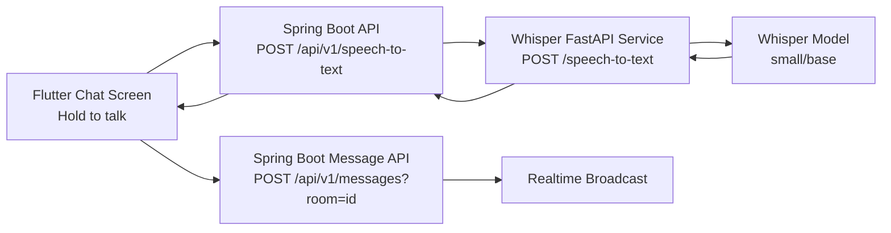

# Speech-to-Text (Whisper) Integration

## Architecture

## Data Flow

1. User long-presses microphone in chat screen.
2. Flutter records mono 16kHz audio and stops recording on release.
3. Flutter uploads audio as multipart/form-data to Spring endpoint.
4. Spring validates input size and forwards multipart payload to Whisper service.
5. Whisper service normalizes audio to WAV with ffmpeg and transcribes using Whisper model.
6. Whisper response `{ "text": "..." }` is returned to Spring, then to Flutter.
7. Flutter automatically sends transcribed text as normal chat message.

## Configuration

### Backend (`chatapp`)
- `WHISPER_BASE_URL` (default `http://whisper:8000`)
- `WHISPER_REQUEST_TIMEOUT_SECONDS` (default `60`)
- `WHISPER_HEALTHCHECK_ENABLED` (default `false`, set `true` to require `/health` before transcribe)
- `WHISPER_CACHE_DIR` (default `/cache/whisper`)
- `WHISPER_DEFAULT_LANGUAGE` (default `auto`)
- `WHISPER_MAX_AUDIO_SIZE_BYTES` (default `12582912`)

### Whisper service (`chatapp/whisper_service`)
- `WHISPER_MODEL` (default `small`)
- `WHISPER_CACHE_DIR` (default `/cache/whisper`)
- `WHISPER_DEFAULT_LANGUAGE` (default `auto`)
- `WHISPER_MAX_AUDIO_SIZE_BYTES` (default `12582912`)
- `WHISPER_FP16` (default `false`)

### Model Cache

- Whisper model files are cached under `WHISPER_CACHE_DIR` and mounted to a named Docker volume (`whisper_model_cache`).
- After the first startup download, subsequent container restarts reuse cached model files and avoid re-downloading.

## Multilingual Recognition (Vietnamese, English, Japanese)

- Supported values are `auto`, `vi`, `en`, `ja`.
- Use `language=auto` to let Whisper detect Vietnamese/English/Japanese automatically.
- Use `language=vi`, `language=en`, or `language=ja` when caller already knows the spoken language.
- Keep sample rate at 16kHz and mono for lower latency and predictable quality.
- Prefer `small` model for better Vietnamese accuracy than `base` while still practical for CPU.

## Near Real-time Improvement Ideas

- Stream audio chunks from Flutter and decode partial transcripts on backend.
- Replace `openai-whisper` with `faster-whisper` (CTranslate2) for lower latency.
- Add VAD (voice activity detection) to auto-stop recording on silence.
- Cache model in memory (already done) and run one Whisper worker per CPU core/GPU device.
- Add queue + worker pool if requests spike.

## Deployment Notes

### Local Docker
- `docker compose up -d --build`
- Health check:
  - Whisper: `GET http://localhost:8000/health`
  - App through gateway: `POST http://localhost:8080/api/v1/speech-to-text`

### Production
- Deploy Whisper as separate stateless service.
- Keep backend timeout slightly above Whisper timeout budget.
- Limit max upload size and enforce authentication at backend API.
- Monitor:
  - request latency p50/p95/p99
  - timeout rate
  - empty transcript rate
  - model load failures
